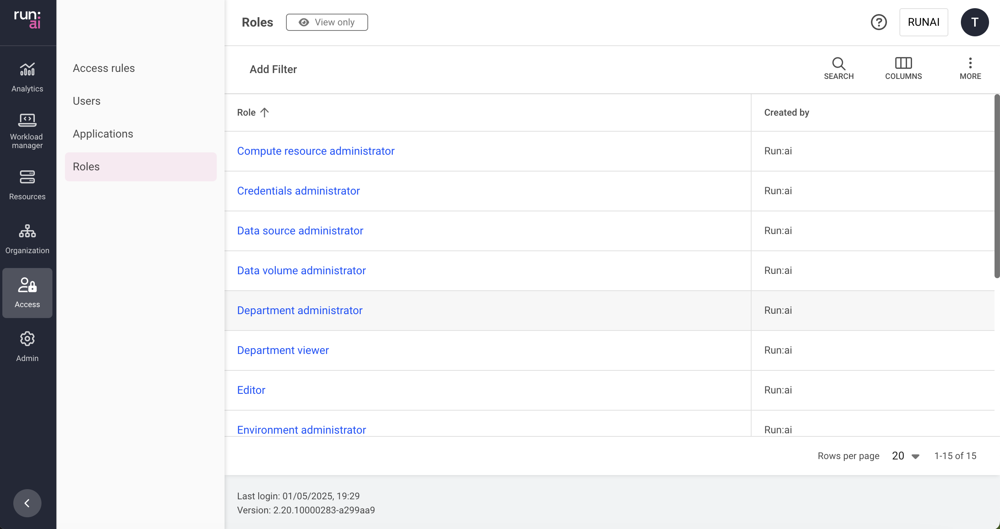

# Roles

This article explains the available roles in the Run:ai platform.

A role is a set of permissions that can be assigned to a [subject in a scope](../../admin/authentication/authentication-overview.md).

A permission is a set of actions (View, Edit, Create and Delete) over a Run:ai entity (e.g. projects, workloads, users).

## Roles table

The Roles table can be found under **Access** in the Run:ai platform.

The Roles table displays a list of predefined roles available to users in the Run:ai platform. It is not possible to create additional rules or edit or delete existing rules.

The Roles table consists of the following columns:

| Column | Description |
| :---- | :---- |
| Role | The name of the role |
| Created by | The name of the role creator |
| Creation time | The timestamp when the role was created |

### Customizing the table view

* Filter - Click ADD FILTER, select the column to filter by, and enter the filter values  
* Search - Click SEARCH and type the value to search by  
* Sort - Click each column header to sort by  
* Column selection - Click COLUMNS and select the columns to display in the table  
* Download table - Click MORE and then Click Download as CSV. Export to CSV is limited to 20,000 rows. 

## Reviewing a role

1. To review a role click the role name on the table  
2. In the role form review the following:  
    * **Role name**  
      The name of the role  
    * **Entity**  
     A system-managed object that can be viewed, edited, created or deleted by a user based on their assigned role and scope  
    * **Actions**  
     The actions that the role assignee is authorized to perform for each entity  
        * **View** If checked, an assigned user with this role can view instances of this type of entity within their defined scope  
        * **Edit** If checked, an assigned user with this role can change the settings of an instance of this type of entity within their defined scope  
        * **Create** If checked, an assigned user with this role can create new instances of this type of entity within their defined scope  
        * **Delete** If checked, an assigned user with this role can delete instances of this type of entity within their defined scope

## Roles in Run:ai

Run:ai supports the following roles and their permissions:  
 Under each role is a detailed list of the actions that the role assignee is authorized to perform for each entity.

??? "Compute resource administrator"
    

??? "Data source administrator"
    

??? "Data volume administrator"
    

??? "Department administrator"
    

??? "Department viewer"
    

??? "Editor"
    

??? "Environment administrator"
    

??? "L1 researcher"
    

??? "L2 researcher"
    

??? "ML engineer"
    

??? "Research manager"
    

??? "System administrator"
    
    
??? "Template administrator"
    
??? "Viewer"
    

!!! Notes
    Keep the following in mind when upgrading from versions 2.13 or earlier:

    * **Admin** becomes **System Admin** with full access to all managed objects and scopes  
    * **Research Manager** is not automatically assigned to all projects, but to projects set by the relevant **Admin** when assigning this role to a user, group or app  
    * To preserve backwards compatibility, users with the role of **Research Manager** are assigned to all current projects, but not to new projects  
    * To allow the **Department Admin** to assign a **Researcher** role to a user, group or app, the **Department Admin** must have **VECD** permissions for jobs and workspaces. This creates a broader span of managed objects  
    * To preserve backwards compatibility, users with the role of **Editor**, are assigned to the same scope they had before the upgrade. However, with new user assignments, the **Admin** can limit the scope to only part of the organizational scope.

## Permitted workloads

When assigning a role with either one, all or any combination of the View, Edit, Create and Delete permissions for workloads, the subject has permissions to manage not only Run:ai native workloads (Workspace, Training, Inference), but also a list of 3rd party workloads:

* k8s: StatefulSet
* k8s: ReplicaSet
* k8s: Pod
* k8s: Deployment
* batch: Job
* batch: CronJob
* [machinelearning.seldon.io](http://machinelearning.seldon.io): SeldonDeployment
* [kubevirt.io](http://kubevirt.io): VirtualMachineInstance
* [kubeflow.org](http://kubeflow.org): TFJob
* [kubeflow.org](http://kubeflow.org): PyTorchJob
* [kubeflow.org](http://kubeflow.org): XGBoostJob
* [kubeflow.org](http://kubeflow.org): MPIJob
* [kubeflow.org](http://kubeflow.org): MPIJob
* [kubeflow.org](http://kubeflow.org): Notebook
* [kubeflow.org](http://kubeflow.org): ScheduledWorkflow
* [amlarc.azureml.com](http://amlarc.azureml.com): AmlJob
* [serving.knative.dev](http://serving.knative.dev): Service
* [workspace.devfile.io](http://workspace.devfile.io): DevWorkspace
* [ray.io](http://ray.io): RayCluster
* [ray.io](http://ray.io): RayJob
* [ray.io](http://ray.io): RayService
* [ray.io](http://ray.io): RayCluster
* [ray.io](http://ray.io): RayJob
* [ray.io](http://ray.io): RayService
* [tekton.dev](http://tekton.dev): TaskRun
* [tekton.dev](http://tekton.dev): PipelineRun
* [argoproj.io](http://argoproj.io): Workflow

## Using API

Go to the [Roles](https://app.run.ai/api/docs#tag/Roles) API reference to view the available actions.

