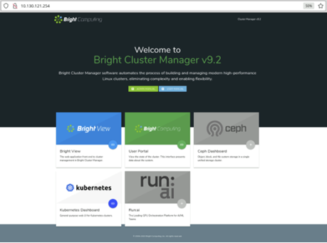
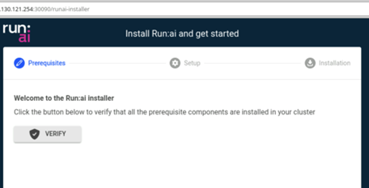
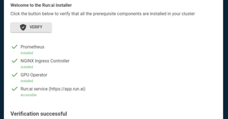
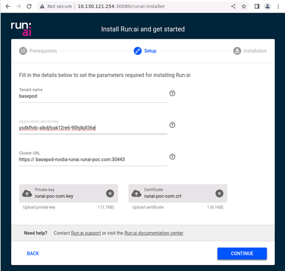
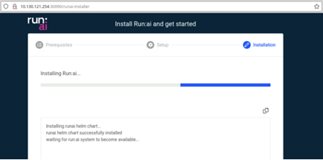
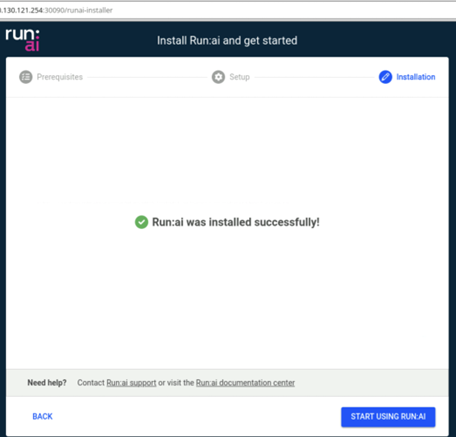

# Install using Base Command Manager

This article explains the steps required to install the Run:ai cluster on a DGX Kubernetes Cluster using NVIDIA [Base Command Manager (BCM)](https://docs.nvidia.com/base-command-manager/index.html){target=\_blank}.

## Run:ai installer

The Run:ai installer is a wizard that simplifies the deployment of the Run:ai cluster on DGX. The Run:ai installer is installed via the BCM cluster wizard when the cluster is created.

!!! Note For custom deployment options, check the [Install using Helm](./install-using-helm.md).

## Before installation

Before installing the cluster using the Run:ai installer, consider:

### System and network requirements

Before installing the Run:ai cluster on a DGX system using BCM, ensure that your [System requirements](./system-requirements.md) and [Network requirements](./network-requirements.md) meets the necessary prerequisites.

The BCM cluster wizard deploys essential [Software Requirements](./system-requirements.md#software-requirements), such as the [Kubernetes Ingress Controller](./system-requirements.md#kubernetes-ingress-controller), [NVIDIA GPU Operator](./system-requirements.md#nvidia-gpu-operator), and [Prometheus](./system-requirements.md#prometheus), as part of the Run:ai Installer deployment. Additional optional software requirements for [Distributed training](./system-requirements.md#distributed-training) and [Inference](./system-requirements.md#inference) requires manual setup.

### Tenant Name

Your tenant name is predefined and supplied by Run:ai. Each customer is provided with a unique, dedicated URL in the format `<tenant-name>.run.ai` which includes the required tenant name.

### Application secret key

An application secret key is required to connect the cluster to the Run:ai Platform, In order to get the Application secret key, a new cluster must be added.

1. Follow the [Adding a new cluster](./install-using-helm.md) setup instructions. **Do not follow the Installation instructions**.
2. Once cluster instructions are displayed, find the `controlPlane.clientSecret` flag in the displayed Helm command, copy and save its value.

!!! Note For **DGX Bundle customers**, installing their first Run:ai cluster - the Application secret key will be provided by the Run:ai support team.


### TLS certificate

A TLS private and public keys for the cluster’s [Fully Qualified Domain Name (FQDN)](./system-requirements.md#fully-qualified-domain-name-fqdn) are required for HTTP access to the cluster

!!! Important TLS Certificate must be trusted. Self-signed certificates are not supported.

## Installation

Follow these instructions to install using BCM.

### Installing a cluster

The cluster installer is available via the locally installed BCM landing page,

1. Go to the locally installed BCM landing page, Select the Run:ai tile or access directly to `http://<BCM-CLUSTER-IP>:30080/runai-installer` (HTTP only)\
   {.border-img}
2. Click **VERIFY** in order to check System Requirements are met.\
   {.border-img}
3. After verification completed successfully, click **CONTINUE**.\
   {.border-img}
4. Enter the cluster information and click **CONTINUE**.\
   {.border-img}
5. The Run:ai installation will start and should be complete within a few minutes\
   {.border-img}
6. Once a message of **Run:ai was installed successfully!** is displayed, Click on **START USING RUN:AI** to launch the login page of the tenant in a new browser tab.\
   {.border-img}

## Troubleshooting

If you encounter an issue with the installation, try the troubleshooting scenario below.

### Run:ai Installer

The Run:ai Installer is a pod in Kubernetes. The pod is responsible for the installation preparation and prerequisite gathering phase. In case of an error during the Prerequisites verification, Run the following command to print the logs:

```bash
kubectl get pods -n runai | grep 'cluster-installer' # Find the cluster installer pod's name
kubectl logs <POD-NAME> -n runai # Print the cluster installer pod logs
```

### Installation

If the Run:ai cluster installation failed, check the installation logs to identify the issue. Run the following script to print the installation logs:

```bash
curl -fsSL https://raw.githubusercontent.com/run-ai/public/main/installation/get-installation-logs.sh
```

### Cluster status

If the Run:ai cluster installation completed, but the cluster status did not change its status to **Connected**, check the cluster [troubleshooting scenarios](../infrastructure-procedures/clusters.md#troubleshooting-scenarios)
