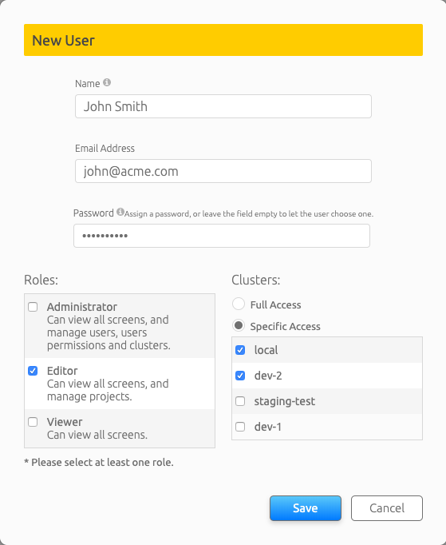

# Adding, Updating and Deleting Users

## Introduction

The Admin User Interface allows:

*   The setup of Kubernetes GPU Clusters.
*   Create, Update and Delete of users.
*   Create, Update and Delete Projects & Departments.
*   Review short term and long term dashboards
*   Review Node and Job-status

This document is about the Creation, Update, and Deletion of Users.

__Notes:__

*   With Run:AI you need to differentiate between the users of the Admin UI and Researcher users which submit workloads on the GPU Kubernetes cluster. This document is about the former.
*   It is possible to connect the Admin UI users module to the organization's LDAP directory. For further information please contact Run:AI customer support.

## Working with Users

### Create User

Note: In order to be able to manipulate users, you must have _Administrator_ access. if you do not have such access, please contact an administrator. The list of administrators is shown on the Users page (see below)

*   Log in to <https://app.run.ai>
*   On the top left, open the menu and select "Users"
*   On the top right, select "Add New Users".

*   Choose a user name and email. Leave password as blank, it will be set by the user
*   Select Roles. Note -- more than one role can be selected. The available roles are:
    *  __Administrator__: Can manage users and install clusters. 
    *  __Editor__: Can manage projects and departments.
    * __Viewer__: View-only access to Admin UI.
    * __Researcher__: Can run ML workloads (subject to the [adding](../Working-with-Projects/#create-a-new-project.md) of the user to a specific project and an existing authentication integration)

*   Select a Cluster. This determines what Clusters are accessible to this user
*   Press "Save"

The user will receive a join mail and will be able to set a password. 

### Update a User

*   Select an existing User. 
*   Right-click and press "Edit"
*   Update the values and press "Save"

### Delete an existing User

*   Select an existing User. 
*   Right-click and press "Delete"

 
