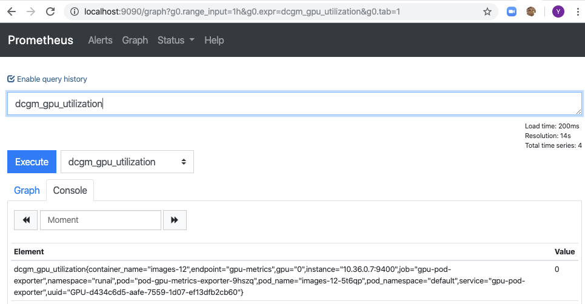

 

## Pods are not created

run:

    kubectl get pods -n runai

You will get a list of running "pods". All pods should be with status _Running_ or _Completed_. There could be various reasons why pods are at a different status. Most notably, pods use Run:AI images that are downloaded from the web. If your company employs an outbound firewall, you may need to open the URLs and ports mentioned in [Network Requirements](Run-AI-GPU-Cluster-Prerequisites/#network-requirements)

## GPU related metrics are not shown

In the Admin portal (<a href="https://app.run.ai" target="_self">app.run.ai</a>) Metrics such as "number of GPUs" and "GPU utilization" do not show

This typically means that there is a disconnect between the Kubernetes pods that require access to GPUs and the NVIDIA software.

This could happen if:

*   Connecting GPU data requires a Kubernetes feature gate flag called KubeletPodResources. This feature gate is a default in Kubernetes 1.15, but must be added in older versions of Kubernetes.  See <https://kubernetes.io/docs/reference/command-line-tools-reference/feature-gates/>. Note that Run:AI has been tested on Kubernetes 1.15.
*    Nvidia perquisites are not installed. See [Run AI GPU ClusterPrerequisites>](Run-AI-GPU-Cluster-Prerequisites/#nvidia-driver) for NVIDIA related prerequisites.

 To verify whether GPU metrics are exported run:  

    kubectl port-forward -n runai prometheus-runai-prometheus-operator-prometheus-0 9090

 Then using your browser go to <http://localhost:9090/> . Verify that you see metrics for _dcgm\_gpu\_utilization_

 

 If no metrics are shown, you can get to the root cause by running: 

    kubectl get pods -n runai --selector=app=pod-gpu-metrics-exporter

 There should be one GPU metrics exporter per node. For each pod run: 

    kubectl logs -n runai &lt;name&gt; -c pod-nvidia-gpu-metrics-exporter

 Where &lt;name&gt; is the pod-gpu-metrics exporter names from above. The logs should contain further data about the issue

A typical issue may be skipping the prerequisite of installing the Nvidia driver plugin. See  [Installing-Run-AI-on-an-on-premise-Kubernetes-Cluster](Installing-Run-AI-on-an-on-premise-Kubernetes-Cluster/#step-2-nvidia). 

 