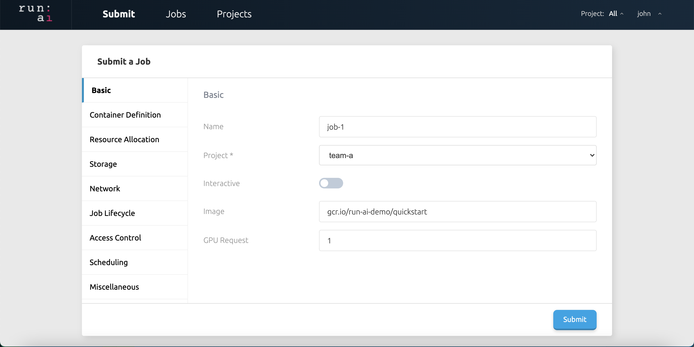

# Researcher User Interface

The Run:AI Researcher User Interface allows Researchers which are less experienced with a command-line interface to view Projects, as well as submit and view Jobs. 

!!! Important
    * The Run:AI Researcher User Interface is currently in __beta__.
    * The Run:AI Researcher User Interface does not work when the [system is configured to authenticate Researchers](../Cluster-Setup/researcher-authentication.md). We are working to add this functionality.

## Connecting to the Researcher UI

To find the URL for the Researcher UI, use the method [here](../../developer/researcher-rest-api/overview.md#Finding-the-API-Endpoint-URL). 

