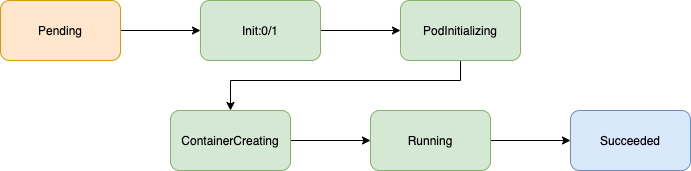

## Introduction

The [runai submit](../Command-Line-Interface-API-Reference/runai-submit.md) function and its sybling the [runai submit-mpi](../Command-Line-Interface-API-Reference/runai-submit-mpi.md) function Submit Run:AI jobs for execution. 

A job has a __status__. Once a job is submitted it goes through a number of statuses. Most of these statuses originate in the underlying _Kubernetes_ infrastructure, but some are Run:AI specific. 

The purpose of this document is to explain each of these statuses. 

## Happy flow

A regular, _training_ job which has no errors and executes without preemption would go through the following statuses:

* Pending - the job is waiting to be scheduled
* Container Creating - the job has been scheduled, the Job docker image is now downloading
* Running - the job is now executing
* Succeeded - the job has finished with exit code 0 (success)

An _interactive_ job, by definition, needs to be closed by the Researcher and will thus never reach the _Succeeded_ status. Rather, it would be moved by the Researcher to status _Deleted_.

A _distributed_ (mpi) job, which has no errors will be slightly more complicated. See picture below 

For an explanation of the additional statuses, see table below

## Status Table

Below is a list of statuses. For each status the list shows:

* Name

* End State -- this status is the final status in the lifecycle of the Job

* Resource Allocation - when the Job is in this status, does the system allocate resources to it.

* Description

* Where to get more data - What command to run to get more information on the problem if such exists. 

* Color - Status color as can be seen in the Administrator User Interface Job list

  

<table cellspacing="0" cellpadding="0" class="t1">
  <tbody>
    <tr>
      <td valign="middle" class="td1">
        
<b>Status</b>

      </td>
      <td valign="middle" class="td2">
        
<b>End State</b>

      </td>
      <td valign="middle" class="td3">
        
<b>Reseource Allocation</b>

      </td>
      <td valign="middle" class="td4">
        
<b>Description</b>

      </td>
      <td valign="middle" class="td5">
        
<b>Where to get more data</b>

      </td>
      <td valign="middle" class="td6">
        
<b>Color</b>

      </td>
    </tr>
    <tr>
      <td valign="middle" class="td7">
        
Running

      </td>
      <td valign="middle" class="td8">
        
 

      </td>
      <td valign="middle" class="td9">
        
Yes

      </td>
      <td valign="middle" class="td10">
        
Job is running successfully

      </td>
      <td valign="middle" class="td11">
        
 

      </td>
      <td valign="middle" class="td12">
        
 

      </td>
    </tr>
    <tr>
      <td valign="middle" class="td13">
        
Terminating

      </td>
      <td valign="middle" class="td14">
        
 

      </td>
      <td valign="middle" class="td15">
        
Yes

      </td>
      <td valign="middle" class="td16">
        
Pod is beeing evicted at the moment (e.g. due to an over-quota allocation, the reason will be writen once eviction finishes). A new pod will be created shortly

      </td>
      <td valign="middle" class="td17">
        
runai get &lt;job-name&gt; 

      </td>
      <td valign="middle" class="td12">
        
 

      </td>
    </tr>
    <tr>
      <td valign="middle" class="td7">
        
ContainerCreating

      </td>
      <td valign="middle" class="td8">
        
 

      </td>
      <td valign="middle" class="td9">
        
Yes

      </td>
      <td valign="middle" class="td10">
        
Image is being pulled from registry

      </td>
      <td valign="middle" class="td11">
        
 

      </td>
      <td valign="middle" class="td12">
        
 

      </td>
    </tr>
    <tr>
      <td valign="middle" class="td13">
        
Init:&lt;number A&gt;/&lt;number B&gt;

      </td>
      <td valign="middle" class="td14">
        
 

      </td>
      <td valign="middle" class="td15">
        
Yes

      </td>
      <td valign="middle" class="td16">
        
<b>MPI Status Only</b>: Waiting for B init containers to finish running, currently A are running

      </td>
      <td valign="middle" class="td17">
        
 

      </td>
      <td valign="middle" class="td12">
        
 

      </td>
    </tr>
    <tr>
      <td valign="middle" class="td7">
        
PodInitializing

      </td>
      <td valign="middle" class="td8">
        
 

      </td>
      <td valign="middle" class="td9">
        
Yes

      </td>
      <td valign="middle" class="td10">
        
<b>MPI Status Only: </b>Init container is running. Currently we have an init container used only for MPI job, but we do support worklaods with init containers with .yaml files.

      </td>
      <td valign="middle" class="td11">
        
runai get &lt;job-name&gt; 

      </td>
      <td valign="middle" class="td12">
        
 

      </td>
    </tr>
    <tr>
      <td valign="middle" class="td13">
        
Pending

      </td>
      <td valign="middle" class="td14">
        
 

      </td>
      <td valign="middle" class="td15">
        
-

      </td>
      <td valign="middle" class="td16">
        
Job is pending. Possible reasons:

        
- Not enough resources

        
- Waiting in Queue (over quota etc)

      </td>
      <td valign="middle" class="td17">
        
runai get &lt;job-name&gt; 

      </td>
      <td valign="middle" class="td18">
        
 

      </td>
    </tr>
    <tr>
      <td valign="middle" class="td7">
        
Succeeded

      </td>
      <td valign="middle" class="td8">
        
Yes

      </td>
      <td valign="middle" class="td9">
        
-

      </td>
      <td valign="middle" class="td10">
        
An Unattended (training) Job has ran and finished successfully

      </td>
      <td valign="middle" class="td11">
        
 

      </td>
      <td valign="middle" class="td19">
        
 

      </td>
    </tr>
    <tr>
      <td valign="middle" class="td13">
        
Deleted

      </td>
      <td valign="middle" class="td14">
        
Yes

      </td>
      <td valign="middle" class="td15">
        
-

      </td>
      <td valign="middle" class="td16">
        
Job has been deleted

      </td>
      <td valign="middle" class="td17">
        
 

      </td>
      <td valign="middle" class="td20">
        
 

      </td>
    </tr>
    <tr>
      <td valign="middle" class="td7">
        
TimedOut

      </td>
      <td valign="middle" class="td8">
        
Yes

      </td>
      <td valign="middle" class="td9">
        
-

      </td>
      <td valign="middle" class="td10">
        
Interactive job has reached the defined timeout of the project

      </td>
      <td valign="middle" class="td11">
        
runai get &lt;job-name&gt; 

      </td>
      <td valign="middle" class="td20">
        
 

      </td>
    </tr>
    <tr>
      <td valign="middle" class="td13">
        
Preempted

      </td>
      <td valign="middle" class="td14">
        
Yes

      </td>
      <td valign="middle" class="td15">
        
-

      </td>
      <td valign="middle" class="td16">
        
Interactive preeemptible job has been evicted

      </td>
      <td valign="middle" class="td17">
        
runai get &lt;job-name&gt; 

      </td>
      <td valign="middle" class="td20">
        
 

      </td>
    </tr>
    <tr>
      <td valign="middle" class="td7">
        
ContainerCannotRun

      </td>
      <td valign="middle" class="td8">
        
Yes

      </td>
      <td valign="middle" class="td9">
        
-

      </td>
      <td valign="middle" class="td10">
        
Container has failed to start running. This is typically a problem within the docker image itself

      </td>
      <td valign="middle" class="td11">
        
 

      </td>
      <td valign="middle" class="td21">
        
 

      </td>
    </tr>
    <tr>
      <td valign="middle" class="td13">
        
Error

      </td>
      <td valign="middle" class="td14">
        
 

      </td>
      <td valign="middle" class="td15">
        
Yes for interactive only 

      </td>
      <td valign="middle" class="td16">
        
The job has returned an exit code different than zero. It is now waiting for another run attempt (retry)

      </td>
      <td valign="middle" class="td17">
        
runai logs &lt;job-name&gt;

      </td>
      <td valign="middle" class="td21">
        
 

      </td>
    </tr>
    <tr>
      <td valign="middle" class="td22">
        
CrashLoopBackOff

      </td>
      <td valign="middle" class="td8">
        
 

      </td>
      <td valign="middle" class="td9">
        
Yes

      </td>
      <td valign="middle" class="td10">
        
<b>Interactive Only: </b>During backoff after Error, before the Kubelet retires to run pod

      </td>
      <td valign="middle" class="td11">
        
 

      </td>
      <td valign="middle" class="td21">
        
 

      </td>
    </tr>
    <tr>
      <td valign="middle" class="td13">
        
Fail

      </td>
      <td valign="middle" class="td14">
        
Yes

      </td>
      <td valign="middle" class="td15">
        
-

      </td>
      <td valign="middle" class="td16">
        
Job has failed after a number of retries (according to "--backoffLimit" field) and will not be trying again. This is a final state

      </td>
      <td valign="middle" class="td17">
        
runai logs &lt;job-name&gt;

      </td>
      <td valign="middle" class="td21">
        
 

      </td>
    </tr>
    <tr>
      <td valign="middle" class="td7">
        
ErrImagePull

      </td>
      <td valign="middle" class="td8">
        
 

      </td>
      <td valign="middle" class="td9">
        
Yes

      </td>
      <td valign="middle" class="td10">
        
Failed to retrieve the image you specified as image

      </td>
      <td valign="middle" class="td11">
        
 

      </td>
      <td valign="middle" class="td21">
        
 

      </td>
    </tr>
    <tr>
      <td valign="middle" class="td13">
        
ImagePullBackOff

      </td>
      <td valign="middle" class="td14">
        
 

      </td>
      <td valign="middle" class="td15">
        
Yes

      </td>
      <td valign="middle" class="td16">
        
During backoff after ImagePullBackOff, before retrying to pull the image again

      </td>
      <td valign="middle" class="td17">
        
 

      </td>
      <td valign="middle" class="td21">
        
 

      </td>
    </tr>
    <tr>
      <td valign="middle" class="td23">
        
Unknown

      </td>
      <td valign="middle" class="td24">
        
Yes

      </td>
      <td valign="middle" class="td25">
        
-

      </td>
      <td valign="middle" class="td26">
        
The Run:AI Scheduler wasn't running when the job has finished

      </td>
      <td valign="middle" class="td27">
        
 

      </td>
      <td valign="middle" class="td28">
        
 

      </td>
    </tr>
  </tbody>
</table>