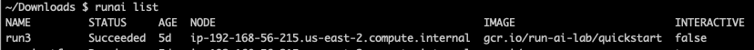

## Introduction

Jobs can be started via Kubeflow, Run:AI CLI, Rancher or via direct Kubernetes API. When jobs are finished (successfully or failing), their resource allocation is taken away, but they remain in the system. You can see old jobs by running the command:

    runai list

You can delete the job manually by running:

    runai delete run3

But this may not be scalable for a production system.

It is possible to flag a job for automatic deletion some period of time after its finish.

!!! Important note 
    Deleting a job, deletes the container behind it, and with it all related information such as job logs. Data that was saved by the researcher on a shared drive is not affected. The Job is also __not__ deleted from the Run:AI user interface

## Enable Automatic Deletion in Cluster (Admin only)

In order for automatic deletion to work, the On-premise Kubernetes cluster needs to be modified. The feature relies on a Kubernetes feature gate "<a href="https://kubernetes.io/docs/concepts/workloads/controllers/ttlafterfinished/" target="_self">TTLAfterFinished</a>"

__Note__: different Kubernetes distributions have different locations and methods to add feature flags. The instructions below are an example based on _Kubespray_<https://github.com/kubernetes-sigs/kubespray>). Refer to the documentation of your Kubernetes distribution.

*   Open a shell on the Kubernetes __master__
*   cd to/etc/kubernetes/manifests
*   vi kube-apiserver.yaml
*   add ``--feature-gates=TTLAfterFinished=true`` to the following location:

        spec:
            containers:
            - command:
            - kube-apiserver
                .....
            - --feature-gates=TTLAfterFinished=true

*   vi kube-controller-manager.yaml
*   add ``--feature-gates=TTLAfterFinished=true`` to the following location:

        spec:
            containers:
            - command:
            - kube-controller-manager
                .....
            - --feature-gates=TTLAfterFinished=true
    

## Automatic Deletion

When starting the job, add the flag ``--ttl-after-finish duration``. duration is the duration, post job finish, after which the job is automatically deleted. Example durations are: 5s, 2m, 3h, 4d etc. For example, the following call will delete the job 2 hours after job finish:

    runai submit myjob1 --ttl-after-finish 2h

<!-- ## Using Templates to set Automatic Deletion as Default

You can use Run:AI templates to set auto-delete to be the default. See [runai template](../cli-reference/runai-template.md) for more. -->