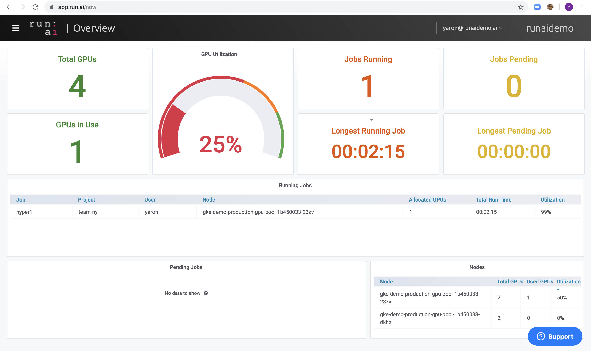

# Walkthrough: Launch Interactive Build Workloads

## Introduction

Deep learning workloads can be divided into two generic types:

*   Interactive "build" sessions. With these types of workloads, the data scientist opens an interactive session, via bash, Jupyter notebook, remote PyCharm or similar and accesses GPU resources directly. 
*   Unattended "training" sessions. With these types of workloads, the data scientist prepares a self-running workload and sends it for execution. During the execution, the customer can examine the results.

With this Walkthrough you will learn how to:

*   Use the Run:AI command-line interface (CLI) to start a deep learning __build__ workload
*   Open an ssh session to the build workload
*   Stop the build workload

It is also possible to open ports to specific services within the container. See "Next Steps" at the end of this article.

## Prerequisites 

To complete this walkthrough you must have:

*   Run:AI software is installed on your Kubernetes cluster. See: [Installing Run:AI on an on-premise Kubernetes Cluster](../../Administrator/Cluster-Setup/Installing-Run-AI-on-an-on-premise-Kubernetes-Cluster.md)
*   Run:AI CLI installed on your machine. See: [Installing the Run:AI Command Line Interface](../../Administrator/Researcher-Setup/Installing-the-Run-AI-Command-Line-Interface.md)

## Step by Step Walkthrough

### Setup

*   Open the Run:AI user interface at <https://app.run.ai>
*   Login
*   Go to "Projects"
*   Add a project named "team-a"
*   Allocate 2 GPUs to the project

### Run Workload

*   At the command line run:

        runai project set team-a
        runai submit build1 -i gcr.io/run-ai-lab/build-demo -g 1 --interactive

*   The job is based on a sample docker image ``gcr.io/run-ai-lab/build-demo``
*   We named the job _build1_.
*   Note the _interactive_ flag which means the job will not have a start or end. It is the researcher's responsibility to close the job. 
*   The job is assigned to team-a with an allocation of a single GPU. 

Follow up on the job's status by running:

    runai list

The result:

Typical statuses you may see:

*   ContainerCreating - The docker container is being downloaded from the cloud repository
*   Pending - the job is waiting to be scheduled
*   Running - the job is running

To get additional status on your job run:

    runai get build1

### Get a Shell to the container

Run:

    runai bash build1

This should provide a direct shell into the computer

### View status on the Run:AI User Interface

*   Go to <https://app.run.ai>
*   Under Dashboards | Overview you should see:

*   Under "Jobs" you can view the new Workload:

 

### Stop Workload

Run the following:

    runai delete build1

This would stop the training workload. You can verify this by running ``runai list`` again.

## Next Steps

*   Expose internal ports to your interactive build workload: [Walkthrough Launch an Interactive Build Workload with Connected Ports](Walkthrough-Launch-an-Interactive-Build-Workload-with-Connected-Ports.md).
*   Follow the Walkthrough: [Walkthrough Launch Unattended Training Workloads](Walkthrough-Launch-Unattended-Training-Workloads-.md).