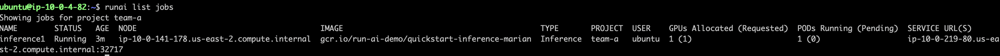
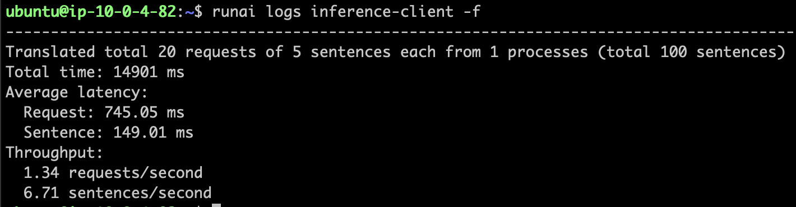
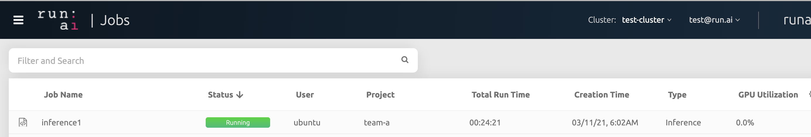

# Quickstart: Launch an Inference Workload

## Introduction

Machine learning (ML) inference is the process of running live data points into a machine-learning algorithm to calculate an output. 

With Inference, you are taking a trained _Model_ and deploying it into a production environment. The deployment must align with the organization's production standards such as average and 95% response time as well as up-time. 

For further information on Inference at Run:ai, see [Inference overview](../../developer/inference/overview.md).

## Prerequisites 

To complete this Quickstart you must have:

*   Run:ai software installed on your Kubernetes cluster. See: [Installing Run:ai on a Kubernetes Cluster](../../admin/runai-setup/installation-types.md)
*   Run:ai CLI installed on your machine. See: [Installing the Run:ai Command-Line Interface](../../admin/researcher-setup/cli-install.md)

## Step by Step Walkthrough

### Setup

*  Login to the Projects area of the Run:ai user interface.
*  Add a Project named "team-a".
*  Allocate 2 GPUs to the Project.

### Run an Inference Workload - Single Replica

*   At the command-line run:

```
runai config project team-a
runai submit --name inference1 --service-type nodeport --port 8888 --inference \
    -i gcr.io/run-ai-demo/quickstart-inference-marian  -g 1
```

This would start an inference workload for team-a with an allocation of a single GPU. The inference workload is based on a [sample](https://github.com/run-ai/models/tree/main/models/marian/server){target=_blank} docker image ``gcr.io/run-ai-demo/quickstart-inference-marian``. The inference engine used in this quickstart is [Marian](https://marian-nmt.github.io/){target=_blank}

*   Follow up on the Job's progress by running:

        runai list jobs

The result:



The output shows the service URL with which to connect to the service.

### Query the Inference Server

The specific `Marian` server is accepting queries over the _WebSockets_ protocol. You can use the Run:ai Marian [sample client](https://github.com/run-ai/models/tree/main/models/marian/client){target=_blank}.

In the following command, replace  `<HOSTNAME>` and `<PORT>` with the service URL displayed in the previous `list` command:

```
runai submit inference-client -i gcr.io/run-ai-demo/quickstart-inference-marian-client \
    -- --hostname <HOSTNAME> --port <PORT> --processes 1 
```

To see the result, run the following:

```
runai logs inference-client -f
```

You should see a log of the inference call:



### View status on the Run:ai User Interface

* Open the Run:ai user interface.
* Under "Jobs" you can view the new Workload:

 


### Stop Workload

Run the following:

    runai delete inference1

This would stop the inference workload. Verify this by running ``runai list jobs`` again.


### Run an Inference Workload - Multiple Replicas

At the command-line run:

```
runai submit inference2 --service-type nodeport --port 8888 --inference \
    -i gcr.io/run-ai-demo/quickstart-inference-marian  --replicas 4 -g 0.25 
```

This will create 4 replicas of the same service that will each run with 25% of the GPU Memory at a total of 1 GPU for all replicas.