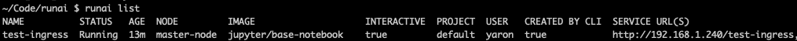

# Walk-through: Launch Interactive Build Workloads with Connected Ports

## Introduction

 This walk-through is an extension of [Walk-through Start and Use Interactive Build Workloads](walkthrough-build.md) 

 When starting a container with the Run:AI Command-Line Interface (CLI), it is possible to expose internal ports to the container user.   

## Exposing a Container Port

 There are a number of alternative ways to expose ports in Kubernetes: 

*    NodePort - Exposes the Service on each Node’s IP at a static port (the NodePort). You’ll be able to contact the NodePort service, from outside the cluster, by requesting ``<NodeIP>:<NodePort>`` regardless of which node the container actually resides.   
*   LoadBalancer - Useful for cloud environments. Exposes the Service externally using a cloud provider’s load balancer.
*   Ingress - Allows access to Kubernetes services from outside the Kubernetes cluster. You configure access by creating a collection of rules that define which inbound connections reach which services.
*   Port Forwarding - Simple port forwarding allows access to the container via localhost:&lt;Port&gt;

Contact your administrator to see which methods are available in your cluster

## Port Forwarding, Step by Step Walk-through

### Setup

*   Open the Run:AI user interface at <https://app.run.ai>
*   Login
*   Go to "Projects"
*   Add a project named "team-a"
*   Allocate 2 GPUs to the project

### Run Workload

*   At the command-line run:

        runai project set team-a
        runai submit jupyter1 -i jupyter/base-notebook -g 1 \
            --interactive --service-type=portforward --port 8888:8888 \
            --args="--NotebookApp.base_url=jupyter1" --command=start-notebook.sh

*   The job is based on a generic Jupyter notebook docker image ``jupyter/base-notebook`` 
*    We named the job _jupyter1_.   Note that in this Jupyter implementation, the name of the job should also be copied to the Notebook base URL.   
*   Note the _interactive_ flag which means the job will not have a start or end. It is the researcher's responsibility to close the job.  
*   The job is assigned to team-a with an allocation of a single GPU.
*   In this example, we have chosen the simplest scheme to expose ports which is port forwarding. We temporarily expose port 8888 to localhost as long as the ``runai submit`` command is not stopped

### Open the Jupyter notebook

Open the following in the browser

        http://localhost:8888/jupyter1

You should see a Jupyter notebook.

## Ingress, Step by Step Walk-through

__Note:__ Ingress must be set up by your administrator prior to usage. For more information see:  [Exposing Ports from Researcher Containers Using Ingress](../../Administrator/Cluster-Setup/allow-external-access-to-containers.md)

### Setup

*   Perform the setup steps for port forwarding above.  

### Run Workload

*   At the command-line run:

        runai project set team-a
        runai submit test-ingress -i jupyter/base-notebook -g 1 \
          --interactive --service-type=ingress --port 8888 \
          --args="--NotebookApp.base_url=team-a-test-ingress" --command=start-notebook.sh

*   An ingress service URL will be created, run:

        runai list

You will see the service URL with which to access the Jupyter notebook

!!! Important note
    With ingress, Run:AI creates an access URL whose domain is _uniform_ (and is IP which serves as the access point to the cluster). The rest of the path is _unique_ and is build as: __&lt;project-name&gt;-&lt;job-name&gt;__. Thus, with the example above, we must set the Jupyter notebook base URL to respond to the service at __team-a-test-ingress__

## See Also

Develop on Run:AI using [Visual Studio Code](../tools/dev-vscode.md)