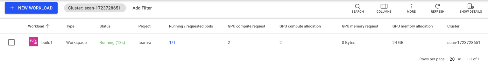
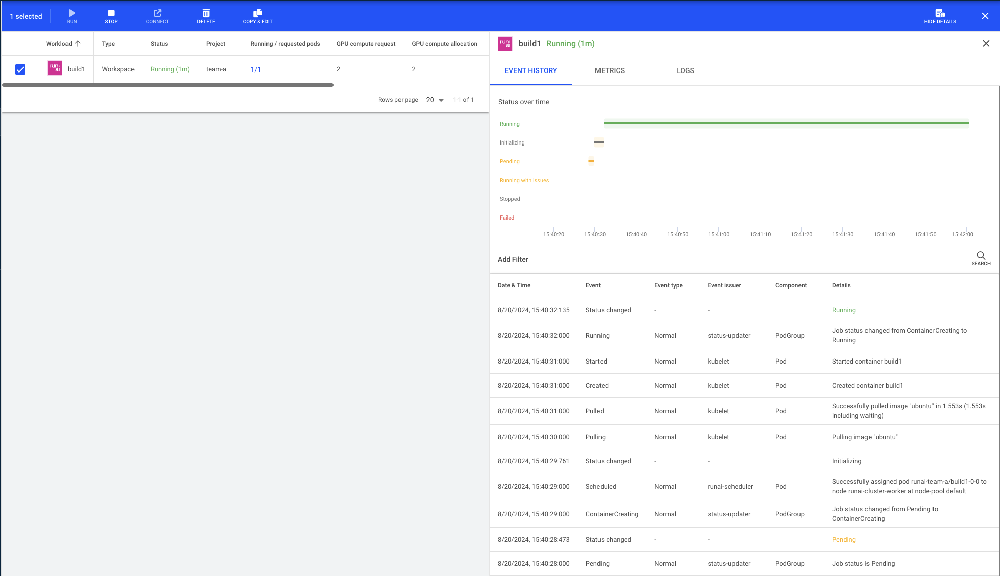

# Quickstart: Launch Interactive Build Workloads

## Introduction

The purpose of this article is to provide a quick ramp-up to running an interactive Workspace to allow building data science programs. data scientists typically use various tools such as Jupyter Notebook,  PyCharm, or Visual Studio code. However, in this quickstart, we will start by launching a bare-bones Workspace without such tools. 

With this Quickstart you will learn how to:

*   Start a workspace.
*   Open an ssh session to the workspace.
*   Stop the workspace.


## Prerequisites 

To complete this Quickstart, the [Platform Administrator](../../platform-admin/overview.md) will need to provide you with:

* _Researcher_ access to _Project_ in Run:ai named "team-a"
* The project should be assigned a quota of at least 1 GPU. 
* A URL of the Run:ai Console. E.g. [https://acme.run.ai](https://acme.run.ai).

To complete this Quickstart __via the CLI__, you will need to have the Run:ai CLI installed on your machine. There are two available CLI variants:

* The older V1 CLI. See installation [here](../../admin/researcher-setup/cli-install.md)
* A newer V2 CLI, supported with clusters of version 2.18 and up. See installation [here](../../admin/researcher-setup/new-cli-install.md)

## Step by Step Quickstart

### Login
=== "CLI V2"
    Run `runai login` and enter your credentials.

=== "CLI V1 [Deprecated]"
    Run `runai login` and enter your credentials.

=== "User Interface"
    Browse to the provided Run:ai user interface and log in with your credentials.

=== "API"
    To use the API, you will need to obtain a token. Please follow the [api authentication](../../developer/rest-auth.md) article.


### Create a Workspace

=== "CLI V2"
    Open a terminal and run:

    ``` bash
    runai project set team-a
    runai workspace submit build1 -i ubuntu -g 1 --command -- sleep infinity
    ```
    !!! Note
        For more information on the workspace submit command, see [cli documentation](../cli-reference/new-cli/runai_workspace_submit.md).

=== "CLI V1 [Deprecated]"
    Open a terminal and run:

    ``` bash
    runai config project team-a   
    runai submit build1 -i ubuntu -g 1 --interactive -- sleep infinity
    ```

    !!! Note
        For more information on the workload submit command, see [cli documentation](../cli-reference/runai-submit.md).

=== "User Interface"
    * In the Run:ai UI select __Workloads__
    * Select __New Workload__ and then __Workspace__
    * You should already have `Cluster`, `Project` and a `start from scratch` `Template` selected. Enter `build1` as the name and press __CONTINUE__.
    * Select __NEW ENVIRONMENT__. Enter `ubuntu` as the name and `ubuntu` as the image. Then select __CREATE ENVIRONMENT__.
    * When the previous screen comes up, select `one-gpu` under the Compute resource. 
    * Select __CREATE WORKSPACE__.
    
    !!! Note
        For more information on submitting Workloads and creating Assets via the user interface, see [Workload documentation](../../platform-admin/workloads/overviews/managing-workloads.md).

=== "API"
    ``` bash
    curl -L 'https://<COMPANY-URL>/api/v1/workloads/workspaces' \ # (1)
    -H 'Content-Type: application/json' \
    -H 'Authorization: Bearer <TOKEN>' \ # (2)
    -d '{ 
        "name": "build1", 
        "projectId": "<PROJECT-ID>", '\ # (3)
        "clusterId": "<CLUSTER-UUID>", \ # (4)
        "spec": {
            "command" : "sleep",
            "args" : "infinity"
            "image": "ubuntu",
            "compute": {
            "gpuDevicesRequest": 1
            }
        }
    }'
    ``` 

    1. `<COMPANY-URL>` is the link to the Run:ai user interface. For example `acme.run.ai`
    2. `<TOKEN>` is an API access token. see above on how to obtain a valid token.
    3. `<PROJECT-ID>` is the the ID of the `team-a` Project. You can get the Project ID via the [Get Projects API](https://app.run.ai/api/docs#tag/Projects/operation/get_projects){target=_blank}
    4. `<CLUSTER-UUID>` is the unique identifier of the Cluster. You can get the Cluster UUID by adding the "Cluster ID" column to the Clusters view. 

    !!! Note
        For more information on the Workspace Submit API see [API Documentation](https://app.run.ai/api/docs#tag/Workspaces/operation/create_workspace1){target=_blank} 

* This would start a workload of type Workspace for `team-a` with an allocation of a single GPU. 
* We named the Workload `build1`. 
* Note that, unlike a Training workload, a Workspace workload will not end automatically. It is the Researcher's responsibility to stop the Workload. 
* The command provided is ``sleep infinity``. You must provide a command or the container will start and then exit immediately. Alternatively, when using the command line, replace these flags with `--attach` to attach immediately to a session.


### List Workloads

Follow up on the Workload's progress by running:

=== "CLI V2"
    ``` bash
    runai workspace list
    ```

    The result:

    ```
    Workload     Type        Status      Project     Preemptible      Running/Requested Pods     GPU Allocation
    ─────────────────────────────────────────────────────────────────────────────────────────────────────────────
    vs1          Workspace   Running     team-a      No               1/1                        1.00
    ```

=== "CLI V1 [Deprecated]"
    ``` bash
    runai list jobs
    ```
    The result:
    


=== "User Interface"
    * Open the Run:ai user interface.
    * Under "Workloads" you can view the new Workspace:

    

    Select the Workloads and press `Show Details` to see the Workload details

     


Typical statuses you may see:

*   ContainerCreating - The docker container is being downloaded from the cloud repository
*   Pending - the job is waiting to be scheduled
*   Running - the job is running

A full list of Job statuses can be found [here](../../platform-admin/workloads/overviews/managing-workloads.md)

### Describe Workload

To get additional status on your Workload run:

=== "CLI V2"
    ``` bash
    runai workspace describe build1
    ```

=== "CLI V1 [Deprecated]"
    ``` bash
    runai describe job build1
    ```

=== "User Interface"
    Workload parameters can be viewed by adding more columns to the Workload list and by reviewing the `Event History` tab for the specific Workload. 


### Get a Shell to the container

=== "CLI V2"
    ``` bash
    runai workspace bash build1
    ```

=== "CLI V1 [Deprecated]"
    Run:
    ``` bash
    runai bash build1
    ```

This should provide a direct shell into the computer

 


### Stop Workload

Run the following:

=== "CLI V2"
    ```    
    runai workspace delete build1
    ```

=== "CLI V1 [Deprecated]"
    ``` bash
    runai delete job build1
    ```

=== "User Interface"
    Select the Workspace and press __DELETE__.

This would stop the workspace. You can verify this by running the [list](#list-workloads) command again.

