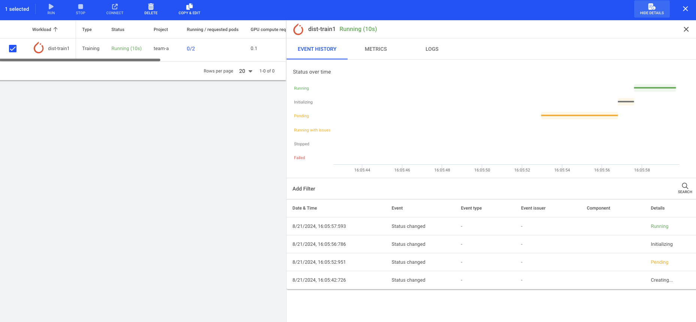

# Quickstart: Launch Distributed Training Workloads

## Introduction

Distributed Training is the ability to split the training of a model among multiple processors. Each processor is called a __worker__. Worker nodes work in parallel to speed up model training. There is also a __master__ which coordinates the workers. 

Distributed Training should not be confused with multi-GPU training. Multi-GPU training is the allocation of more than a single GPU to your workload which runs on a **single container**.

Getting distributed training to work is more complex than a single-container training as it requires syncing of data and timing between the different workers. However, it is often a necessity when multi-GPU training no longer applies; typically when you require more GPUs than exist on a single node. Several Deep Learning frameworks support distributed training. This example will focus on PyTorch.

Run:ai provides the ability to run, manage, and view distributed training workloads. The following is a Quickstart document for such a scenario.

There are various ways to submit a distributed training Workload:

* Run:ai __command-line interface (CLI)__
* Run:ai __user interface__
* Run:ai __API__

## Prerequisites

To complete this Quickstart, the [Infrastructure Administrator](../../admin/overview-administrator.md) will need to install the optional Kubeflow Training Operator as described [here](../../admin/runai-setup/cluster-setup/cluster-prerequisites.md#distributed-training)

To complete this Quickstart, the [Platform Administrator](../../platform-admin/overview.md) will need to provide you with:

* _Researcher_ access to _Project_ in Run:ai named "team-a"
* The project should be assigned a quota of at least 1 GPU. 
* A URL of the Run:ai Console. E.g. [https://acme.run.ai](https://acme.run.ai).

To complete this Quickstart __via the CLI__, you will need to have the Run:ai CLI installed on your machine. There are two available CLI variants:

* The older V1 CLI. See installation [here](../../admin/researcher-setup/cli-install.md)
* A newer V2 CLI, supported with clusters of version 2.18 and up. See installation [here](../../admin/researcher-setup/new-cli-install.md)


## Step by Step Walkthrough

### Login

=== "CLI V1"
    Run `runai login` and enter your credentials.

=== "CLI V2"
    Run `runai login` and enter your credentials.

=== "User Interface"
    Browse to the provided Run:ai user interface and log in with your credentials.

=== "API"
    To use the API, you will need to obtain a token. Please follow the [api authentication](../../developer/rest-auth.md) article.


### Run a Distributed Training Workload


=== "CLI V1"
    Open a terminal and run:

    ``` bash
    runai config project team-a
    runai submit-dist pytorch dist-train1 --workers=2 -g 0.1 \
        -i /kubeflow/pytorch-dist-mnist:latest
    ```

    !!! Note
        For more information on the workload submit command, see [cli documentation](../cli-reference/runai-submit-dist-pytorch.md).

=== "CLI V2"
    Open a terminal and run:

    ``` bash
    runai project set team-a
    runai distributed submit dist-train1  --framework PyTorch \
        -i /kubeflow/pytorch-dist-mnist:latest --workers 2 
        --gpu-request-type portion --gpu-portion-request 0.1 --gpu-devices-request 1 --cpu-memory-request 100M
    ```
    !!! Note
        For more information on the training submit command, see [cli documentation](../cli-reference/new-cli/runai_training_submit.md).

=== "User Interface"
    * In the Run:ai UI select __Workloads__
    * Select __New Workload__ and then __Training__
    * You should already have `Cluster`, `Project` and a `start from scratch` `Template` selected. 
    * Under `Workload architecture` select `Distributed` and choose `PyTorch`. Set the distributed training configuration to `Workers & master`.
    * Enter `train1` as the name and press __CONTINUE__.
    * Select __NEW ENVIRONMENT__. Enter `pytorch-dt` as the name and `/kubeflow/pytorch-dist-mnist:latest` as the image. Then select __CREATE ENVIRONMENT__.
    * When the previous screen comes up, under `Compute resource` enter 2 workers and select `small-fraction` as the Compute resource. 
    * Select __CONTINUE__ and then __CREATE TRAINING__.
    
    !!! Note
        For more information on submitting Workloads and creating Assets via the user interface, see [Workload documentation](../workloads/workspaces/overview.md).

=== "API"
    ``` bash
    curl -L 'https://<COMPANY-URL>/api/v1/workloads/distributed' \ # (1)
    -H 'Content-Type: application/json' \
    -H 'Authorization: Bearer <TOKEN>' \ # (2)
    -d '{ 
        "name": "dist-train1", 
        "projectId": "<PROJECT-ID>", '\ # (3)
        "clusterId": "<CLUSTER-UUID>", \ # (4)
        "spec": {
            "compute": {
                "cpuCoreRequest": 0.1,
                "gpuRequestType": "portion",
                "cpuMemoryRequest": "100M",
                "gpuDevicesRequest": 1,
                "gpuPortionRequest": 0.1
            },
            "image": "/kubeflow/pytorch-dist-mnist:latest",  
            "numWorkers": 2,  \ # (5)
            "distributedFramework": "PyTorch" \ # (6)
        }
    }'
    ``` 

    1. `<COMPANY-URL>` is the link to the Run:ai user interface. For example `acme.run.ai`
    2. `<TOKEN>` is an API access token. see above on how to obtain a valid token.
    3. `<PROJECT-ID>` is the the ID of the `team-a` Project. You can get the Project ID via the [Get Projects API](https://app.run.ai/api/docs#tag/Projects/operation/get_projects){target=_blank}
    4. `<CLUSTER-UUID>` is the unique identifier of the Cluster. You can get the Cluster UUID by adding the "Cluster ID" column to the Clusters view. 
    5. Use 2 workers.
    6. Use PyTorch training operator 

    !!! Note
        * The above API snippet will only work with Run:ai clusters of 2.18 and above. For older clusters, use, the now deprecated [Cluster API](../../developer/cluster-api/submit-rest.md).
        * For more information on the Distributed Training Submit API see [API Documentation](https://app.run.ai/api/docs#tag/Distributed/operation/create_distributed){target=_blank} 

This would start a distributed training Workload for `team-a`. The Workload will have one master and two workers. We named the Workload ``dist-train1``

### List Workloads

Follow up on the Workload's progress by running:

=== "CLI V1"
    ``` bash
    runai list jobs
    ```
    The result:
    

=== "CLI V2"
    ``` bash
    runai distributed list
    ```

    The result:

    ```
    Workload     Type         Status      Project     Preemptible      Running/Requested Pods     GPU Allocation
    ───────────────────────────────────────────────────────────────────────────────────────────────────────────────
    dist-train1  Distributed  Running      team-a      Yes              0/2                        0.00
    ```

=== "User Interface"
    * Open the Run:ai user interface.
    * Under "Workloads" you can view the new Training Workload:

    

    * Select the `0/2` under Running/Requested Pods and watch the worker pod status:

    


    Select the `dist-train1` workload and press `Show Details` to see the Workload details

     


### Describe Workload

The Run:ai scheduler ensures that all pods can run together. You can see the list of workers as well as the main "launcher" pod by running:

=== "CLI V1"
    ``` bash
    runai describe job train1
    ```

=== "CLI V2"
    ``` bash
    runai training describe train1
    ```

=== "User Interface"
    Workload parameters can be viewed by adding more columns to the Workload list and by reviewing the `Event History` tab for the specific Workload. 

### View Logs

Run the following:

=== "CLI V1"

    Get the name of the worker pods from the above `describe` command, then run: 
    
    ```
    runai logs dist-train1 --pod dist-train1-worker-0
    ```

    (where `dist-train1-worker-0` is the name of the first worker)
    
    You should see a log of a running container

=== "CLI V2"

    Get the name of the worker pods from the above `describe` command, then run: 

    ``` bash
    runai distributed logs dist-train1 --pod dist-train1-worker-0
    ```

    (where `dist-train1-worker-0` is the name of the first worker)

    You should see a log of a running container:


=== "User Interface"
    Select the Workload, and press __Show Details__. Under `Logs` you can select each of the workers and see the logs emitted from the container

### Stop Workload

Run the following:

=== "CLI V1"
    ``` bash
    runai delete job dist-train1
    ```

=== "CLI V2"
    ```    
    runai training delete dist-train1
    ```

=== "User Interface"
    Select the Workload and press __DELETE__.

This would stop the training workload. You can verify this by [listing](#list-workloads) training workloads again.
