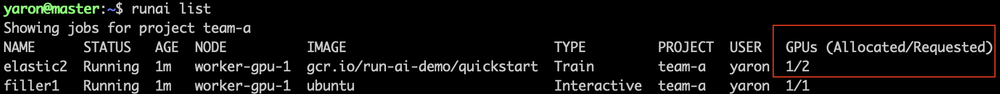

# Walk-through: Elasticity, Dynamically Stretch or Compress Workload's GPU Allocation

## Introduction

_Elasticity_ allows unattended, train-based  workloads to __shrink__ or __expand__ based on the cluster's availability.

* Shrinking a training job allows your workload to run on a smaller number of GPUs than the researcher code was originally written for.
* Expanding a training job allows your workload to run on more GPUs than the researcher code was originally written for. 

## Prerequisites 

To complete this walk-through you must have:

*   Run:AI software installed on your Kubernetes cluster. See: [Installing Run:AI on an on-premise Kubernetes Cluster](../../Administrator/Cluster-Setup/cluster-install.md)
*   Run:AI CLI installed on your machine. See: [Installing the Run:AI Command-Line Interface](../../Administrator/Researcher-Setup/cli-install.md)
*   [Run:AI Python Researcher Library](../researcher-library/researcher-library-overview.md) installed on a docker image

## Step by Step Walk-through

### Setup

*   A GPU cluster with a __single__ node of __2__ GPUs. 

    *  If the cluster contains more than one node,  use [Node affinity](../../../Administrator/Admin-User-Interface-Setup/Working-with-Projects/#further-affinity-refinement-by-the-researcher) to simulate a single node or use more filler jobs as described below.
    *  If the cluster nodes contain more than 2 GPUs, you can create an interactive job on a different project to consume the remaining GPUs.    

*   Open the Run:AI user interface at <https://app.run.ai>
*   Login
*   Go to "Projects"
*   Add a project named "team-a"
*   Allocate 2 GPUs to the project

### Expansion 

*   At the command-line run:
    
        runai project set team-a
        runai submit elastic1 -i gcr.io/run-ai-demo/quickstart -g 1 --elastic

* This would start an unattended training job for team-a 
* The job is based on a sample docker image ``gcr.io/run-ai-demo/quickstart``. We named the job ``elastic1``and have requested 1 GPU for the job
* The flag ``--elastic`` enables the Elasticity feature
* Follow up on the job's progress by running:

        runai list

    The result:

    

    !!! Discussion
        * The Job has requested 1 GPU, but has been allocated with 2, as 2 are available right now.
        * The code needs to be ready to accept more GPUs than it requested, otherwise, the GPUs will not be utilized. The Run:AI Elasticity library helps with expanding the job effectively.

* Add a filler class:
        
        runai submit filler1 -i ubuntu --command sleep --args infinity -g 1 --interactive
        runai list
    
    The result: 

    

    !!! Discussion
        An interactive job (filler1) needs to be scheduled. The elastic job is now reduced to the originally requested single-GPU.

* Finally, delete the jobs:

        runai delete elastic1 filler1

### Shrinking

*   At the command-line run:
    
        runai submit filler2 -i ubuntu --command sleep --args infinity -g 1 --interactive
        runai submit elastic2 -i gcr.io/run-ai-demo/quickstart -g 2 --elastic 

*   This would start a filler job on 1 GPU and attempt to start another unattended job with 2 GPUs

*   Follow up on the job's progress by running:
    
        runai list

    The result:

    

    !!! Discussion
        Since only a single GPU remains unallocated, under normal circumstances, the job should not start. However, the ``--elastic`` flag tells the system to allocate a single GPU instead.

*   Delete the filler job and list the jobs again:

        runai delete filler2
        runai list

    The result:

    

    !!! Discussion
        With the filler job gone, the elastic job has more room to expand, which it does.

*   Finally, delete the job:

        runai delete elastic2

## See Also

* For more information on the elasticity module of the Researcher python library, see [Researcher library : Elasticity](../researcher-library/rl-elasticity.md)
