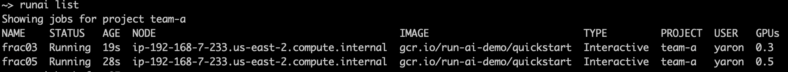

# Quickstart: Launch Workloads with GPU Fractions

## Introduction

Run:ai provides a Fractional GPU sharing system for containerized workloads on Kubernetes. The system supports workloads running CUDA programs and is especially suited for lightweight AI tasks such as inference and model building. The fractional GPU system transparently gives data science and AI engineering teams the ability to run multiple workloads simultaneously on a single GPU, enabling companies to run more workloads such as computer vision, voice recognition and natural language processing on the same hardware, lowering costs.

Run:ai’s fractional GPU system effectively creates logical GPUs, with their own memory and computing space that containers can use and access as if they were self-contained processors. This enables several workloads to run in containers side-by-side on the same GPU without interfering with each other. The solution is transparent, simple, and portable; it requires no changes to the containers themselves.

A typical use-case could see 2-8 Jobs running on the same GPU, meaning you could do eight times the work with the same hardware. 

## Prerequisites

To complete this Quickstart you must have:

*   Run:ai software installed on your Kubernetes cluster. See: [Installing Run:ai on a Kubernetes Cluster](../../admin/runai-setup/installation-types.md)
*   Run:ai CLI installed on your machine. See: [Installing the Run:ai Command-Line Interface](../../admin/researcher-setup/cli-install.md)

## Step by Step Walkthrough

### Setup

*  Login to the Projects area of the Run:ai user interface.
*   Add a Project named "team-a".
*   Allocate 1 GPU to the Project.

### Run Workload

*   At the command-line run:

        runai config project team-a

        runai submit frac05 -i gcr.io/run-ai-demo/quickstart -g 0.5 --interactive
        runai submit frac03 -i gcr.io/run-ai-demo/quickstart -g 0.3 

*   The Jobs are based on a sample docker image ``gcr.io/run-ai-demo/quickstart`` the image contains a startup script that runs a deep learning TensorFlow-based workload.
*   We named the Jobs _frac05_ and _frac03_ respectively. 
*   Note that fractions may or may not use the ``--interactive`` flag. Setting the flag means that the Job will not automatically finish. Rather, it is the Researcher's responsibility to delete the Job. Fractions support both Interactive and non-interactive Jobs. 
*   The Jobs are assigned to _team-a_ with an allocation of a single GPU. 

Follow up on the Job's status by running:

    runai list jobs

The result:



Note that both Jobs were allocated to the __same__ node.

When both Jobs are running, bash into one of them:

    runai bash frac05

 Now, inside the container,  run: 

    nvidia-smi

The result:


Notes:

*   The total memory is circled in red. It should be 50% of the GPUs memory size. In the picture above we see 8GB which is half of the 16GB of Tesla V100 GPUs.
*   The script running on the container is limited by 8GB. In this case, TensorFlow, which tends to allocate almost all of the GPU memory has allocated 7.7GB RAM (and not close to 16 GB). Overallocation beyond 8GB will lead to an out-of-memory exception 

## Use Exact GPU Memory

Instead of requesting a fraction of the GPU, you can ask for specific GPU memory requirements. For example:

```
runai submit  -i gcr.io/run-ai-demo/quickstart --gpu-memory 5G

```

Which will provide 5GB of GPU memory. 
