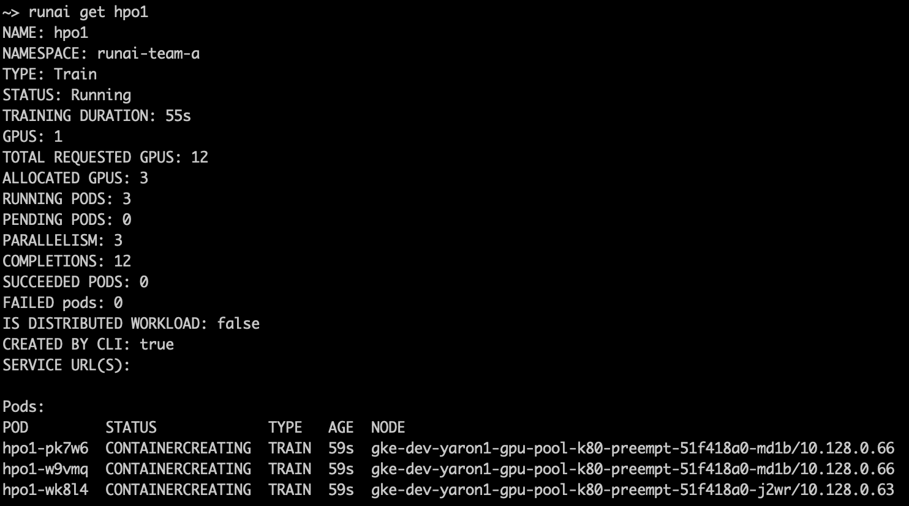

# Quickstart: Hyperparameter Optimization

## Introduction

Hyperparameter optimization (HPO) is the process of choosing a set of optimal hyperparameters for a learning algorithm. A hyperparameter can be a parameter whose value is used to control the learning process, to define the model architecture or the data pre-processing process, etc. Example hyperparameters: learning rate, batch size, different optimizers, number of layers.

To search for good hyperparameters, Researchers typically start a series of small runs with different hyperparameter values, let them run for a while, and then examine results to decide what works best.

There are several strategies for searching the hyperparameter space. Most notable are __Random search__ and __Grid search__. The former, as its name implies, selects parameters at random while the latter does an exhaustive search from a list of pre-selected values.

Run:ai provides the ability to run, manage, and view HPO runs. The following is a Quickstart of such a scenario.

## Prerequisites

To complete this Quickstart you must have:

*   Run:ai software installed on your Kubernetes cluster. See: [Installing Run:ai on a Kubernetes Cluster](../../admin/runai-setup/installation-types.md)
*   Run:ai CLI installed on your machine. See: [Installing the Run:ai Command-Line Interface](../../admin/researcher-setup/cli-install.md)

## Step by Step Walkthrough

### Setup

*  Login to the Projects area of the Run:ai user interface.
*  Add a Project named "team-a".
*  Allocate _2_ GPUs to the Project.
*  On shared storage create a library to store HPO results. E.g. ``/nfs/john/hpo``.

### Pods

With HPO, we introduce the concept of __Pods__. Pods are units of work within a Job. 

* Typically, each Job has a single Pod. However, with HPO as well as with [Distributed Training](walkthrough-distributed-training.md) there are multiple Pods per Job. 
* Pods are independent
* All Pods execute with the same arguments as added via ``runai submit``. E.g. The same image name, the same code script, the same number of Allocated GPUs, and memory.

### HPO Sample Code

The Quickstart code uses the Run:ai HPO python library [github.com/run-ai/docs](https://github.com/run-ai/docs/tree/master/quickstart/hpo){target=_blank}. And needs to be installed within the image. Below are some highlights of the code: 

``` python

# import Run:ai HPO library
import runai.hpo

# select Random search or grid search
strategy = runai.hpo.Strategy.GridSearch

# initialize the Run:ai HPO library. Send the NFS directory used for sync
runai.hpo.init("/nfs")

# pick a configuration for this HPO experiment
# we pass the options of all hyperparameters we want to test
# `config` will hold a single value for each parameter
config = runai.hpo.pick(
grid=dict(
        batch_size=[32, 64, 128],
        lr=[1, 0.1, 0.01, 0.001]),
strategy=strategy)

....

# Use the selected configuration within your code
optimizer = keras.optimizers.SGD(lr=config['lr'])
```

### Run an HPO Workload

*   At the command-line run:

```
runai config project team-a 
runai submit hpo1 -i gcr.io/run-ai-demo/quickstart-hpo -g 1 \
    --parallelism 3 --completions 12 -v /nfs/john/hpo:/nfs
```

*   We named the Job _hpo1_
*   The Job is assigned to _team-a_
*   The Job will be complete when 12 pods will run (_--completions 12_), each allocated with a single GPU (_-g 1_)
*   At most, there will be 3 pods running concurrently (_--parallelism 3_)
*   The Job is based on a sample docker image ``gcr.io/run-ai-demo/quickstart-hpo``. The image contains a startup script that selects a set of hyperparameters and then uses them, as described above. 
*   The command maps a shared volume ``/nfs/john/hpo`` to a directory in the container ``/nfs``. The running pods will use the directory to sync hyperparameters and save results.


Follow up on the Job's status by running:

```
runai list jobs
```

The result:


Follow up on the Job's pods by running:

```
runai describe job hpo1 
```

You will see 3 running pods currently executing:



Once the 3 pods are done, they will be replaced by new ones from the 12 _completions_. This process will continue until all 12 have run.

You can also submit Jobs on another Project until only 2 GPUs remain. This will preempt 1 pod and will henceforth limit the HPO Job to run on 2 pods only. Preempted pods will be picked up and ran later.


You can see logs of specific pods by running :

```
runai logs hpo1 --pod <POD-NAME>
```

where ``<<POD-NAME>>`` is a pod name as appears above in the ``runai describe job hpo1`` output 

The logs will contain a couple of lines worth noting:

> Picked HPO experiment #4

> ...

> Using HPO directory /hpo

> Using configuration: {'batch_size': 32, 'lr': 0.001}

### Examine the Results

The Run:ai HPO library saves the experiment variations and the experiment results to a single file, making it easier to pick the best HPO run. The file can be found in the shared folder. Below is a snapshot of the file for two experiments with two epochs each:

``` YAML
creationTime: 24/08/2020 08:50:06
experiments:
- config:
    batch_size: 32
    lr: 1
  id: 1
  modificationTime: 24/08/2020 08:50:06
  reports:
  - epoch: 0
    metrics:
      acc: 0.09814
      loss: 2.310984723968506
      val_acc: 0.1
      val_loss: 2.3098626373291014
    reportTime: 24/08/2020 08:52:11
  - epoch: 1
    metrics:
      acc: 0.09914
      loss: 2.30994320602417
      val_acc: 0.1
      val_loss: 2.3110838134765626
    reportTime: 24/08/2020 08:54:10
- config:
    batch_size: 32
    lr: 0.1
  id: 2
  modificationTime: 24/08/2020 08:50:36
  reports:
  - epoch: 0
    metrics:
      acc: 0.11012
      loss: 2.2979678358459474
      val_acc: 0.1667
      val_loss: 2.268467852783203
    reportTime: 24/08/2020 08:52:44
  - epoch: 1
    metrics:
      acc: 0.2047
      loss: 2.0894255745697023
      val_acc: 0.2833
      val_loss: 1.8615504817962647
    reportTime: 24/08/2020 08:54:45
```

Finally, you can delete the HPO Job by running:

        runai delete job hpo1


## See Also

For further information on the Run:ai HPO support library see:

* [The Run:ai HPO Support Library](../scheduling/hpo.md)
* Sample code in [Github](https://github.com/run-ai/docs/tree/master/quickstart/hpo){target=_blank}


