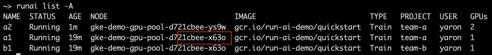

# Quickstart: Over-Quota and Bin Packing

## Goals

The goal of this Quickstart is to explain the concepts of over-quota and bin-packing (consolidation) and how they help in maximizing cluster utilization: 

* Show the simplicity of resource provisioning, and how resources are abstracted from users.
* Show how the system eliminates compute bottlenecks by allowing teams/users to go over their resource quota if there are free GPUs in the cluster.

## Setup and configuration:


To complete this Quickstart, the [Platform Administrator](../../platform-admin/overview.md) will need to provide you with:

* Your cluster should have 4 GPUs on 2 machines with 2 GPUs each.
* _Researcher_ access to two _Projects_  named "team-a" and "team-b"
* Each project should be assigned an exact quota of 2 GPUs. 
* A URL of the Run:ai Console. E.g. [https://acme.run.ai](https://acme.run.ai).
* Run:ai CLI installed on your machine. There are two available CLI variants:

    * The older V1 CLI. See installation [here](../../admin/researcher-setup/cli-install.md)
    * A newer V2 CLI, supported with clusters of version 2.18 and up. See installation [here](../../admin/researcher-setup/new-cli-install.md)

## Login

Run `runai login` and enter your credentials.


## Part I: Over-quota

Open a terminal and run the following command:

=== "CLI V1 [Deprecated]"
    ```
    runai submit a2 -i runai.jfrog.io/demo/quickstart -g 2 -p team-a
    runai submit a1 -i runai.jfrog.io/demo/quickstart -g 1 -p team-a
    runai submit b1 -i runai.jfrog.io/demo/quickstart -g 1 -p team-b
    ```
=== "CLI V2"
    ```
    runai training submit a2 -i runai.jfrog.io/demo/quickstart -g 2 -p team-a
    runai training submit a1 -i runai.jfrog.io/demo/quickstart -g 1 -p team-a
    runai training submit b1 -i runai.jfrog.io/demo/quickstart -g 1 -p team-b
    ```

System status after run:


!!! Discussion
    * team-a has 3 GPUs allocated. Which is over its quota by 1 GPU. 
    * The system allows this over-quota as long as there are available resources
    * The system is at full capacity with all GPUs utilized. 

## Part 2: Basic Fairness via Preemption

Run the following command:

=== "CLI V1 [Deprecated]"

    ```
    runai submit b2 -i runai.jfrog.io/demo/quickstart -g 1 -p team-b
    ```
=== "CLI V2"
    ```
    runai training submit b2 -i runai.jfrog.io/demo/quickstart -g 1 -p team-b
    ```

System status after run:


!!! Discussion
    * team-a can no longer remain in over-quota. Thus, one Job, must be _preempted_: moved out to allow team-b to grow.
    * Run:ai scheduler chooses to preempt Job _a1_.
    * It is important that unattended Jobs will save [checkpoints](../best-practices/save-dl-checkpoints.md). This will ensure that whenever Job _a1_ resume, it will do so from where it left off.

## Part 3: Bin Packing

Run the following command:

=== "CLI V1 [Deprecated]"

    ```
    runai delete job a2 -p team-a
     ```
=== "CLI V2"
    ```
    runai training delete a2
    ```
_a1_ is now going to start running again.

Run:

=== "CLI V1 [Deprecated]"

    ```
    runai list jobs -A
    ```
=== "CLI V2"
    ```
    runai training list -A
    ```

You have __two__ Jobs that are running on the first node and __one__ Job that is running alone the second node. 

Choose one of the two Jobs from the full node and delete it:

=== "CLI V1 [Deprecated]"

    ```
    runai delete job <job-name> -p <project>
    ```
=== "CLI V2"
    ```
    runai training delete <job-name> -p <project>
    ```

The status now is:


Now, run a 2 GPU Job:
=== "CLI V1 [Deprecated]"

    ```
    runai submit a2 -i runai.jfrog.io/demo/quickstart -g 2 -p team-a
    ```
=== "CLI V2"
    ```
    runai training submit a2 -i runai.jfrog.io/demo/quickstart -g 2 -p team-a
    ```
_
The status now is:


!!! Discussion 
    Note that Job _a1_ has been preempted and then restarted on the second node, to clear space for the new _a2_ Job. This is __bin-packing__ or __consolidation__


