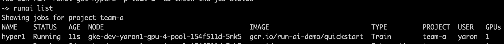
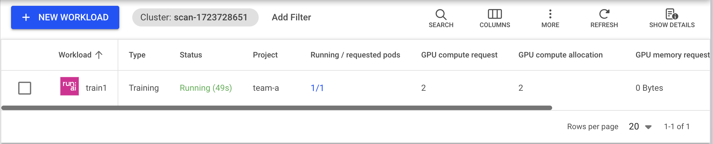
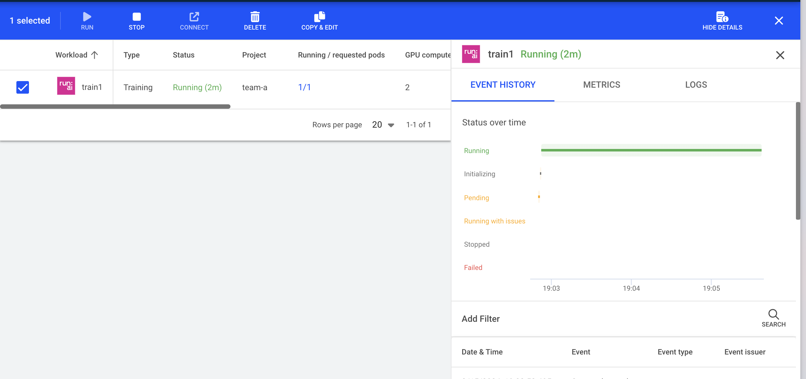
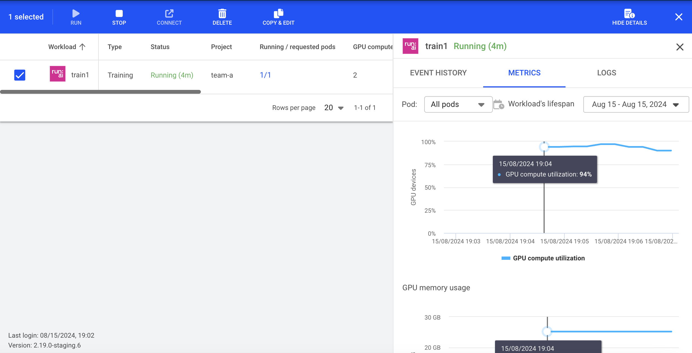

# Quickstart: Launch Unattended Training Workloads

## Introduction

Deep learning workloads can be divided into two generic types:

*   Interactive "build" sessions. With these types of workloads, the data scientist opens an interactive session, via bash, Jupyter notebook, remote PyCharm, or similar and accesses GPU resources directly.
*   Unattended "training" sessions. With these types of workloads, the data scientist prepares a self-running workload and sends it for execution. During the execution, the customer can examine the results.

With this Quickstart you will learn how to:

*   Use the Run:ai command-line interface (CLI) to start a deep learning __training__ workload.
*   View training status and resource consumption using the Run:ai user interface and the Run:ai CLI.
*   View training logs.
*   Stop the training.

## Prerequisites 

To complete this Quickstart you must have:

*   Run:ai software installed on your Kubernetes cluster. See: [Installing Run:ai on a Kubernetes Cluster](../../admin/runai-setup/installation-types.md)
*   Run:ai CLI installed on your machine. See: [Installing the Run:ai Command-Line Interface](../../admin/researcher-setup/cli-install.md)

## Step by Step Walkthrough

### Setup

* Login to the Projects area of the Run:ai user interface.
*  Add a Project named "team-a".
*  Allocate 2 GPUs to the Project.

### Run Workload

*   At the command-line run:

        runai config project team-a
        runai submit train1 -i gcr.io/run-ai-demo/quickstart -g 1

This would start an unattended training Job for team-a with an allocation of a single GPU. The Job is based on a [sample](https://github.com/run-ai/docs/tree/master/quickstart/main){target=_blank} docker image ``gcr.io/run-ai-demo/quickstart``. We named the Job ``train1``

*   Follow up on the Job's progress by running:

        runai list jobs

The result:

Typical statuses you may see:

*   ContainerCreating - The docker container is being downloaded from the cloud repository
*   Pending - the Job is waiting to be scheduled
*   Running - the Job is running
*   Succeeded - the Job has ended

A full list of Job statuses can be found [here](../scheduling/job-statuses.md) 

To get additional status on your Job run:

    runai describe job train1

### View Logs

Run the following:

    runai logs train1

You should see a log of a running deep learning session:

### View status on the Run:ai User Interface

* Open the Run:ai user interface.
* Under "Jobs" you can view the new Workload:

The image we used for training includes the Run:ai Training library. Among other features, this library allows the reporting of metrics from within the deep learning Job. Metrics such as progress, accuracy, loss, and epoch and step numbers.  

*   Progress can be seen in the status column above. 
*   To see other metrics, press the settings wheel on the top right  and select additional deep learning metrics from the list

Under Nodes you can see node utilization:

### Stop Workload

Run the following:

    runai delete job train1

This would stop the training workload. You can verify this by running ``runai list jobs`` again.

## Next Steps

*   Follow the Quickstart document: [Launch Interactive Workloads](walkthrough-build.md)
*   Use your container to run an unattended training workload