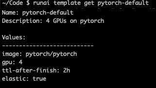

!!! Note
    Templates are currently not supported

---

## Description

Templates are a way to reduce the amount of flags required when running the command ``runai submit``. A template is added by the administrator and is out of scope for this article. A researcher can:

*   Review list of templates by running ``runai template list``
*   Review the contents of a specific template by running ``runai template get <template-name>``
*   Use a template by running ``runai submit --template <template-name>``

The administrator can also set a default template which is always used on ``runai submit`` whenever a template is __not__ specified.

## Synopsis

    runai template get <template-name> 
    runai template list

## Options

<template-name\> the name of the template to run the command on

``runai template list`` will show the list of existing templates.

### Global Flags

--loglevel (string)

>  Set the logging level. One of: debug|info|warn|error (default "info")

## Output

``runai template list`` will show a list of templates. Example:

``runai template get`` to get the template details

Use the template:

    runai submit my-pytorch1 --template pytorch-default

## See Also

See: [Configure Command-Line Interface Templates](../../Administrator/Researcher-Setup/template-config.md) on how to configure templates.