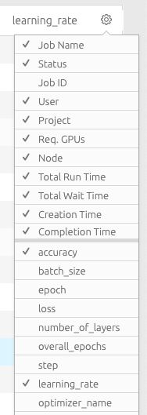

# Researcher Library: Extended Reporting on Workload Progress

The Run:AI Researcher Library is a python library you can add to your deep learning python code. The reporting module in the library will externalize information about the run which can then be available for users of the Run:AI user interface ([https://app.run.ai](https://app.run.ai){target=_blank})

With the reporter module, you can externalize information such as progress, accuracy, and loss over time/epoch and more. In addition, you can externalize custom metrics of your choosing.

## Sending Metrics

### Python Deep-Learning Code

In your command-line run:

    pip install runai

In your python code add:

    import runai.reporter

Create a `Reporter` object as a Python context manager (i.e. with a `with` statement):

    with runai.reporter.Reporter() as reporter:
        pass

Then use `reporter` to send metrics and parameters.

To send a number-based metric report, write:

    reporter.reportMetric(&lt;reporter_metric_name&gt;, &lt;reporter_metric_value&gt;)

For example,

    reporter.reportMetric("accuracy", 0.34)

To send a text-based metric report, write:

    reporter.reportParameter(&lt;reporter_param_name&gt;, &lt;reporter_param_value&gt;)

For example,

    reporter.reportParameter("state", "Training Model")

### Recommended Metrics to send

For the sake of uniformity with the Keras implementation (see below), we recommend sending the following metrics:

<table border="1" cellpadding="1" cellspacing="1" style="width: 600px;">
<tbody>
<tr>
<td style="padding: 6px; width: 160px;"><strong>Metric</strong></td>
<td style="padding: 6px; width: 160px;"><strong>Type</strong></td>
<td style="padding: 6px; width: 160px;"><strong>Frequency of Send</strong></td>
<td style="padding: 6px; width: 220px;"><strong>Description</strong></td>
</tr>
<tr>
<td style="padding: 6px; width: 160px;">accuracy</td>
<td style="padding: 6px; width: 160px;">numeric</td>
<td style="padding: 6px; width: 160px;">Each step</td>
<td style="padding: 6px; width: 220px;">
<ins>Current</ins> accuracy of run</td>
</tr>
<tr>
<td style="padding: 6px; width: 160px;">loss</td>
<td style="padding: 6px; width: 160px;">numeric</td>
<td style="padding: 6px; width: 160px;">Each step</td>
<td style="padding: 6px; width: 220px;">
<ins>Current</ins> result of loss function of run</td>
</tr>
<tr>
<td style="padding: 6px; width: 160px;">learning_rate</td>
<td style="padding: 6px; width: 160px;">numeric</td>
<td style="padding: 6px; width: 160px;">Once</td>
<td style="padding: 6px; width: 220px;">Defined learning rate of run</td>
</tr>
<tr>
<td style="padding: 6px; width: 160px;">step</td>
<td style="padding: 6px; width: 160px;">numeric</td>
<td style="padding: 6px; width: 160px;">Each Step</td>
<td style="padding: 6px; width: 220px;">Current step of run</td>
</tr>
<tr>
<td style="padding: 6px; width: 160px;">number_of_layers</td>
<td style="padding: 6px; width: 160px;">numeric</td>
<td style="padding: 6px; width: 160px;">Once</td>
<td style="padding: 6px; width: 220px;">Number of layers defined for the run</td>
</tr>
<tr>
<td style="padding: 6px; width: 160px;">optimizer_name</td>
<td style="padding: 6px; width: 160px;">text</td>
<td style="padding: 6px; width: 160px;">Once</td>
<td style="padding: 6px; width: 220px;">Name of Deep Learning Optimizer</td>
</tr>
<tr>
<td style="padding: 6px; width: 160px;">batch_size</td>
<td style="padding: 6px; width: 160px;">numeric</td>
<td style="padding: 6px; width: 160px;">Once</td>
<td style="padding: 6px; width: 220px;">Size of batch</td>
</tr>
<tr>
<td style="padding: 6px; width: 160px;">epoch</td>
<td style="padding: 6px; width: 160px;">numeric</td>
<td style="padding: 6px; width: 160px;">Each epoch</td>
<td style="padding: 6px; width: 220px;">Current Epoch number</td>
</tr>
<tr>
<td style="padding: 6px; width: 160px;">overall_epochs</td>
<td style="padding: 6px; width: 160px;">numeric&nbsp;</td>
<td style="padding: 6px; width: 160px;">Once</td>
<td style="padding: 6px; width: 220px;">Total number of epochs</td>
</tr>
</tbody>
</table>

__epoch__ and __overall\_epochs__ are especially important since the job progress bar is computed by dividing these parameters.

## Automatic Sending of Metrics for Keras-Based Scripts

For Keras based deep learning runs, there is support to automate the task of sending metrics.

First, import `runai.reporter.keras` instead of `runai.reporter`.
Second, use `runai.reporter.keras.Reporter` instead of `runai.reporter.Reporter`.

The Keras reporter supports automatic logging.
This could be done in two ways:
1. Passing `autolog=True` upon creation
2. Calling the method `autolog` after creation

After enabling automatic logging, the above metrics will automatically be sent going forward.

For example:

```
with runai.reporter.keras.Reporter(autolog=True) as reporter:
    pass
```

## Adding the Metrics to the User interface

The metrics show up in the Job list of the user interface. To add a metric to the UI

*   Integrate the reporter library into your code
*   Send a metrics via the reporter library
*   Run the workload once to send initial data.
*   Go to Jobs list: [https://app.run.ai/jobs](https://app.run.ai/jobs){target=_blank}
*   On the top right, use the settings wheel and select the metrics you have added


