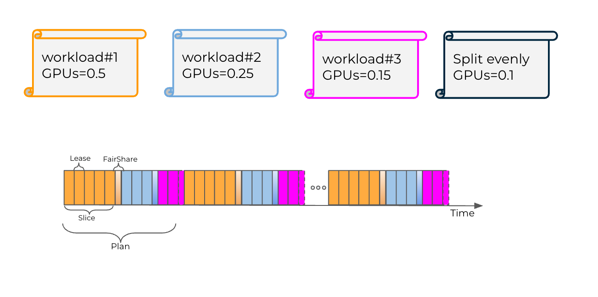

Run:ai supports simultaneous submission of multiple workloads to a single GPU when using fractional GPU workloads. This is achieved by slicing the GPU memory between the different workloads according to the requested GPU fraction, and by using NVidia's GPU orchestrator to share the GPU compute runtime. Run:ai ensures each workload receives the exact share of the GPU memory (= gpu\_memory \* requested), while the NVidia GPU orchestrator splits the GPU runtime evenly between the different workloads running on that GPU. For example, when there are 2 workloads running on the same GPU, each will get 50% of the GPU compute runtime, even if one workload requested 25% of the GPU memory, and the other workload requests 75% of the GPU memory.

## New Time-slicing scheduler by Run:ai

To provide customers with predictable and accurate GPU compute resources scheduling, Run:ai is introducing a new feature called Time-slicing GPU scheduler which adds **fractional compute** capabilities on top of other existing Run:ai **memory fractions** capabilities. Unlike the default NVIDIA GPU orchestrator which doesn’t provide the ability to split or limit the runtime of each workload, Run:ai created a new mechanism that gives each workload **exclusive** access to the full GPU for a **limited** amount of time ([lease time](#timeslicing-plan-and-lease-times)) in each scheduling cycle ([plan time](#timeslicing-plan-and-lease-times)). This cycle repeats itself for the lifetime of the workload.

Using the GPU runtime this way guarantees a workload is granted its requested GPU compute resources proportionally to its requested GPU fraction.

Run:ai offers two new Time-slicing modes:

1. **Strict**&mdash;each workload gets its **precise** GPU compute fraction, which equals to its requested GPU (memory) fraction. In terms of official Kubernetes resource specification, this means:

```
gpu-compute-request = gpu-compute-limit = gpu-(memory-)fraction
```

2. **Fair**&mdash;each workload is guaranteed at least its GPU compute fraction, but at the same time can also use additional GPU runtime compute slices that are not used by other idle workloads. Those excess time slices are divided equally between all workloads running on that GPU (after each got at least its requested GPU compute fraction). In terms of official Kubernetes resource specification, this means:

```
gpu-compute-request = gpu-(memory-)fraction

 or

gpu-compute-limit = 1.0
```

The figure below illustrates how **strict** time-slicing mode is using the GPU from Lease (slice) and Plan (cycle) perspective:



The figure below illustrates how **Fair** time-slicing mode is using the GPU from Lease (slice) and Plan (cycle) perspective:


### Setting the Time-slicing scheduler policy

Time-slicing is a cluster flag which changes the default behavior of Run:ai GPU fractions feature.

Enable time-slicing by setting the following cluster flag in the `runaiconfig` file:

```
global: 
    core: 
        timeSlicing: 
            mode: fair/strict
```

If the `timeSlicing` flag is not set, the system continues to use the default NVidia GPU orchestrator to maintain backward compatability.

## Time-slicing Plan and Lease Times

Each GPU scheduling cycle is a **plan**, the plan time is determined by the lease time and granularity (precision). By default, basic lease time is 250ms with 5% granularity (precision), which means the plan (cycle) time is: 250 / 0.05 = 5000ms (5 Sec). Using these values, a workload that asked to get gpu-fraction=0.5 gets 2.5s runtime out of 5s cycle time.

Different workloads requires different SLA and precision, so it also possible to tune the lease time and precision for customizing the time-slicing capabilities to your cluster.

!!! Note
    Decreasing the lease time makes time-slicing less accurate. Increasing the lease time make the system more accurate, but each workload is less responsive.

Once timeSlicing is enabled, all submitted GPU fraction or GPU memory workloads will have their gpu-compute-request\\limit set automatically by the system, depending on the annotation used on the timeSlicing mode:

### Strict Compute Resources

| **Annotation** | **Value** | **GPU Compute Request** | **GPU Compute Limit** |
| --- |  --- |  --- |  --- |
| `gpu-fraction` | x | x | x |
| `gpu-memory` | x | 0 | 1.0 |

### Fair Compute Resources

| **Annotation** | **Value** | **GPU Compute Request** | **GPU Compute Limit** |
| --- |  --- |  --- |  --- |
| `gpu-fraction` | x | x | 1.0 |
| `gpu-memory` | x | 0 | 1.0 |

!!! Note
     The above tables show that when submitting a workload using gpu-memory annotation, the system will split the GPU compute time between the different workloads running on that GPU. This means the workload can get anything from very little compute time (>0) to full GPU compute time (1.0).
