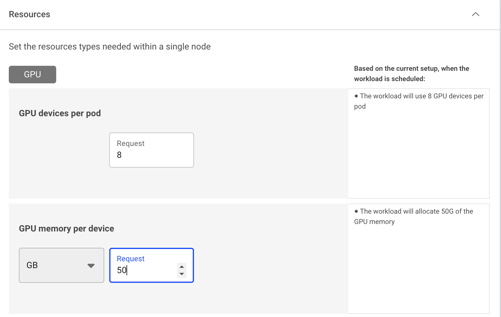
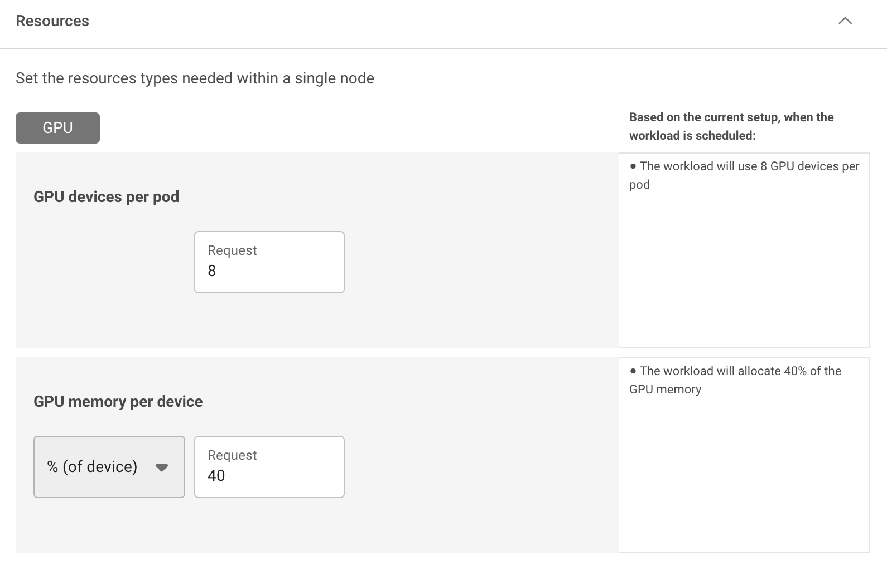

# Allocation of GPU Fractions

##  Introduction

A single GPU has a significant amount of memory. Ranging from a couple of gigabytes in older generations and up to 80GB per GPU in the later models of the latest NVIDIA GPU technology. A single GPU also has a vast amount of computing power. 

This amount of memory and computing power is important for processing large amounts of data, such as in training deep learning models. However, there are quite a few applications that do not need this power. Examples can be inference workloads and the model-creation phase. It would thus be convenient if we could __divide up a GPU__ between various workloads, thus achieving better GPU utilization. 

This article describes a Run:ai technology called __Fractions__ that allow the division of GPUs and how to use them with Run:ai.

## Run:ai Fractions

Run:ai provides the capability to allocate a container with a specific amount of GPU RAM. As a researcher, if you know that your code needs 4GB of RAM. You can submit a job using the flag `--gpu-memory 4G` to specify the exact _portion_ of the GPU memory that you need. Run:ai will allocate your container that specific amount of GPU RAM. Attempting to reach beyond your allotted RAM will result in an out-of-memory exception. 

You can also use the flag `--gpu 0.2` to get 20% of the GPU memory on the GPU assigned for you. 

For more details on Run:ai fractions see the [fractions quickstart](../Walkthroughs/walkthrough-fractions.md).

!!! limitation
    With the fraction technology all running workloads, which utilize the GPU, share the compute in parallel and on average get an even share of the compute. For example, assuming two containers, one with 0.25 GPU workload and the other with 0.75 GPU workload - both will get (on average) an __equal__ part of the computation power. If one of the workloads does not utilize the GPU, the other workload will get the entire GPU's compute power.

!!! Info
    For interoperability with other Kubernetes schedulers, Run:ai creates special _reservation_ pods. Once a workload has been allocated a fraction of a GPU, Run:ai will create a pod in a dedicated `runai-reservation` namespace with the full GPU as a resource. This would cause other schedulers to understand that the GPU is reserved.    

## Multi-GPU Fractions

Run:ai also supports workload submission using multi-GPU fractions. Multi-GPU fractions work similarly to fractional single GPU workloads, however, the Run:ai Scheduler allocates the same fraction size on multiple GPU devices within the same node. For example, if practitioners  develop a new model that uses 8 GPUs and requires 40GB of memory per GPU, they can allocate 8×40GB with multi-GPU fractions instead of reserving the full memory of each GPU (e.g. 80GB). This leaves 40GB of GPU memory available on each of the 8 GPUs for other workloads within that node. This is useful during model development, where memory requirements are usually lower due to experimentation with smaller model or configurations. 

This approach significantly improves GPU utilization and availability, enabling more precise and often smaller quota requirements for the end user. Time sharing where single GPUs can serve multiple workloads with fractions remains unchanged, only now, it serves multiple workloads using multi-GPU per workload, single GPU per workload, or a mix of both.

### Configuring Multi-GPU Fractions

Using the [compute resources](../workloads/assets/compute.md) asset,  you can define the compute requirement to run multiple GPU devices, by specifying either a fraction (percentage) of the overall memory or specifying the memory request (GB, MB): 

## See Also

* Fractions [quickstart](../Walkthroughs/walkthrough-fractions.md).

