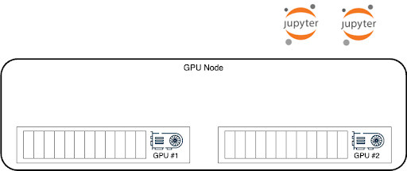

The Node Level Scheduler optimizes the performance of your pods and maximizes the utilization of GPUs by making optimal local decisions on GPU allocation to your pods. While the Cluster Scheduler chooses the specific node for a POD, but has no visibility to node’s GPUs internal state, the Node Level Scheduler is aware of the local GPUs states and makes optimal local decisions such that it can optimize both the GPU utilization and pods’ performance running on the node’s GPUs.

Node Level Scheduler applies to all workload types, but will best optimize the performance of burstable workloads, giving those more GPU memory than requested and up to the limit specified. Be aware, burstable workloads are always susceptible to an OOM Kill signal if the owner of the excess memory requires it back. This means that using the Node Level Scheduler with Inference or Training workloads may cause pod preemption. Interactive workloads that are using notebooks behave differently since the OOM Kill signal will cause the Notebooks' GPU process to exit but not the notebook itself. This keeps the Interactive pod running and retrying to attach a GPU again. This makes Interactive workloads with notebooks a great use case for burstable workloads and Node Level Scheduler.

## Interactive Notebooks Use Case

Consider the following example of a node with 2 GPUs and 2 interactive pods that are submitted and want GPU resources.



The Scheduler instructs the node to put the two pods on a single GPU, bin packing a single GPU and leaving the other free for a workload that might want a full GPU or more than half GPU. However that would mean GPU#2 is idle while the two notebooks can only use up to half a GPU, even if they temporarily need more.


However, with Node Level Scheduler enabled, the local decision will be to spread those two pods on two GPUs and allow them to maximize bot pods’ performance and GPUs’ utilization by bursting out up to the full GPU memory and GPU compute resources.


The Cluster Scheduler still sees a node with a full empty GPU.
When a 3rd pod is scheduled, and it requires a full GPU (or more than 0.5 GPU), the scheduler will send it to that node, and Node Level Scheduler will move one of the Interactive workloads to run with the other pod in GPU#1, as was the Cluster Scheduler initial plan.


This is an example of one scenario that shows how Node Level Scheduler locally optimizes and maximizes GPU utilization and pods’ performance.

## How to configure Node Level Scheduler

Node Level Scheduler can be enabled per Node-Pool, giving the Administrator the option to decide which Node-Pools will be used with this new feature.

To use Node Level Scheduler the Administrator should follow the steps:

1. Enable Node Level Scheduler at the cluster level (per cluster), edit the `runaiconfig` file and set:

    ```YAML
    spec: 
      global: 
          core: 
            nodeScheduler:
            enabled: true
    ```

    The Administrator can also use this patch command to perform the change:

    ```bash
    kubectl patch -n runai runaiconfigs.run.ai/runai --type='merge' --patch '{"spec":{"global":{"core":{"nodeScheduler":{"enabled": true}}}}}'
    ```

2. To enable ‘GPU resource optimization’ on your tenant’s, go to your tenant’s UI and press *Tools & Settings*, *General*, the open the *Resources* pane and toggle *Resource Optimization* to on.

3. To enable ‘Node Level Scheduler’ on any of the Node Pools you want to use this feature, go to the tenant’s UI ‘Node Pools’ tab (under ‘Nodes’), and either create a new Node-Pool or edit an existing Node-Pool. In the Node-Pool’s form, under the ‘Resource Utilization Optimization’ tab, change the ‘Number of workloads on each GPU’ to any value other than ‘Not Enforced’ (i.e. 2, 3, 4, 5).

The Node Level Scheduler is now ready to be used on that Node-Pool.
