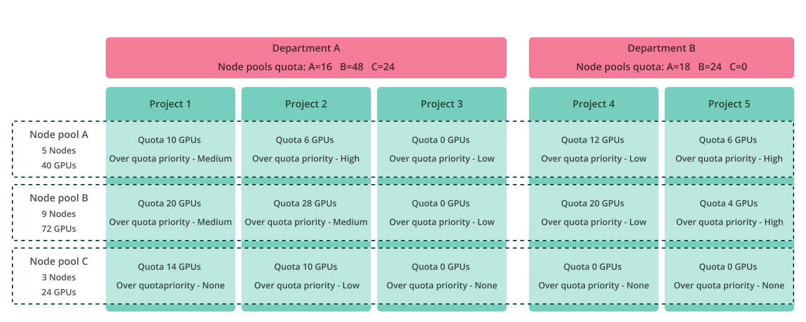
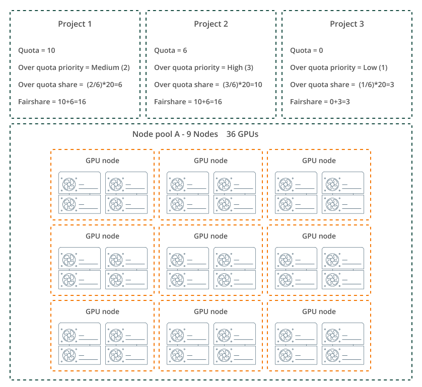

  
Each time a user submits a workload via the Run:ai platform, through a 3rd party framework, or directly to Kubernetes APIs, the submitted workload goes to the selected Kubernetes cluster, and is handled by the Run:ai Scheduler.

The Scheduler’s main role is to find the best-suited node or nodes for each submitted workload. The nodes must match the resources and other characteristics requested by the workload, while adhering to the quota and fairness principles of the Run:ai platform. A workload can be a single pod running on a single node, or a distributed workload using multiple pods, each running on a node (or part of a node). It is not rare to find large training workloads using 128 nodes and even more, or inference workloads using many pods (replicas) and nodes. There are numerous types of workloads, some are Kubernetes native and some are 3rd party extensions on top of Kubernetes native pods. The Run:ai Scheduler schedules any Kubernetes native workloads, Run:ai workloads, or any other type of 3rd party workload.

## Scheduler basics

Set out below are some basic terms and information regarding the Run:ai Scheduler.

### Terminology

This section describes the terminology and building blocks of the Run:ai scheduler, it also explains some of the scheduling principles used by the Run:ai scheduler.

#### Workloads and Pod-Groups

The Run:ai scheduler attaches any newly created pod to a pod-group. A pod-group may contain one or more pods representing a workload. For example, if the submitted workload is a PyTorch distributed training with 32 workers, a single pod-group is created for the entire workload, and all pods are then attached to the pod-group with certain rules that may apply to the pod-group itself, for example, _gang scheduling_.

#### Scheduling queue

A scheduling queue (or simply a queue) represents a scheduler primitive that manages the scheduling of workloads based on different parameters. A queue is created for each project/node pool pair and department/node pool pair. The Run:ai scheduler supports hierarchical queueing, project queues are bound to department queues, per node pool. This allows an organization to manage quota, over-quota, and other characteristics for projects and their associated departments.

#### Priority and Preemption

Run:ai supports scheduling workloads using different priorities and preemption policies. In the Run:ai scheduling system, higher priority workloads (pods) may preempt lower priority workloads (pods) __within the same__ scheduling queue (project), according to their Preemption policy. Run:ai Scheduler implicitly assumes any PriorityClass >= 100 is non-preemptible and any PriorityClass < 100 is preemptible.

Cross project and cross department workload preemptions are referred to as _Resource reclaim_ and are based on fairness between queues rather than the priority of the workloads.

To make it easier for users to submit AI workloads, Run:ai preconfigured several Kubernetes PriorityClass objects, the Run:ai preset PriorityClass objects have their _preemptionPolicy_ always set to _PreemptLowerPriority_, regardless of their actual Run:ai preemption policy within the Run:ai platform.

| PriorityClass Name | PriorityClass | Run:ai preemption policy | K8S preemption policy |
| ----- | ----- | ----- | ----- |
| Inference | 125 | Non-preemptible | PreemptLowerPriority |
| Build | 100 | Non-preemptible | PreemptLowerPriority |
| Interactive-preemptible | 75 | Preemptible | PreemptLowerPriority |
| Train | 50 | Preemptible | PreemptLowerPriority |

#### Quota

Each project and department includes a set of guaranteed resource quotas per node pool per resource type. For example, Project LLM-Train/Node Pool NV-H100 quota parameters specify the number of GPUs, CPUs(cores), and the amount of CPU memory that this project guarantees for that node pool.

#### Over-quota

Projects and departments can have a share in the unused resources of any node pool, beyond their quota of resources. We name these resources as over quota resources. The admin configures the over-quota parameters per node pool for each project and department.

#### Over quota priority

Projects can receive a share of the cluster/node pool unused resources when the over-quota priority setting is enabled, the part each Project receives depends on its over-quota priority value, and the total weights of all other projects’ over-quota priorities. The admin configures the over-quota priority parameters per node pool for each project and department.

#### Fairshare and fairshare balancing

Run:ai Scheduler calculates a numerical value per project (or department) for each node-pool, representing the project’s (department’s) sum of guaranteed resources plus the portion of non-guaranteed resources in that node pool. We name this value fairshare.

The scheduler strives to provide each project (or department) the resources they deserve using two main parameters - deserved quota and deserved fairshare (i.e. quota + over quota resources), this is done per node pool. If one project’s node pool queue is below fairshare and another project’s node pool queue is above fairshare, the scheduler shifts resources between queues to balance fairness; this may result in the preemption of some over-quota preemptible workloads.

#### Over-subscription

Over-subscription is a scenario where the sum of all guaranteed resource quotas surpasses the physical resources of the cluster or node pool. In this case, there may be scenarios in which the scheduler cannot find matching nodes to all workload requests, even if those requests were within the resource quota of their associated projects.

#### Gang scheduling

Gang scheduling describes a scheduling principle where a workload composed of multiple pods is either fully scheduled (i.e. all pods are scheduled and running) or fully pending (i.e. all pods are not running). Gang scheduling refers to a single pod group.

#### Fairness (fair resource distribution)

Fairness is a major principle within the Run:ai scheduling system. In essence, it means that the Run:ai Scheduler always respects certain resource splitting rules (fairness) between projects and between departments.

#### Preemption of lower priority workloads within a project

Workload priority is always respected within a project. This means higher priority workloads are scheduled before lower priority workloads, it also means that higher priority workloads may preempt lower priority workloads within the same project __if the lower priority workloads are preemptible__.

#### Reclaim of resources between projects and departments

Reclaim is an inter-project (and inter-department) scheduling action that takes back resources from one project (or department) that has used them as over-quota, back to a project (or department) that deserves those resources as part of its guaranteed quota, or to balance fairness between projects, each to its fairshare (i.e. sharing fairly the portion of the unused resources).

#### Multi-Level quota system

Each project has a set of guaranteed resource quotas (GPUs, CPUs, and CPU memory) per node pool. Projects can go over-quota and get a share of the unused resources (over-quota) in a node pool beyond their guaranteed quota in that node pool. __The same applies to Departments__. The Scheduler balances the amount of over quota between departments, and then between projects.

#### Placement strategy - bin-pack and spread

The admin can set per node pool placement strategy of the scheduler for GPU based workloads and for CPU-only based workloads.

Each type’s strategy can be either bin-pack or spread.

GPU workloads:

* Bin-pack means the Scheduler places as many workloads as possible in each GPU and each node to use fewer resources and maximize GPU and node vacancy.  
* Spread means the Scheduler spreads workloads across as many GPUs and nodes as possible to minimize the load and maximize the available resources per workload.  
* GPU workloads are workloads that request both GPU and CPU resources.

CPU workloads:

* Bin-pack means the scheduler places as many workloads as possible in each CPU and node to use fewer resources and maximize CPU and node vacancy.  
* Spread means the scheduler spreads workloads across as many CPUs and nodes as possible to minimize the load and maximize the available resources per workload.  
* CPU workloads are workloads that request only CPU resources

## Scheduler deep dive

### Allocation

When a user submits a workload, the workload controller creates a pod or pods (for distributed training workloads or a deployment based Inference). When the scheduler gets a submit request with the first pod, it creates a pod group and allocates all the relevant building blocks of that workload. The next pods of the same workload are attached to the same pod group.

A workload, with its associated pod group, is queued in the appropriate queue. In every scheduling cycle, the Scheduler ranks the order of queues by calculating their precedence for scheduling.

The next step is for the scheduler to find nodes for those pods, assign the pods to their nodes (bind operation), and bind other building blocks of the pods such as storage, ingress etc.

If the pod-group has a _gang scheduling_ rule attached to it, the scheduler either allocates and binds all pods together, or puts all of them into the pending state. It retries to schedule them all together in the next scheduling cycle.

The scheduler also updates the status of the pods and their associate pod group, users are able to track the workload submission process both in the CLI or Run:ai UI.

### Preemption

If the scheduler cannot find resources for the submitted workloads (and all of its associated pods), and the workload deserves resources either because it is under its queue quota or under its queue fairshare, the scheduler tries to reclaim resources from other queues; if this doesn’t solve the resources issue, the scheduler tries to preempt lower priority preemptible workloads within the same queue.

#### Reclaim preemption between projects (and departments)

Reclaim is an inter-project (and inter-department) resource balancing action that takes back resources from one project (or department) that has used them as an over-quota, back to a project (or department) that deserves those resources as part of its deserved quota, or to balance fairness between projects (or departments), so a project (or department) doesn’t exceed its fairshare (portion of the unused resources).

This mode of operation means that a lower priority workload submitted in one project (e.g. training) can reclaim resources from a project that runs a higher priority workload (e.g. preemptive workspace) if fairness balancing is required.

!!! Note
    Only preemptive workloads can go over-quota as they are susceptible to reclaim (cross-projects preemption) of the over-quota resources they are using. The amount of over-quota resources a project can gain depends on the over-quota priority or quota (if over-quota priority is disabled). Departments’ over-quota is always proportional to its quota.

#### Priority preemption within a project

Higher priority workloads may preempt lower priority preemptible workloads within the same project/node pool queue. For example, in a project that runs a training workload that exceeds the project quota for a certain node pool, a newly submitted workspace within the same project/node pool may stop (preempt) the training workload if there are not enough over-quota resources for the project within that node pool to run both workloads (e.g. workspace using in-quota resources and training using over-quota resources).

There is no priority notion between workloads of different projects.

### Quota, over-quota, and fairshare

Run:ai scheduler strives to ensure fairness between projects and between departments, this means each department and project always strive to get their deserved quota, and unused resources are split between projects according to known rules (e.g. over-quota weights).

If a project needs more resources even beyond its fairshare, and the scheduler finds unused resources that no other project needs, this project can consume resources even beyond its fairshare.

Some scenarios can prevent the scheduler from fully providing the deserved quota and fairness promise, such as fragmentation or other scheduling constraints like affinities, taints etc.

The example below illustrates a split of quota between different projects and departments, using several node pools:

__Legend:__

* __OQP__ = Over-quota priority
* __OQ__ = Over-quota

The example below illustrates how fairshare is calculated per project/node pool and per department/node pool for the above example:

The __Over quota (OQ)__ portion of each Project (per node pool) is calculated as:

    [(OQ-Priority) / (Σ Projects OQ-Priorities)] x (Unused Resource per node pool)

__Fairshare(FS)__ is calculated as: the sum of Quota + Over-Quota

Let’s see how Project 2 __over quota__ and __fairshare__ are calculated:

For this example, we assume that out of the 40 available GPUs in node pool A, 20 GPUs are currently unused (unused means either not part of any project’s quota, or part of a project’s quota but not used by any workloads of that project).

Project 2 __over quota__ share:

    [(Project 2 OQ-Priority) / (Σ all Projects OQ-Priorities)] x (Unused Resource within node pool A)

    [(3) / (2 + 3 + 1)] x (20) = (3/6) x 20 = 10 GPUs

__Fairshare__ = deserved quota + over quota = 6 +10 = 16 GPUs

Similarly, fairshare is also calculated for CPU and CPU memory.

The scheduler can grant a project more resources than its fairshare if the scheduler finds resources not required by other projects that may deserve those resources.

One can also see in the above illustration that Project 3 has no guaranteed quota, but it still has a share of the excess resources in node pool A. Run:ai Scheduler ensures that Project 3 receives its part of the unused resources for over quota, even if this results in reclaiming resources from other projects and preempting preemptible workloads.

### Fairshare balancing

The Scheduler constantly re-calculates the fairshare of each project and department (per node pool, represented in the scheduler as queues), resulting in the re-balancing of resources between projects and between departments. This means that a preemptible workload that was granted resources to run in one scheduling cycle, can find itself preempted and go back to the pending state waiting for resources on the next cycle.

A queue, representing a scheduler-managed object for each Project or Department per node pool, can be in one of 3 states:

* __In-quota __ 
  The *queue’s allocated resources* ≤ queue deserved quota  
* __Over-quota (but below fairshare) __ 
  The queue’s deserved quota < *queue’s allocates resources* <= queue’s fairshare  
* __Over-Fairshare (and over-quota)__  
  The queue’s fairshare < *queue’s allocated resources*

The scheduler’s first priority is to ensure each queue (representing a project/node pool or department/node pool scheduler object) receives its deserved quota. Then the scheduler tries to find and allocate more resources to queues that need resources beyond their deserved quota and up to their fairshare, finally, the scheduler tries to allocate resources to queues that need even more resources - beyond their fairshare.

When re-balancing resources between queues of different projects and departments, the scheduler goes in the opposite direction, i.e. first take resources from over-fairshare queues, then from over-quota queues, and finally, in some scenarios, even from queues that are below their deserved quota.

## Summary

The scheduler’s role is to bind any submitted pod to a node that satisfies the pod’s requirements and constraints while adhering to the Run:ai quota and fairness system. In some scenarios, the scheduler finds a node for a pod (or nodes for a group of pods) immediately. In other scenarios, the scheduler has to preempt an already running workload to “make room”, while sometimes a workload becomes pending until resources are released by other workloads (e.g. wait for other workloads to terminate), and only then it is scheduled and run.

Other than scenarios where the requested resources or other constraints cannot be met within the cluster, either because the resources physically don’t exist (e.g. a node with 16 GPUs, or a GPU with 200GB of memory), or a combination of constraints cannot be matched (e.g. a GPU with 80GB of memory together with a node with specific label or storage type), the scheduler eventually finds any workload its matching nodes to use, but this process may take some time.

The Run:ai scheduler adheres to Kubernetes standard rules, but it also adds a layer of fairness between queues, queue hierarchy, node pools, and many more features, making the scheduling and Quota management more sophisticated, granular, and robust. The combination of these scheduler capabilities results in higher efficiency, scale, and maximization of cluster utilization.

