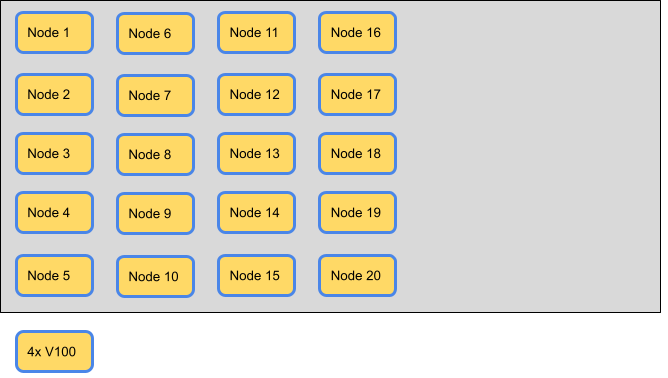

## Introduction

Run:ai version 2.8 introduced a new building block to assist in managing resources effectively - node-pools.
A node-pool is a set of nodes grouped into a bucket of resources using a predefined or administrator-defined label (key & value). Typically, those nodes share a common feature or property, such as GPU type or other HW capability (such as Infiniband connectivity) or represent a proximity group (i.e. nodes interconnected via a local ultra-fast switch). Those nodes would typically be used by researchers to run specific workloads on specific resource types, or by MLops engineers to run specific Inference workloads that require specific node types. 

### Enabling Node-Pools
After upgrading from version 2.7 or older to version 2.8 or newer, the ‘Node Pools’ feature is disabled by default. Once the feature is enabled by the administrator, all nodes in each of your upgraded clusters are associated with the ‘Default’ node pool.
* To use node-pools - enable this feature under ‘Settings->General’, set ‘Enable Node Pools’ switch.
* To manage CPU resources - enable this feature under ‘Settings->General’, set ‘Enable CPU Resources Quota’.

### Creating and using Node-Pools
An administrator creates logical groups of nodes by specifying a unique label (key & value) and associating it with a node-pool. Run:ai allows an administrator to use any label key and value as the designated node-pool label (e.g. gpu-type = A100 or faculty = computer-science). Each node-pool has its unique name and label.
Once a new node-pool is created, it is automatically assigned to all Projects and Departments with a quota of zero GPU resources and CPU resources. This allows any Project and Department to use any node pool when over-quota is enabled, even if the administrator did not assign a quota for a specific node-pool.

Using resources with over-quota means those resources might be reclaimed by other Projects or Departments that have assigned quota in place for those node-pools. On the other hand, this pattern allows for high utilization of GPU and CPU resources.
An administrator should assign resources from a node-pool to any project for which the administrator wants to guarantee reserved resources on that node pool. The reservation should be done for GPU resources and CPU resources. Projects and Departments with no reserved resources for a specific node-pool can still use node-pools resources, but the resources are not reserved and can be reclaimed by the resources owner Project (or Department).

Creating a new node-pool and assigning resources from a node-pool to Projects and Departments is an operation limited to Administrators only. Researchers can use node-pools when 
submitting a new workload. By specifying the node pool from which a workload allocates resources, the scheduler shell launch that workload on a node that is part of the specified node pool. If no node-pool is selected by a workload, the ‘Default’ node-pool is used. 

### Node-Pools Best Practices
Node-pools give administrators the ability to manage quotas in a more granular manner than the Project level, allowing them to specify which Projects are assigned guaranteed resources on specific sets of nodes to be then used by Workloads that need specific node characteristics. Any Project can use any Node-Pool, even if a quota was not assigned to the Node-Pool, it can still be used in Over-Quota manner.
As a rule of thumb, it is best for the administrator to split the organization's GPU deployment to the smallest number of node-pools that still serves its purpose, this would help in keeping each pool large enough and minimize the probability that the Run:ai scheduler would not be able to find available resources on a specific node-pool.

#### Common use-cases
- Training workloads that require specific GPU-type nodes, either because of the scale of parameters (computation time) or for other specific GPU capabilities
- Inference workloads that require specific GPU-type nodes to comply with constraints such as execution time
- Workloads that require proximity of nodes for purposes of local ultra-fast networking
- Organizations where specific nodes belong to specific a  department, and while assuring quota for that department and its subordinated projects, the administrator also wants to let other departments and projects use those nodes when not used by the resource owner
- Projects that need to use specific resources, but also ensure others will not occupy those resources

### Plan your Node-Pools deployment

Let's look at an example of an organization's deployment which consists of 20 GPU nodes, each node includes 4 GPUs of type V100, total of 80 GPUs of type V100. The organization has two departments, one is the R&D department, using GPUs for Build and Training workloads. The other department is the ML-Ops department using GPUs for Inference workloads. Each department owns 20 GPUs and is split into 4 Projects representing R&D teams and ML-OPS teams running specific applications respectively. Any workload can use any node since all GPUs are similar, their usage is limited only by their department's and projects' respective quotas, and their respective over-quota fare share of resources.

For the development of new AI models, the organization has purchased 5 nodes of 4xA100 GPUs each GPU with 40GB of memory to be used by Inference workloads (ML-OPS department), and another 5 nodes of 4xA100 GPU each GPU with 80GB of memory to be used by Build and Training workloads (R&D department). The administrator wants to assign the new nodes to the respective departments and projects while allowing any project and department to use any of the GPUs when not used by its owner. 

Once the new nodes are added and discovered by Run:ai, they become part of the 'Default' node-pool.

