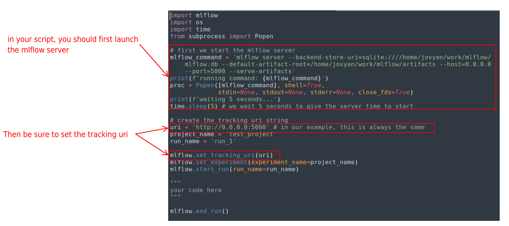

# Using MLflow with Run:ai  
  
__A 10-minute video of a live demo can be found [here](https://youtu.be/EwOW-OBosuY){target=_blank}__  
  
Full content can be found at the GitHub repository [here](https://github.com/run-ai/docs/tree/master/docs/use-cases/runai_mlflow_demo){target=_blank}.  
  
## Description  

This repository details an example of how to integrate Run:ai with MLflow.   
It consists of 3 basic steps:  
  
1. Create a persistent directory on the NFS 
    + called 'MLflow' in our example
    + to hold the MLflow database and artifact folder.
2. Create a docker image with MLflow and jupyter-server-proxy installed
    + jupyter-server-proxy is used to access the MLflow UI
3. Run python scripts by submitting jobs to the scheduler, using the created docker image.  

## MLflow introduction 
### what does MLflow need?  

Two things are needed for MLflow:  

1. A Database to store information related to experiment runs.
2. An Artifacts folder to store objects related to the runs. 

  
  
### How does MLflow work?  

__1. First we start the server with a CLI command__  

Running either of these commands will automatically create a database in the local directory if one does not exist.  
  
~~~bash
MLflow ui
~~~  
  
~~~bash
MLflow server
~~~  
  
We can also choose to specify the location of the database, and artifact folder, as well as the host IP, and port.  

~~~bash
MLflow server \
    --backend-store-uri=sqlite:///abs/path/to/db/mlflow.db \
     --default-artifact-root=/abs/path/to/artifacts \
     --host=0.0.0.0 \
     --port=5000 
~~~  

__2. Call MLflow commands within the python script__  

you’ll want to import MLflow, then set the tracking uri so that MLflow will save everything to the database and artifact folder.  
  
Then you’ll want to start your run, and at the end, you’ll want to end the run.  
  
~~~python
import MLflow

mlflow.set_tracking_uri('0.0.0.0:5000')
mlflow.start_run()

"""
your code here
"""

mlflow.end_run()
~~~  
  
## MLflow with run:ai  
### What is needed to run MLflow on Run:ai?  

1. A persistent directory to keep
    + MLflow database
    + MLflow artifacts folder
2. A docker image with the following installed
    + MLflow
    + jupyterlab*
    + jupyter-server-proxy*  
  
\*needed in to access the MLflow UI  

### Creating a Persistent Folder

We need to create an ‘MLflow’ folder on our NFS.  

  
  
  
  
  
  
### Docker Image

The docker image we will use is [jonathancosme/mlflow-ui](https://hub.docker.com/repository/docker/jonathancosme/mlflow-ui){target=_blank}. 
The `dockerfile` will show as:  

   
  
To access the MLflow UI, we need to add this entry to the `jupyter_server_config.py` file, and replace the existing file in the image:  

  

## Accessing the MLflow User Interface
Create a jupyter interactive job with:  
  
+ Image [jonathancosme/mlflow-ui](https://hub.docker.com/repository/docker/jonathancosme/mlflow-ui){target=_blank}.
+ Mounted NFS folder (with ‘mlflow’ folder) in default jupyter work directory
  
  
  
  
  
A new tab should appear with the MLflow user interface  
  
  
  
## Running MLflow Experiments with Run:ai
### Python Scripts  

  
  
### CLI submission
Our example scripts are located here:  
  
  
  
Thus, our CLI command would look like this:  
  
~~~bash
runai submit \
    --project testproj \
    --gpu 0 \
    --job-name-prefix mlflow-demo \
    --image jonathancosme/mlflow-ui \
    --volume /home/jonathan_cosme/jcosme:/home/jovyan/work \
    -- python work/projects/mlflow_demo/mlflow_demo_1.py
~~~  
  
 
  
### Example Job Submission

 

