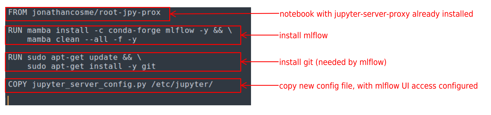
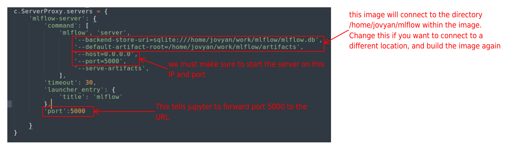

# Jupyter notebook with MLflow UI access (python 3.8) and root privileges 

This uses the base image [jonathancosme/root-jpy-prox](https://hub.docker.com/repository/docker/jonathancosme/root-jpy-prox).  
The github repo for the image can be found [here](https://github.com/jonathancosme/root-jpy-prox)

This image is publicly available here:  
[jonathancosme/MLflow-ui](https://hub.docker.com/repository/docker/jonathancosme/MLflow-ui)  

There are two components:  

Here is the explanation for the **Dockerfile** file:  
  

The **jupyter_server_config.py** file is the same as the one found [here](https://github.com/jupyter/docker-stacks/blob/main/base-notebook/jupyter_server_config.py), with the addition of the following:  
   
