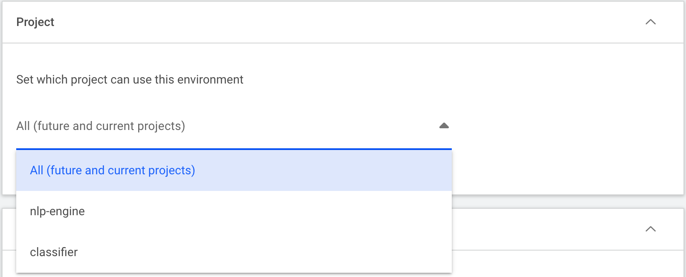

# Creating a new environment

To create an environment:

* Select the `New Environment` button.
* Give the environment a meaningful name.
* Select the project the environment will reside in.

An Environment is assigned to a single project or all projects (current and future ones). The latter option can only be created by a Run:ai administrator. A compute resource, by design, is shared with all project members.

## Set the container image

Enter the image URL path as well as a policy for pulling the image from the image repository.

## Select the relevant tools
In a single environment, it is possible to add as many tools as needed (or none at all).

Tools can be:

* Different applications such as Code editor IDEs (e.g VS Code), Experiment tracking (e.g. Weight and Biases), visualization tools (e.g. Tensor Board), and more.
* Open source tools (e.g Jupyter notebook) or commercial 3rd party tools (e.g. MATLAB)

It is also possible to set up a custom tool used by the organization.

For each tool, you must set the type of connection interface and port. If not set, default values are provided. The supported connection types are:

* External URL:  This connection type allows you to connect to your tool either by inserting a custom URL or having one generated for you. Either way, the URL should be unique per workspace as many workspaces may use the same environment. If the URL type was set to custom, the URL will be requested from the Researcher upon creating the workspace.
* External node port: A [NodePort](../../../../admin/runai-setup/config/allow-external-access-to-containers.md) exposes your application externally on every host of the cluster, access the tool using `http://<HOST_IP>:<NODEPORT>` (e.g http://203.0.113.20:30556).

!!! Note
    Selecting a tool is not sufficient to have it up and running. To actually configure a tool you need additional steps:

    * The container image needs to support the tool. 
    *  The administrator must configure a DNS record and certificate as described [here](../../../../admin/runai-setup/config/allow-external-access-to-containers.md#workspaces-configuration).
    
## Configure runtime settings

Per environment, the creating user (either Researcher or administrator) is allowed to set the command running in the container. This command will be visible in the workspace creation form, although it will not be editable (e.g. a python command). In addition, the researcher can add arguments that can be edited upon creating a workspace using this environment. Similarly, environment variables can be added to the environments, but these can be edited in the workspace creation form.

!!! Note 
    The value of an environment variable can be left empty for the researcher to fill in upon workplace creation.

Examples:

1. WANDB
2. UID and GID of the user when launching a Jupyter notebook. 

In addition, in the environment, it is possible to set the path to the working directory that will be used as the current directory when the container running the created workload starts.

It is possible to either use the exact UID and GID defined in the image. However, in many cases, it can be with root privileges so it is possible to override it. If [single sign on](../../../../admin/runai-setup/authentication/sso.md) is configured, the UID and GID to be used will be the ones of the logged researcher that creates the workspace, otherwise, the researcher creating the workspace will be guided to provide it upon workspace creation form.

