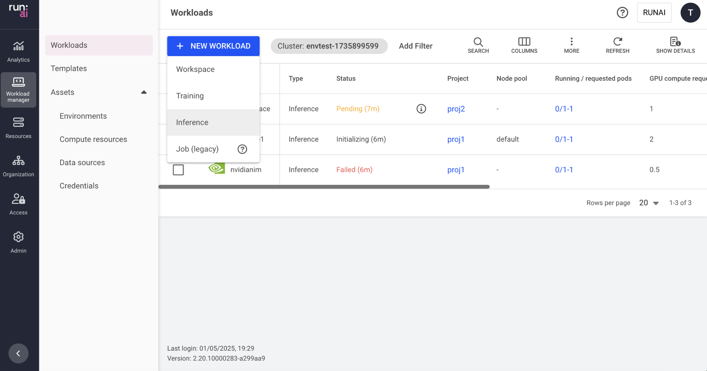

# Deploy a custom inference workload

This article explains how to create a custom inference workload via the Run:ai UI.

An inference workload provides the setup and configuration needed to deploy your trained model for real-time or batch predictions. It includes specifications for the container image, data sets, network settings, and resource requests required to serve your models.

The inference workload is assigned to a project and is affected by the project’s quota.

To learn more about the inference workload type in Run:ai and determine that it is the most suitable workload type for your goals, see [Workload types](../overviews/workload-types.md).

## Creating a custom inference workload

Before you start, make sure you have a project.

To add a new custom inference workload:

1.  Go to the Workload manager → Workloads
2.  Click __+NEW WORKLOAD__ and select __Inference__  
    Within the new inference form:
3.  Select under which __cluster__ to create the inference workload
4.  Select the __project__ in which your inference will run
5. Select __custom__ inference from __Inference type__ 

    !!! Note 
        Selecting the Inference type is disabled by default. If you cannot see it in the menu, then it must be enabled by your Administrator, under General settings → Workloads → Models.

6.  Enter a unique __name__ for the inference workload (if the name already exists in the project, you will be requested to submit a different name)
7.  Click __CONTINUE__  
    In the next step:
8.  Select the __environment__ for your inference workload
    *   Select an environment or click __+NEW ENVIRONMENT__ to add a new environment to the gallery.  
        For a step-by-step guide on adding environments to the gallery, see [Environments](../assets/environments.md). Once created, the new environment will be automatically selected.
    *   Set an inference __serving endpoint__. The connection protocol and the container port are defined within the environment
        * Optional: Modify who can access the endpoint
            * __Public (default)__
               
                Everyone within the network can access the endpoint with no authentication
            
            * __All authenticated users__ 
                
                Everyone within the organization’s account that can log in (to Run:ai or SSO)
            
            * __Specific group(s)__ 
                * Click __+GROUP__
                * Enter __group names__ as they appear in your identity provider. You must be a member of one of the groups listed to have access to the endpoint.
           
            * __Specific user(s)__
                * Click __+USER__ 
                * Enter a valid email address or username. If you remove yourself, you will lose access to the endpoint.

    *   Set the connection for your __tool(s)__. The tools are configured as part of the environment.
        *   __External URL__
            *   __Custom URL__
                *   Set the URL
            *   Optional: Modify who can __access__ the tool:
                *   __All authenticated users__ (default)  
                    Everyone within the organization’s account
                *   __Specific group(s)__
                     * Click __+GROUP__
                     * Enter __group names__ as they appear in your identity provider. You must be a member of one of the groups listed to have access to the tool.
                *    __Specific user(s)__
                     * Click __+USER__
                     * Enter a valid email address or username. If you remove yourself, you will lose access to the tool.
        *   __Node port__
            *   __Custom port__
                *   Set the node port (enter a port between 30000 and 32767; if the node port is already in use, the workload will fail and display an error message)
    *   Optional: Set the __command and arguments__ for the container running the workload  
        If no command is added, the container will use the image’s default command (entry-point).
        *   Modify the existing command or click __+COMMAND & ARGUMENTS__ to add a new command.
        *   Set multiple arguments separated by spaces, using the following format (e.g.: `--arg1=val1`).
    *   Set the __environment variable(s)__  
        * Modify the existing environment variable(s). The existing environment variables may include instructions to guide you with entering the correct values.
        * (Optional) Add new variables
            *  Click __+ENVIRONMENT VARIABLE__
            *  Enter a __name__
            *  Select the __source__ for the environment variable
                * __Custom__
                    * Enter a value according to the provided instructions
                * __Credentials__ - Select existing credentials as the environment variable
                    * Select a __credential name__
                    To add new credentials to the credentials list, and for additional information, see [Credentials](../assets/credentials.md).
                    * Select a __secret key__

9.  Select the __compute resource__ for your inference workload
    *   Select a compute resource or click __+NEW COMPUTE RESOURCE__ to add a new compute resource to the gallery.  
        For a step-by-step guide on adding compute resources to the gallery, see [compute resources](../assets/compute.md). Once created, the new compute resource will be automatically selected.
    *   Optional: Set the __minimum and maximum__ number of replicas to be scaled up and down to meet the changing demands of inference services.
    *   If the number of minimum and maximum replicas are different,  autoscaling will be triggered and you'll need to set __conditions for creating a new replica__. A replica will be created every time a condition is met. When a condition is no longer met after a replica was created, the replica will be automatically deleted to save resources.    
        * Select a __variable__ - The variable's values will be monitored via the container's port.
            * __Latency (milliseconds)__
            * __Throughput (Requests/sec)__
            * __Concurrency (Requests)__
        * Set a __value__ - This value is the threshold at which autoscaling is triggered. 

    * Optional: Set when the replicas should be automatically __scaled down to zero__.
        This allows compute resources to be freed up when the model is inactive (i.e., there are no requests being sent)
        When automatic scaling to zero is enabled, the minimum number of replicas set in the previous step, automatically changes to 0
    *   Optional: Set the __order of priority__ for the __node pools__ on which the scheduler tries to run the workload.  
        When a workload is created, the scheduler will try to run it on the first node pool on the list. If the node pool doesn't have free resources, the scheduler will move on to the next one until it finds one that is available.
        *   Drag and drop them to change the order, remove unwanted ones, or reset to the default order defined in the project.
        *   Click __+NODE POOL__ to add a new node pool from the list of node pools that were defined on the cluster.  
            To configure a new node pool and for additional information, see [node pools](../../../platform-admin/aiinitiatives/resources/node-pools.md).
    *   Select a __node affinity__ to schedule the workload on a specific node type.  
        If the administrator added a ‘[node type (affinity)](../../../platform-admin/aiinitiatives/org/scheduling-rules.md#node-type-affinity)’ scheduling rule to the project/department, then this field is mandatory.  
        Otherwise, entering a node type (affinity) is optional. [Nodes must be tagged](../../../platform-admin/aiinitiatives/org/scheduling-rules.md#labelling-nodes-for-node-types-grouping) with a label that matches the node type key and value.  
    * Optional: Set toleration(s) to allow the workload to be scheduled on a node with a matching taint
        
        !!! Note 
            Tolerations are disabled, by default. If you cannot see Tolerations in the menu, then it must be enabled by your Administrator, under General settings → Workloads → Tolerations

        *   Click __+TOLERATION__
        *   Enter a __key__
        *   Select the operator
            *   __Exists__ - If the key exists on the node, the effect will be applied.
            *   __Equals__ - If the key and the value set below matches to the value on the node, the effect will be applied
                *   Enter a __value__ matching the value on the node
        *   Select the effect for the toleration
            *   __NoExecute__ - Pods that do not tolerate this taint are evicted immediately.
            *   __NoSchedule__ - No new pods will be scheduled on the tainted node unless they have a matching toleration. Pods currently running on the node will not be evicted.
            *   __PreferNoSchedule__ - The control plane will try to avoid placing a pod that does not tolerate the taint on the node, but it is not guaranteed.
            *   __Any__ - All effects above match.

10. Optional: Select __data sources__ for your inference workload 
    Select a data source or click __+NEW DATA SOURCE__ to add a new data source to the gallery. If there are issues with the connectivity to the cluster, or issues while creating the data source, the data source won't be available for selection.  
    For a step-by-step guide on adding data sources to the gallery, see [data sources](../assets/datasources.md).  
    Once created, the new data source will be automatically selected.
    *   Optional: Modify the data target location for the selected data source(s).

    !!! Note 
        S3 data sources are not supported for inference workloads.

11.  __Optional - General settings__:
    *   Set __annotations(s)__  
        Kubernetes annotations are key-value pairs attached to the workload. They are used for storing additional descriptive metadata to enable documentation, monitoring and automation.
        *   Click __+ANNOTATION__
        *   Enter a __name__
        *   Enter a __value__
    *   Set __labels(s)__  
        Kubernetes labels are key-value pairs attached to the workload. They are used for categorizing to enable querying.
        *   Enter a __name__
        *   Enter a __value__
12.  Click __CREATE INFERENCE__

## Managing and monitoring

After the inference workload is created, it is added to the [Workloads](../../../platform-admin/workloads/overviews/managing-workloads.md) table, where it can be managed and monitored.

## Using API

To view the available actions, see the [Inferences](https://api-docs.run.ai/latest/tag/Inferences/) API reference.