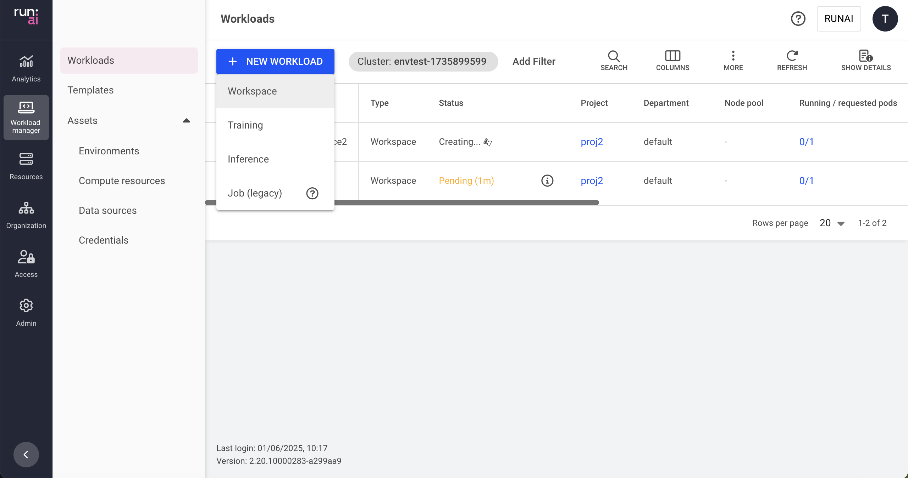

# Running workspaces

This article explains how to create a workspace via the Run:ai UI.

A workspace contains the setup and configuration needed for building your model, including the container, images, data sets, and resource requests, as well as the required tools for the research, all in a single place.

To learn more about the workspace workload type in Run:ai and determine that it is the most suitable workload type for your goals, see [Workloads in Run:ai](../overviews/workload-support.md).

## Creating a new Workspace

Before you start, make sure you have a project.

To add a new workspace:

1.  Go to the Workload manager → Workloads
2.  Click __+NEW WORKLOAD__ and select __Workspace__  
    Within the new workspace form:
3.  Select under which __cluster__ to create the workload
4.  Select the __project__ in which your workspace will run
5.  Select a preconfigured [template](../assets/templates.md) or select __Start from scratch__ to launch a new workspace quickly
6.  Enter a unique __name__ for the workspace (if the name already exists in the project, you will be requested to submit a different name)
7.  Click __CONTINUE__  
    In the next step:
8.  Select the __environment__ for your workspace

    *   Select an environment or click __+NEW ENVIRONMENT__ to add a new environment to the gallery.  
        For a step-by-step guide on adding environments to the gallery, see [Environments](../assets/environments.md). Once created, the new environment will be automatically selected.
    *   Set the connection for your __tool(s)__. The tools are configured as part of the environment.
        *   __External URL__
            *   __Custom URL__
                *   Set the URL
            *   Optional: Modify who can __access__ the tool:
                *   __All authenticated users__ (default)  
                    Everyone within the organization’s account
                *   __Specific group(s)__
                     * Click __+GROUP__
                     * Enter __group names__ as they appear in your identity provider. You must be a member of one of the groups listed to have access to the tool.
                *    __Specific user(s)__
                     * Click __+USER__
                     * Enter a valid email address or username. If you remove yourself, you will lose access to the tool.
        *   __Node port__
            *   __Custom port__
                *   Set the node port (enter a port between 30000 and 32767; if the node port is already in use, the workload will fail and display an error message)
    *   Set the User ID (UID), Group ID (GID) and the supplementary groups that can run commands in the container
        *   Enter __UID__
        *   Enter __GID__
        *   Add __Supplementary groups__ (multiple groups can be added, separated by commas).
    *   Optional: Set the __command and arguments__ for the container running the workload  
        When If no command is added, the container will use the image’s default command (entry-point).
        *   Modify the existing command or click __+COMMAND & ARGUMENTS__ to add a new command.
        *   Set multiple arguments separated by spaces, using the following format (e.g.: `--arg1=val1`).
    *   Optional: Set the __environment variable(s)__  
        The environment variable(s) are added to the environment variables already configured in the environment.
        *  Click __+ENVIRONMENT VARIABLE__
        *  Enter a __name__
        *  Select the __source__ for the environment variable

             * __Custom__
                  * Enter a value according to the provided instructions
             * __Credentials__ - Select select an existing credentials as the environment variable
                 * Select a __credential name__
                   To add new credentials to the credentials list, and for additional information, see [Credentials](../assets/credentials.md).
                 * Select a __secret key__

9.  Select the __compute resource__ for your workspace
    *   Select a compute resource or click __+NEW COMPUTE RESOURCE__ to add a new compute resource to the gallery.  
        For a step-by-step guide on adding compute resources to the gallery, see [compute resources](../assets/compute.md). Once created, the new compute resource will be automatically selected.
    *   Optional: Set the __order of priority__ for the __node pools__ on which the scheduler tries to run the workload.  
        When a workload is created, the scheduler will try to run it on the first node pool on the list. If the node pool doesn't have free resources, the scheduler will move on to the next one until it finds one that is available.
        *   Drag and drop them to change the order, remove unwanted ones, or reset to the default order defined in the project.
        *   Click __+NODE POOL__ to add a new node pool from the list of node pools that were defined on the cluster.  
            To configure a new node pool and for additional information, see [node pools](../../../platform-admin/aiinitiatives/resources/node-pools.md).
    *   Select a __node affinity__ to schedule the workload on a specific node type.  
        If the administrator added a ‘[node type (affinity)](../../../platform-admin/aiinitiatives/org/scheduling-rules.md#node-type-affinity)’ scheduling rule to the project/department, then this field is mandatory.  
        Otherwise, entering a node type (affinity) is optional. [Nodes must be tagged](../../../platform-admin/aiinitiatives/org/scheduling-rules.md#labelling-nodes-for-node-types-grouping) with a label that matches the node type key and value.  
    * Optional: Set toleration(s) to allow the workload to be scheduled on a node with a matching taint
        
        !!! Note 
            Tolerations are disabled, by default. If you cannot see Tolerations in the menu, then it must be enabled by your Administrator, under General Settings → Workloads → Tolerations

        *   Click __+TOLERATION__
        *   Enter a __key__
        *   Select the operator
            *   __Exists__ - If the key exists on the node, the effect will be applied.
            *   __Equals__ - if the key and the value set below matches to the value on the node, the effect will be applied
                *   Enter a __value__ matching the value on the node
        *   Select the effect for the toleration
            *   __NoExecute__ - Pods that do not tolerate this taint are evicted immediately.
            *   __NoSchedule__ - No new pods will be scheduled on the tainted node unless they have a matching toleration. Pods currently running on the node will not be evicted.
            *   __PreferNoSchedule__ - The control plane will try to avoid placing a pod that does not tolerate the taint on the node, but it is not guaranteed.
            *   __Any__ - All effects above match.
10. Optional: Set the volume needed for your workload  
    A volume allocates storage space to your workload that is persistent across restarts.
    *   Click __+VOLUME__
    *   Select the __storage class__
        *   __None__ - Proceed without defining a storage class.
        *   __Custom storage class__ - This option applies when selecting a storage class based on existing storage classes.  
            To add new storage classes to the storage class list, and for additional information, see [Kubernetes storage classes](../../../admin/config/shared-storage.md)
    *   Select the __access mode(s)__ (multiple modes can be selected)
        *   __Read-write by one node__ - The volume can be mounted as read-write by a single node.
        *   __Read-only by many nodes__ - The volume can be mounted as read-only by many nodes.
        *   __Read-write by many nodes__ - The volume can be mounted as read-write by many nodes.
    *   Set the __claim size__ and its __units__
    *   Select the __volume mode__
        *   __File system__ (default) - This allows the volume to be mounted as a file system, enabling the usage of directories and files.
        *   __Block__ - This exposes the volume as a block storage, which can be formatted or used directly by applications without a file system.
    *   Set the __Container path__ with the volume target location
    *   Set the volume persistency
        *   __Persistent__ - The volume and its data will be deleted only when the workload is deleted.
        *   __Ephemeral__ - The volume and its data will be deleted every time the workload’s status changes to “Stopped.”
11. Optional: Select __data sources__ for your workspace  
    Select a data source or click __+NEW DATA SOURCE__ to add a new data source to the gallery. If there are issues with the connectivity to the cluster, or issues while creating the data source, the data source won't be available for selection.  
    For a step-by-step guide on adding data sources to the gallery, see [data sources](../assets/datasources.md).  
    Once created, the new data source will be automatically selected.
    *   Optional: Modify the data target location for the selected data source(s).
12.  __Optional - General settings__:
    *   Allow the workload to exceed the project quota (workloads running over quota may be preempted and stopped at any time).
    *   Set the __backoff limit__ before workload failure. The backoff limit is the maximum number of retry attempts for failed workloads. After reaching the limit, the workload status will change to "Failed." (Enter a value between 1 and 100.)
    *   Set the __timeframe for auto-deletion__ after workload completion or failure (the time after which a completed or failed workload is deleted; if this field is set to 0 seconds, the workload will be deleted automatically).
    *   Set __annotations(s)__  
        Kubernetes annotations are key-value pairs attached to the workload. They are used for storing additional descriptive metadata to enable documentation, monitoring and automation.
        *   Click __+ANNOTATION__
        *   Enter a __name__
        *   Enter a __value__
    *   Set __labels(s)__  
        Kubernetes labels are key-value pairs attached to the workload. They are used for categorizing to enable querying.
        *   Enter a __name__
        *   Enter a __value__
13.  Click __CREATE WORKSPACE__

## Workload Policies

When creating a new workload, fields and assets may have limitations or defaults. These rules and defaults are derived from a policy your administrator set.

Policies allow you to control, standardize, and simplify the workload submission process. For additional information, see [Workload Policies and Rules](../../../platform-admin/workloads/policies/overview.md).

The effects of the policy are reflected in the workspace creation form:

*   Defaults derived from the policy will be displayed automatically for specific fields.
*   Disabled actions or values must be within a certain range.
*   Rules and defaults for entire sections (such as environments, compute resources, or data sources) may prevent selection and will appear on the entire library card with an option for additional information via an external modal.

## Managing and monitoring

After the workspace is created, it is added to the [Workloads](../overviews/managing-workloads.md) table, where it can be managed and monitored.

## Using CLI

To view the available actions on workspaces, see the Workspaces [CLI v2 reference](../../cli-reference/new-cli/runai_workspace_submit.md) or the [CLI v1 reference](../../cli-reference/runai-submit.md).

## Using API

To view the available actions on workspaces, see the [Workspaces](https://api-docs.run.ai/latest/tag/Workspaces) API reference.