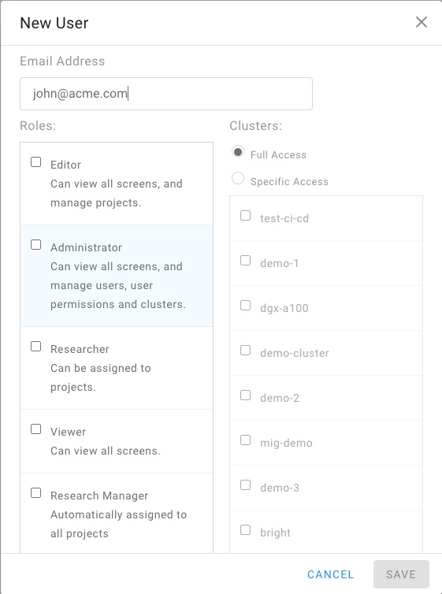

# Adding, Updating, and Deleting Users

## Introduction

The Run:AI User Interface allows the creation of Run:AI Users. Run:AI Users can receive varying levels of access to the Administration UI and submit Jobs on the Cluster.

__Notes:__

*   It is possible to connect the Run:AI user interface to the organization's SAML. For further information see [configuration single sign-on](../runai-setup/authentication/sso.md).

## Working with Users

### Create User

!!! Note
    To be able to manipulate Users, you must have _Administrator_ access. if you do not have such access, please contact an Administrator. 

* Login to the Users area of the Run:AI User interface at `company-name.run.ai`.
*  On the top right, select "Add New Users".

*   Choose a User name and email. Leave password as blank, it will be set by the User
*   Select Roles. Note -- more than one role can be selected. The available roles are:
    *  __Administrator__: Can manage Users and install Clusters. 
    *  __Editor__: Can manage Projects and Departments.
    * __Viewer__: View-only access to the Run:AI User Interface.
    * __Researcher__: Can run ML workloads using the Run:AI command-line interface, The Researcher user interface or similar. This setting is relevant only if [Researcher Authentication](../runai-setup/authentication/researcher-authentication.md) is enabled and requires the [assigning of users to projects](../project-setup/#create-a-new-project.md).
    * __Research Manager__: Can act as _Researcher_ in all projects, including new ones to be created in the future. 
*   Select a Cluster. This determines what Clusters are accessible to this User
*   Press "Save"

The User will receive a join mail and will be able to set a password. 

### Update a User

*   Select an existing User. 
*   Right-click and press "Edit".
*   Update the values and press "Save".

### Delete an existing User

*   Select an existing User. 
*   Right-click and press "Delete".

 
