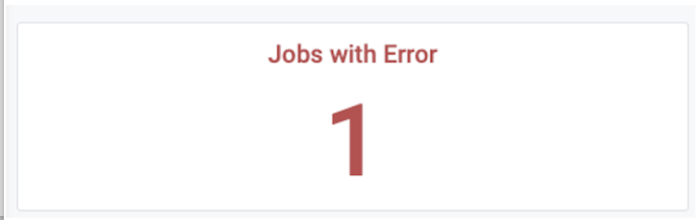
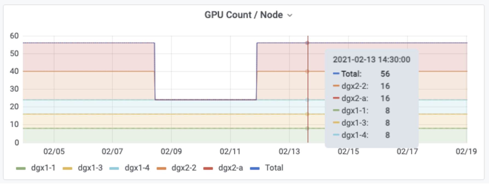
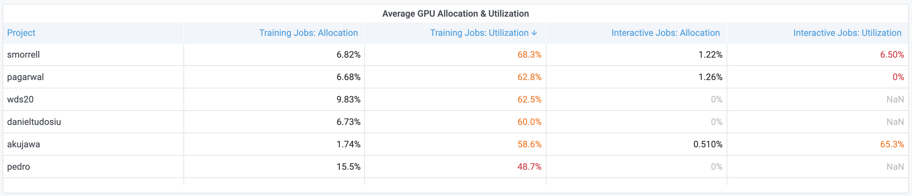
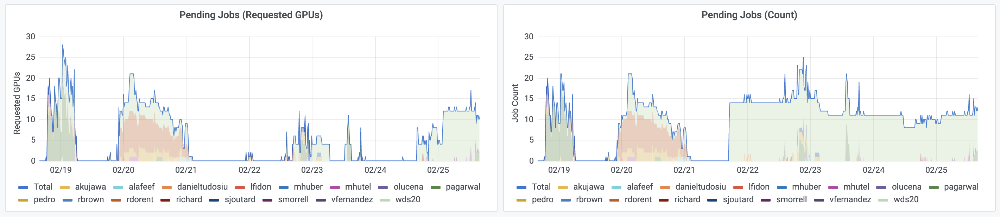
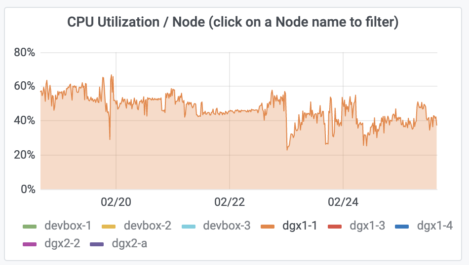
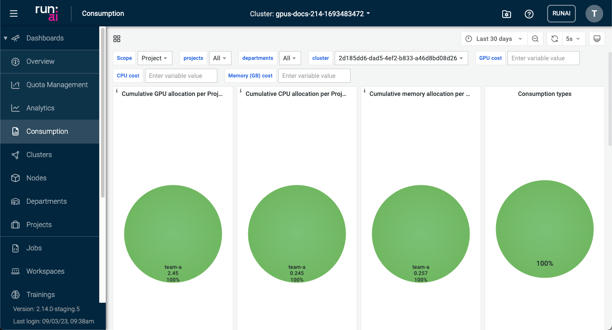
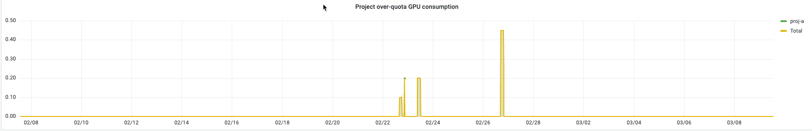

The Run:ai Administration User Interface provides a set of dashboards that help you monitor Clusters, Cluster Nodes, Projects, and Jobs. This document provides the key metrics to monitor, how to assess them as well as suggested actions. 

There are 4 dashboards:

* **Overview** dashboard - Provides information about what is happening right now in the cluster
* **Analytics** dashboard - Provides long term analysis of cluster behavior
* **Multi-Cluster Overview** dashboard - Provides a more holistic, multi-cluster view of what is happening right now. The dashboard is intended for organizations that have more than one connected cluster.
* **Consumption** dashboard&mdash;Provides information about resource consumption.

## Overview Dashboard

The Overview dashboard provides information about what is happening **right now** in the cluster.  Administrators can view high-level information on the state of the cluster, including:

* The number of available and allocated resources and their cluster-wide utilization
* The number of running and pending **Jobs**, their utilization, information on Jobs with errors or Jobs with idle GPUs
* Active **Projects**, their assigned and allocated GPUs and number of running and pending Jobs

Cluster administrators can use the Overview dashboard to find issues and fix them. Below are a few examples:

### Jobs with idle GPUs

Locate Jobs with idle GPUs, defined as GPUs with 0% GPU utilization for more than 5 minutes. 

**How to**: view the following panel:

**Analysis and Suggested actions**:

| Review  | Analysis  & Actions |
|---------|---------------------|
| Interactive Jobs are too frequently idle | *  Consider setting time limits for interactive Jobs through the Projects tab.   *  Consider also reducing GPU quotas for specific Projects to encourage users to run more training Jobs as opposed to interactive Jobs (note that interactive Jobs can not use more than the GPU quota assigned to their Project). |
| Training Jobs are too frequently idle | Identify and notify the right users and work with them to improve the utilization of their training scripts |

### Jobs with an Error

Search for Jobs with an error status. These Jobs may be holding GPUs without actually using them. 

**How to**: view the following panel:

**Analysis and Suggested actions**:

Search for Jobs with an Error status on the Jobs view and discuss with the Job owner. Consider deleting these Jobs to free up the resources for other users.

### Jobs with a Long Duration 

View list of 5 longest Jobs. 

**How to**: view the following panel:

**Analysis and Suggested actions**:

| Review  | Analysis & Actions |
|---------|---------------------|
| Training Jobs run for too long | Ask users to view their Jobs and analyze whether useful work is being done. If needed, stop their Jobs. | 
| Interactive Jobs run for too long | Consider setting time limits for interactive Jobs via the Project editor. |

### Job Queue

Identify queueing bottlenecks.

**How to**: view the following panel:

**Analysis and Suggested actions**:

| Review  | Analysis & Actions  |
|---------|---------------------|
| Cluster is fully loaded | Go over the table of active Projects and check that fairness between Projects was enforced, by reviewing the number of allocated GPUs for each Project, ensuring each Project was allocated with its fair-share portion of the cluster. |
| Cluster is not fully loaded | Go to the Jobs view to review the resources requested for that Job (CPU, CPU memory, GPU, GPU memory).  Go to the Nodes view to verify that there is no Node with enough free resources that can host that Job. |

Also, check the command that the user used to submit the job. The Researcher may have requested a specific Node for that Job.

## Analytics Dashboard

The Analytics dashboard provides means for viewing historical data on cluster information such as:

* Utilization across the cluster
* GPU usage by different **Projects**, including allocation and utilization, broken down into interactive and training Jobs
* Breakdown of running **Jobs** into interactive, training, and GPU versus CPU-only Jobs, including information on queueing (number of pending Jobs and requested GPUs),
* Status of Nodes in terms of availability and allocated and utilized resources.

The information presented in Analytics can be used in different ways for identifying problems and fixing them. Below are a few examples.

### Node Downtime

View the overall available resources per Node and identify cases where a Node is down and there was a reduction in the number of available resources.

**How to**: view the following panel.

**Analysis and Suggested actions**:
 
 Filter according to time range to understand for how long the Node is down.

### GPU Allocation

Track GPU allocation across time.

**How to**: view the following panels. 

The panel on the right-hand side shows the cluster-wide GPU allocation and utilization versus time, whereas the panels on the left-hand side show the cluster-wide GPU allocation and utilization averaged across the filtered time range.

**Analysis and Suggested actions**:

If the allocation is too low for a long period, work with users to run more workloads and to better utilize the Cluster.

### Track GPU utilization

Track whether Researchers efficiently use the GPU resources they have allocated for themselves. 

**How to**: view the following panel:

**Analysis and Suggested actions**:

If utilization is too low for a long period, you will want to identify the source of the problem:

* Go to “Average GPU Allocation & Utilization” 
* Look for Projects with large GPU allocations for interactive Jobs or Projects that poorly utilize their training Jobs. Users tend to poorly utilize their GPUs in interactive sessions because of the dev & debug nature of their work which typically is an iterative process with long idle GPU time. On many occasions users also don’t shut down their interactive Jobs, holding their GPUs idle and preventing others from using them. 

| Review  | Analysis & Actions  |
|---------|---------------------|
| Low GPU utilization is due to interactive Jobs being used too frequently | Consider setting time limits for interactive Jobs through the Projects tab or reducing GPU quotas to encourage users to run more training Jobs as opposed to interactive Jobs (note that interactive Jobs can not use more than the GPU quota assigned to their Project). |
| Low GPU utilization is due to users poorly utilizing their GPUs in training sessions | Identify Projects with bad GPU utilization in training Jobs, notify the users and work with them to improve their code and the way they utilize their GPUs. |

### Training vs. Interactive -- Researcher maturity 

Track the number of running Jobs and the breakdown into interactive, training, and CPU-only Jobs. 

**How to**: view the following panel:

**Analysis and Suggested actions**:

We would want to encourage users to run more training Jobs than interactive Jobs, as it is the key to achieving high GPU utilization across the Cluster:

* Training Jobs run to completion and free up their resources automatically when training ends
* Training Jobs can be preempted, queued, and resumed automatically by the Run:ai system according to predefined policies which increases fairness and Cluster utilization.

### Pending Queue Size

Track how long is the queue for pending Jobs

**How to**: view the following panels:

**Analysis and Suggested actions**:

Consider buying more GPUs:

* When there are too many Jobs are waiting in queue for too long.
* With a large number of requested GPUs.
* While the Cluster is fully loaded and well utilized.

### CPU & Memory Utilization

Track CPU and memory Node utilization and identify times where the load on specific Nodes is high. 

**How to**: view the following panel:

**Analysis and Suggested actions**:

If the load on specific Nodes is too high, it may cause problems with the proper operation of the Cluster and the way jobs are running.

Consider adding more CPUs, or adding additional CPU-only nodes for Jobs that do only CPU processing.

## Multi-Cluster overview dashboard

Provides a holistic, aggregated view across Clusters, including information about Cluster and Node utilization, available resources, and allocated resources. With this dashboard, you can identify Clusters that are down or underutilized and go to the Overview of that Cluster to explore further. 

## Consumption dashboard

This dashboard enables users and admins to view consumption usage using run:AI services. The dashboard provides views based on configurable filters and timelines.

The dashboard has 4 dashlets for:

* Cumulative GPU allocation per Project or Department
* Cumulative CPU allocation per Project or Department
* Cumulative memory allocation per Project or Department
* Consumption types

Use the drop down menus at the top of the dashboard to apply filters for:

* Project or department
* Per project (single, multiple, or all)
* Per department (single, multiple or all)

Use the time picker dropdown to select relative time range options and set custom absolute time ranges.
You can change the Timezone and fiscal year settings from the time range controls by clicking the Change time settings button.

!!! Note
     Dashboard data updates once an hour.

You can change the refresh interval using the refresh interval drop down.

The dashboard has a Total consumption table that displays the total consumption of resources based on:

* Project
* Department
* GPU hours
* CPU hours
* Memory hours

Hover over an entry in the table to filter it in or out of the table.

The dashboard has a graph of the GPU allocation over time.

!

The dashboard has a graph of the Project over-quota GPU consumtion.

!
