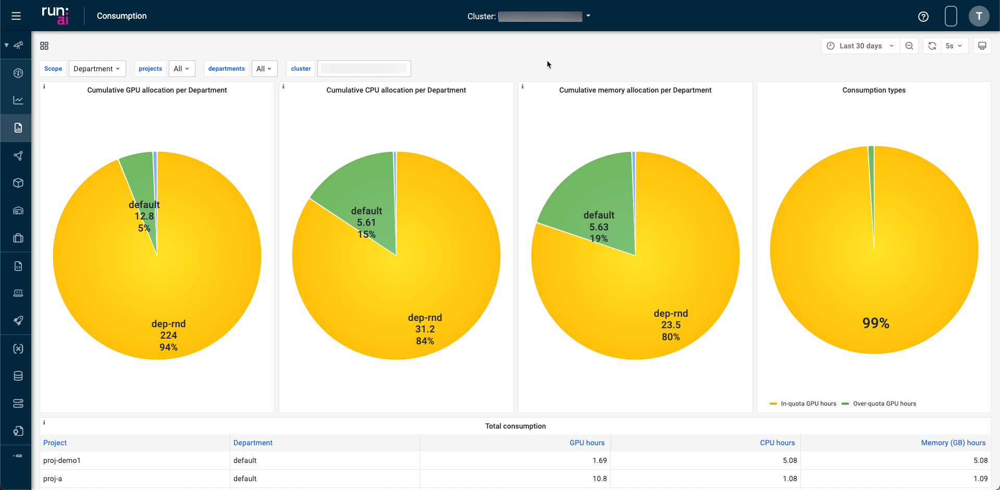

# Introduction

The Run:ai Administration User Interface provides a set of dashboards that help you monitor Clusters, Cluster Nodes, Projects, and Workloads. This document provides the key metrics to monitor, how to assess them as well as suggested actions.

There are 5 dashboards:

* [**GPU/CPU Overview**](#gpucpu-overview-dashboard) dashboard&mdash;Provides information about what is happening right now in the cluster.
* [**Quota Management**](#quota-management-dashboard) dashboard&mdash;Provides information about quota utilization.
* [**Analytics**](#analytics-dashboard) dashboard&mdash;Provides long term analysis of cluster behavior.
* [**Multi-Cluster Overview**](#multi-cluster-overview-dashboard) dashboard&mdash;Provides a more holistic, multi-cluster view of what is happening right now. The dashboard is intended for organizations that have more than one connected cluster.
* [**Consumption**](#consumption-dashboard) dashboard&mdash;Provides information about resource consumption.

## GPU/CPU Overview Dashboard

The Overview dashboard provides information about what is happening **right now** in the cluster.  Administrators can view high-level information on the state of the cluster. The dashboard has two tabs that change the display to provide a focused view for [GPU Dashboards](#gpu-dashboard) (default view) and [CPU Dashboards](#cpu-dashboard).

### GPU Dashboard

The GPU dashboard displays specific information for GPU based nodes, node-pools, clusters, or tenants. These dashboards also include additional metrics that specific to GPU based environments. The dashboard contains tiles that show information about specific resource allocation and performance metrics. The tiles are interactive allowing you to link directly to the assets or drill down to specific scopes. Use the time frame selector to choose a time frame for all the tiles in the dashboard.

The dashboard has the following tiles:

* Ready nodes&mdash;displays GPU nodes that are in the ready state.
* Ready GPU devices&mdash;displays the number of GPUs in nodes that are in the ready state.
* Allocated GPU compute&mdash;displays the total number of GPUs allocated from all the nodes.
* Running workloads&mdash;displays the number of running workloads.
* Pending workloads&mdash;displays the number of workloads in the pending status.
* Allocation ration by node pool&mdash;the graph displays the percentage of GPUs allocated per node pool. Hover over the bar for detailed information. Use the scope selected at the bottom of the graph to drill down for more details.
* Free resources by node pool&mdash;the graph displays the amount of free resources per node pool. Press a entry in the graph for more details. Hover over the resource bubbles for specific details for the workers in the node. Use the ellipsis to download the graph as a CSV file.
* Resource allocation by workload type&mdash;the graph displays the resource allocation by workload type. Hover over the bar for detailed information. Use the scope selected at the bottom of the graph to drill down for more details. Use the ellipsis to download the graph as a CSV file.
* Workload by status&mdash;the graph displays the number of workloads for each status in the workloads table. Hover over the bar for detailed information. Use the scope selected at the bottom of the graph to drill down for more details. Use the ellipsis to download the graph as a CSV file.
* Resources utilization&mdash;this graph displays the resource utilization over time. The right pane of the graph shows the average utilization of the selected time frame of the dashboard. Hover over the graph to see details of a specific time in the graph. Use the ellipsis to download the graph as a CSV file.
* Resource allocation&mdash;this graph displays the resource allocation over time. The right pane of the graph shows the average allocation of the selected time frame of the dashboard. Hover over the graph to see details of a specific time in the graph. Use the ellipsis to download the graph as a CSV file.

### CPU Dashboard

The CPU dashboards display specific information for CPU based nodes, node-pools, clusters, or tenants. These dashboards also include additional metrics that specific to CPU based environments.

To enable CPU Dashboards:

1. Press the `Tools & Settings` icon, then press `General`.
2. Open the `Analytics` pane and toggle the *Show CPU dashboard* switch to enable the feature.

Toggle the switch to `disable` to disable *CPU Dashboards* option.

**Analysis and Suggested actions**:

| Review  | Analysis  & Actions |
|---------|---------------------|
| Interactive Workloads are too frequently idle | *  Consider setting time limits for interactive Workloads through the Projects tab.   *  Consider also reducing GPU/CPU quotas for specific Projects to encourage users to run more training Workloads as opposed to interactive Workloads (note that interactive Workloads can not use more than the GPU/CPU quota assigned to their Project). |
| Training Workloads are too frequently idle | Identify and notify the right users and work with them to improve the utilization of their training scripts |

### Workloads with an Error

Search for Workloads with an error status. These Workloads may be holding GPUs/CPUs without actually using them.
<!--
**How to**: view the following panel:

-->
**Analysis and Suggested actions**:

Search for workloads with an Error status on the Workloads view and discuss with the Job owner. Consider deleting these Workloads to free up the resources for other users.

### Workloads with a Long Duration

View list of 5 longest Workloads.
<!-- 
**How to**: view the following panel:

-->
**Analysis and Suggested actions**:

| Review  | Analysis & Actions |
|---------|---------------------|
| Training Workloads run for too long | Ask users to view their Workloads and analyze whether useful work is being done. If needed, stop their Workloads. |
| Interactive Workloads run for too long | Consider setting time limits for interactive Workloads via the Project editor. |

### Job Queue

Identify queueing bottlenecks.
<!-- 
**How to**: view the following panel:

-->
**Analysis and Suggested actions**:

| Review  | Analysis & Actions  |
|---------|---------------------|
| Cluster is fully loaded | Go over the table of active Projects and check that fairness between Projects was enforced, by reviewing the number of allocated GPUs/CPUs for each Project, ensuring each Project was allocated with its fair-share portion of the cluster. |
| Cluster is not fully loaded | Go to the Workloads view to review the resources requested for that Job (CPU, CPU memory, GPU, GPU memory).  Go to the Nodes view to verify that there is no Node with enough free resources that can host that Job. |

Also, check the command that the user used to submit the job. The Researcher may have requested a specific Node for that Job.

## Analytics Dashboard

The Analytics dashboard provides means for viewing historical data on cluster information such as:

* Utilization across the cluster
* GPU usage by different **Projects**, including allocation and utilization, broken down into interactive and training Workloads
* Breakdown of running **Workloads** into interactive, training, and GPU versus CPU-only Workloads, including information on queueing (number of pending Workloads and requested GPUs),
* Status of Nodes in terms of availability and allocated and utilized resources.

The dashboard has a dropdown filter for node pools and Departments. From the dropdown, select one or more node pools. The default setting is `all`.

The information presented in Analytics can be used in different ways for identifying problems and fixing them. Below are a few examples.

### Node Downtime

View the overall available resources per Node and identify cases where a Node is down and there was a reduction in the number of available resources.

**How to**: view the following panel.

**Analysis and Suggested actions**:

 Filter according to time range to understand for how long the Node is down.

### GPU Allocation

Track GPU allocation across time.

**How to**: view the following panels.

The panel on the right-hand side shows the cluster-wide GPU allocation and utilization versus time, whereas the panels on the left-hand side show the cluster-wide GPU allocation and utilization averaged across the filtered time range.

**Analysis and Suggested actions**:

If the allocation is too low for a long period, work with users to run more workloads and to better utilize the Cluster.

### Track GPU utilization

Track whether Researchers efficiently use the GPU resources they have allocated for themselves.

**How to**: view the following panel:

**Analysis and Suggested actions**:

If utilization is too low for a long period, you will want to identify the source of the problem:

* Go to “Average GPU Allocation & Utilization”
* Look for Projects with large GPU allocations for interactive Workloads or Projects that poorly utilize their training Workloads. Users tend to poorly utilize their GPUs in interactive sessions because of the dev & debug nature of their work which typically is an iterative process with long idle GPU time. On many occasions users also don’t shut down their interactive Workloads, holding their GPUs idle and preventing others from using them.

| Review  | Analysis & Actions  |
|---------|---------------------|
| Low GPU utilization is due to interactive Workloads being used too frequently | Consider setting time limits for interactive Workloads through the Projects tab or reducing GPU quotas to encourage users to run more training Workloads as opposed to interactive Workloads (note that interactive Workloads can not use more than the GPU quota assigned to their Project). |
| Low GPU utilization is due to users poorly utilizing their GPUs in training sessions | Identify Projects with bad GPU utilization in training Workloads, notify the users and work with them to improve their code and the way they utilize their GPUs. |

### Training vs. Interactive -- Researcher maturity

Track the number of running Workloads and the breakdown into interactive, training, and CPU-only Workloads.

**How to**: view the following panel:

**Analysis and Suggested actions**:

We would want to encourage users to run more training Workloads than interactive Workloads, as it is the key to achieving high GPU utilization across the Cluster:

* Training Workloads run to completion and free up their resources automatically when training ends
* Training Workloads can be preempted, queued, and resumed automatically by the Run:ai system according to predefined policies which increases fairness and Cluster utilization.

### Pending Queue Size

Track how long is the queue for pending Workloads

**How to**: view the following panels:

**Analysis and Suggested actions**:

Consider buying more GPUs:

* When there are too many Workloads are waiting in queue for too long.
* With a large number of requested GPUs.
* While the Cluster is fully loaded and well utilized.

### CPU & Memory Utilization

Track CPU and memory Node utilization and identify times where the load on specific Nodes is high.

**How to**: view the following panel:

**Analysis and Suggested actions**:

If the load on specific Nodes is too high, it may cause problems with the proper operation of the Cluster and the way workloads are running.

Consider adding more CPUs, or adding additional CPU-only nodes for Workloads that do only CPU processing.

## Multi-Cluster overview dashboard

Provides a holistic, aggregated view across Clusters, including information about Cluster and Node utilization, available resources, and allocated resources. With this dashboard, you can identify Clusters that are down or underutilized and go to the Overview of that Cluster to explore further.

## Consumption dashboard

This dashboard enables users and admins to view consumption usage using run:AI services. The dashboard provides views based on configurable filters and timelines. The dashboard also provides costing analysis for GPU, CPU, and memory costs for the system.

The dashboard has 4 dashlets for:

* Cumulative GPU allocation per Project or Department
* Cumulative CPU allocation per Project or Department
* Cumulative memory allocation per Project or Department
* Consumption types

Use the drop down menus at the top of the dashboard to apply filters for:

* Project or department
* Per project (single, multiple, or all)
* Per department (single, multiple or all)
* Per cluster (single, multiple, all)

To enable the Consumption Dashboard:

1. Press the `Tools & Settings` icon, then press `General`.
2. Open the `Analytics` pane and toggle the *Consumption* switch to enable the feature.
3. Enter the cost of:
   1. GPU compute / Hour
   2. CPU compute / Hour
   3. CPU memory / Hour

Use the time picker dropdown to select relative time range options and set custom absolute time ranges.
You can change the Timezone and fiscal year settings from the time range controls by clicking the Change time settings button.

!!! Note
     Dashboard data updates once an hour.

You can change the refresh interval using the refresh interval drop down.

The dashboard has a 2 consumption tables that display the total consumption of resources.
Hover over an entry in the table to filter it in or out of the table.

The *Total consumption* table includes consumption details based on the filters selected. Fields include:

* Project
* Department
* GPU hours
* CPU hours
* Memory hours
* GPU Idle allocated hours&mdash;the portion of time the GPUs spend idle from the total allocation hours.
* CPU usage hours&mdash;the actual usage time of CPU.
* Memory usage time&mdash;the actual usage time of CPU memory.
* GPU cost (only when configured)
* CPU cost (only when configured)
* CPU memory (only when configured)

The *Total department consumption* table includes consumption details for each department, or details for departments selected in the filters. Fields include:

* Department
* GPU hours
* CPU hours
* Memory hours
* GPU Idle allocated hours&mdash;the portion of time the GPUs spend idle from the total allocation hours.
* CPU usage hours&mdash;the actual usage time of CPU.
* Memory usage time&mdash;the actual usage time of CPU memory.
* GPU cost (only when configured)
* CPU cost (only when configured)
* CPU memory (only when configured)

The dashboard has a graph of the GPU allocation over time.

!

The dashboard has a graph of the Project over-quota GPU consumption.

!

## Quota management dashboard

The Quota management dashboard provides an efficient means to monitor and manage resource utilization within the AI cluster. The dashboard is divided into sections with essential metrics and data visualizations to identify resource usage patterns, potential bottlenecks, and areas for optimization. The sections of the dashboard include:

* **Add Filter**
* **Quota / Total**
* **Allocated / Quota**
* **Pending workloads**
* **Quota by node pool**
* **Allocation by node pool**
* **Pending workloads by node pool**
* **Departments with lowest allocation by node pool**
* **Projects with lowest allocation ratio by node pool**
* **Over time allocation / quota**

### Add Filter

Use the *Add Filter* dropdown to select filters for the dashboard. The filters will change the data shown on the dashboard. Available filters are:

* Departments
* Projects
* Nodes

Select a filter from the dropdown, then select a item from the list, and press apply.

!!! Note
    You can create a filter with multiple categories, but you can use each category and item only once.

### Quota / Total

This section shows the number of GPUs that are in the quota based on the filter selection. The quota of GPUs is the number of GPUs that are reserved for use.

### Allocated / Quota

This section shows the number of GPUs that are allocated based on the filter selection. Allocated GPUs are the number of GPUs that are being used.

### Pending workloads

This section shows the number workloads that are pending based on the filter selection. Pending workloads are workloads that have not started.

### Quota by node pool

This section shows the quota of GPUs by node pool based on the filter. The quota is the number of GPUs that are reserved for use. You can drill down into the data in this section by pressing on the graph or the link at the bottom of the section.

### Allocation by node pool

This section shows the allocation of GPUs by node pool based on the filter. The allocation is the number of GPUs that are being used. You can drill down into the data in this section by pressing on the graph or the link at the bottom of the section.

### Pending workloads by node pool

This section shows the number of pending workloads by node pool. You can drill down into the data in this section by pressing on the graph or the link at the bottom of the section.

### Departments with lowest allocation by node pool

This section shows the departments with the lowest allocation of GPUs by percentage relative to the total number of GPUs.

### Projects with lowest allocation ratio by node pool

This section shows the projects with the lowest allocation of GPUS by percentage relative to the total number of GPUs.

### Over time allocation / quota

This section shows the allocation of GPUs from the quota over a period of time.