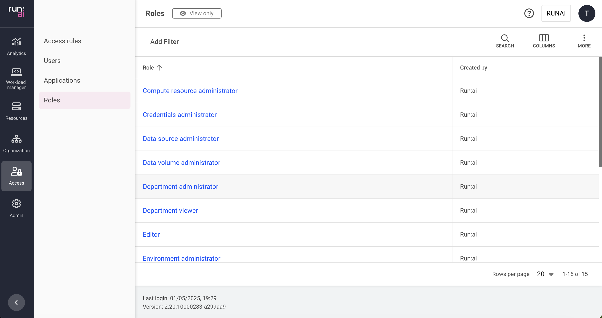

This article explains the roles in the Run:ai platform.

A role is a set of permissions that can be assigned to a subject in a scope.

A permission is a set of actions (View, Edit, Create & Delete) over a Run:ai entity (e.g. projects, workloads, users).

## Roles table

The Roles table can be found under **Tools & Settings** in the Run:ai platform.

The Roles table displays a list of predefined roles available to users in the Run:ai platform. It is not possible to create additional rules or edit or delete existing rules.

The Roles table consists of the following columns:

| Column | Description |
| :---- | :---- |
| Role | The name of the role |
| Created by | The name of the role creator |
| Creation time | The timestamp when the role was created |

### Customizing the table view

* Filter - Click ADD FILTER, select the column to filter by, and enter the filter values  
* Search - Click SEARCH and type the value to search by  
* Sort - Click each column header to sort by  
* Column selection - Click COLUMNS and select the columns to display in the table  
* Download table - Click MORE and then Click Download as CSV

## Reviewing a role

* **Role name** - The name of the role  
* **Permissions** - Displays the available permissions defining the role, as follows:

| Column | Description |
| :---- | :---- |
| Entity | A system-managed object that can be viewed, edited, created or deleted by a user based on their assigned role and scope |
| View | If checked, an assigned user with this role can view instances of this type of entity within their defined scope |
| Edit | If checked, an assigned user with this role can change the settings of an instance of this type of entity within their defined scope |
| Create | If checked, an assigned user with this role can create new instances of this type of entity within their defined scope |
| Delete | If checked, an assigned user with this role can delete instances of this type of entity within their defined scope |

## Using API
  Go to the [Roles](https://app.run.ai/api/docs#tag/Roles) API reference to view the available actions

