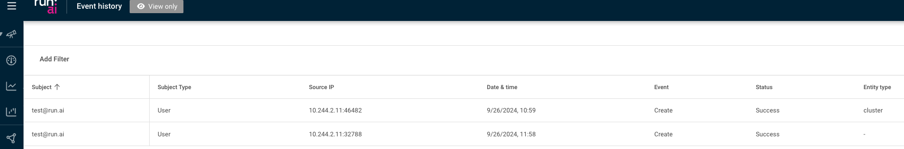
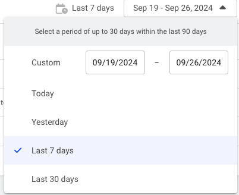

  
This article provides details about Run:ai’s Audit log.  
The Run:ai control plane provides the audit log API and event history table in the Run:ai UI . Both reflect the same information regarding changes to business objects: clusters, projects and assets etc.

## Events history table

The Events history table can be found under Event history in the Run:ai UI.

The Event history table consists of the following columns:

| Column | Description |
| :---- | :---- |
| Subject | The name of the subject |
| Subject type | The user or application assigned with the role |
| Source IP | The IP address of the subject |
| Date & time | The exact timestamp at which the event occurred. Format dd/mm/yyyy for date and hh:mm am/pm for time. |
| Event | The type of the event. Possible values: Create, Update, Delete, Login |
| Event ID | Internal event ID, can be used for support purposes |
| Status | The outcome of the logged operation. Possible values: Succeeded, Failed |
| Entity type | The type of the logged business object. |
| Entity name | The name of logged business object. |
| Entity ID | The system's internal id of the logged business object. |
| *URL* | The endpoint or address that was accessed during the logged event. |
| HTTP Method | The HTTP operation method used for the request. Possible values include standard HTTP methods such as `GET`, `POST`, `PUT`, `DELETE`, indicating what kind of action was performed on the specified URL. |

### Customizing the table view

* Filter - Click ADD FILTER, select the column to filter by, and enter the filter values  
* Search - Click SEARCH and type the value to search by  
* Sort - Click each column header to sort by  
* Column selection - Click COLUMNS and select the columns to display in the table  
* Download table - Click MORE and then Click Download as CSV or Download as JSON

## Using the event history date selector

The Event history table saves events for the last 90 days. However, the table itself presents up to the last 30 days of information due to the potentially very high number of operations that might be logged during this period.

To view older events, or to refine your search for more specific results or fewer results, use the time selector and change the period you search for.  
You can also refine your search by clicking and using ADD FILTER accordingly.

## Using API

Go to the [Audit log API](https://api-docs.run.ai/2.18/tag/Audit/) reference to view the available actions.  
Since the amount of data is not trivial, the API is based on paging. It retrieves a specified number of items for each API call. You can get more data by using subsequent calls.

### Limitations

* User login auditing: User login events are not currently audited. This means, there is no record of when users log in or out of the system.  
* Workload submission auditing: Submissions of workloads are not audited. As a result, the system does not track or log details of workload submissions, such as timestamps or user activity.

