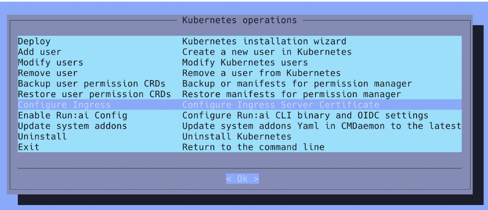
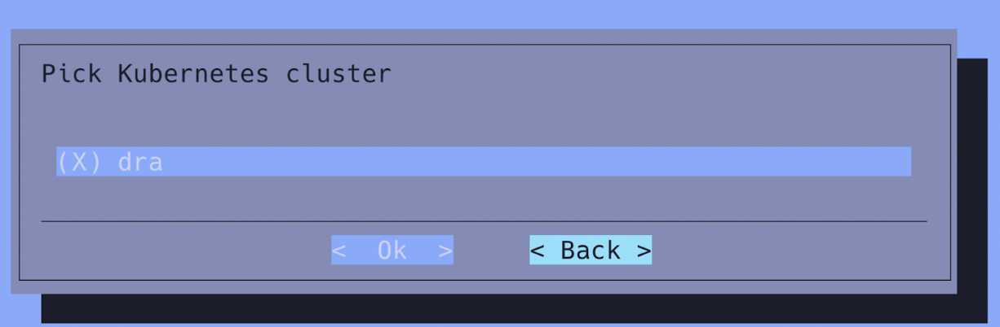
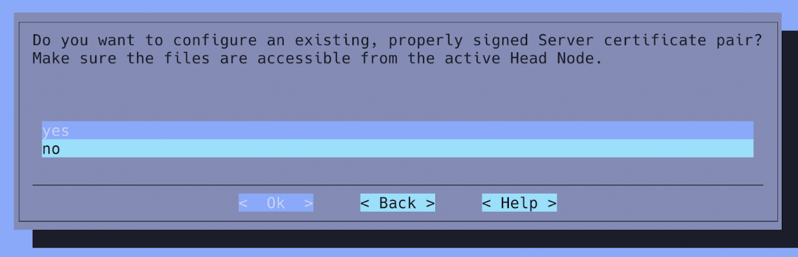
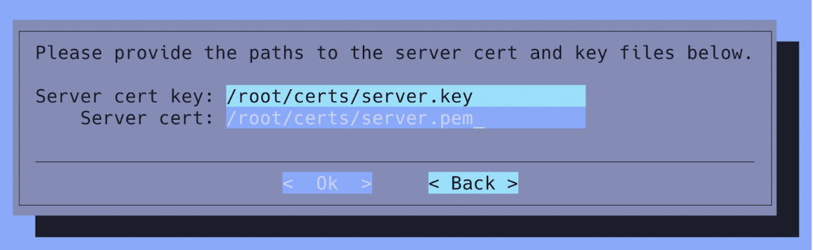

# Configure BCM Kubernetes for Run:ai

## Label the Run:ai control plane  nodes

Label the nodes using CMSH:

```
cmsh
kubernetes
labelsets
add runai-control-plane
append categories runai-control-plane
append labels 
node-role.kubernetes.io/runai-system=true
commit
```

!!! Note
    the names of the categories are arbitrary names so they may vary depending on the customer choice or any other preference. Make sure that you label the correct category. Mixing labels will result in pods running on incorrect nodes or not being scheduled at all.


## Create the CPU worker node ConfigurationOverlay

The default Kubernetes worker ConfigurationOverlay initializes `containerd` with the NVIDIA Container Toolkit plugin runtime. This is not desirable on nodes with GPU resources and can lead to problems when certain workloads deploy (minimal containers that cannot handle the Toolkit’s CRI initialization. For that reason, it is recommended to create a separate configuration overlay for those nodes:

```
root@bcmhead1:~/certs# cmsh
[bcmhead1]% configurationoverlay
[bcmhead1->configurationoverlay]% clone kube-dra-worker kube-dra-worker-cpuonly
[bcmhead1->configurationoverlay*[kube-dra-worker-cpuonly*]->roles[generic::containerd]]% configurations
[bcmhead1->configurationoverlay*[kube-dra-worker-cpuonly*]->roles[generic::containerd]->configurations*]% remove containerd-nvidia-cri
[bcmhead1->configurationoverlay*[kube-dra-worker-cpuonly*]->roles*[generic::containerd*]->configurations*]% commit
```

After that you need to extend the worker node label to members of the new ConfigurationOverlay:
```
[bcmhead1]% kubernetes
[bcmhead1->kubernetes[dra]]% labelsets
[bcmhead1->kubernetes[dra]->labelsets]% use worker
[bcmhead1->kubernetes[dra]->labelsets[worker]]% append overlays kube-dra-worker-cpuonly
[bcmhead1->kubernetes*[dra*]->labelsets*[worker*]]% commit
```

and finally move  the CPU worker nodes to the new ConfigurationOverlay:
```
[bcmhead1->configurationoverlay]% removefrom kube-dra-worker categories runai-control-plane
[bcmhead1->configurationoverlay*]% append kube-dra-worker-cpuonly categories runai-control-plane
[bcmhead1->configurationoverlay*]% commit
```

The syntax is as follows:

```
`[append | removefrom]  <ConfigurationOverlay name>  [categories | nodes] <BCM category or node name>`
```
## Create the Run:ai namespaces

Create the following Kubernetes namespaces:

!!! Note
    Load the Kubernetes Lmod module if needed with `module load kubernetes`.

You will need a JFrog container registry pull secret in order to download the Run:ai container images. The token can be found in Run:ai welcome e-mail together with the EULA and other relevant info. If you do not have one, reach out to sales for guidance.

For NV-internal VPRs, you can use the credential from the CORP Prod Vault instance.

```
TOKEN="eyJ2ZXIiOiIyIiwi...."

kubectl create ns runai-backend

kubectl create ns runai

kubectl create secret docker-registry runai-reg-creds  \
--docker-server=https://runai.jfrog.io \
--docker-username=self-hosted-image-puller-prod \
--docker-password=$TOKEN \
--docker-email=support@run.ai \
--namespace=runai-backend 
```

## Configure the Ingress controller to use the signed SSL certificates

### Scale-up the Ingress Deployment

Increase the number of replicas (from 1 to 3):

```
# cmsh
[bcmhead1->device]% kubernetes
[bcmhead1->kubernetes[dra]]% appgroups
[bcmhead1->kubernetes[dra]->appgroups]% use system
[bcmhead1->kubernetes[dra]->appgroups[system]]% applications
[bcmhead1->kubernetes[dra]->appgroups[system]->applications]% use ingress_controller
[bcmhead1->kubernetes[dra]->appgroups[system]->applications[ingress_controller]]% environment
[bcmhead1->kubernetes[dra]->appgroups[system]->applications[ingress_controller]->environment]% set replicas  value 3
[bcmhead1->kubernetes*[dra*]->appgroups*[system*]->applications*[ingress_controller*]->environment*]% commit
```

### Configure the NGINX proxy TLS certificates

1. Run `cm-kubernetes-setup` on the active headnode and select `Configure Ingress.`

    

2. Select the Kubernetes cluster:

    

3. Select `yes` when asked to provide signed certificates:

    

4. Enter the path to the private key and PEM certificate (See [Customer-provided Prerequisites](?tab=t.0#heading=h.26in1rg) ):

    

5. Wait for the Ingress pod to restart (~1 minute) and verify that the pod is running.

    ```
    root@bcmhead1:~# a	kubectl get -n ingress-nginx   all
    NAME                                       	READY   STATUS	RESTARTS   AGE
    pod/ingress-nginx-controller-74dd65f46-9w247   1/1 	Running   0      	20s

    NAME                                     	TYPE    	CLUSTER-IP   	EXTERNAL-IP   PORT(S)                  	AGE
    service/ingress-nginx-controller         	NodePort	10.150.101.148   <none>    	80:30081/TCP,443:30444/TCP   29h
    service/ingress-nginx-controller-admission   ClusterIP   10.150.47.133	<none>    	443/TCP                  	29h

    NAME                                   	READY   UP-TO-DATE   AVAILABLE   AGE
    deployment.apps/ingress-nginx-controller   1/1 	1        	1       	29h

    NAME                                              	DESIRED   CURRENT   READY   AGE
    replicaset.apps/ingress-nginx-controller-6cb66c9c65   0     	0     	0   	29h
    replicaset.apps/ingress-nginx-controller-74dd65f46	1     	1     	1   	20s

    NAME                                   	STATUS 	COMPLETIONS   DURATION   AGE
    job.batch/ingress-nginx-admission-create   Complete   1/1       	7s     	29h
    job.batch/ingress-nginx-admission-patch	Complete   1/1       	24s    	29h
    root@bcmhead1:~#

    NAME                                              	DESIRED   CURRENT   READY   AGE
    replicaset.apps/ingress-nginx-controller-55c4bcf495   1     	1     	1   	21d
    replicaset.apps/ingress-nginx-controller-58dc974f94   0     	0     	0   	21d

    NAME                                   	COMPLETIONS   DURATION   AGE
    job.batch/ingress-nginx-admission-create   1/1       	32s    	21d
    job.batch/ingress-nginx-admission-patch	1/1       	51s    	21d
    ```

and that  the signing certificate is being used by connecting to one of the Kubernetes nodes (`bcm-runai-1.nvidia.com` in the example below) via HTTPS:

```
# openssl s_client -showcerts < ENDPOINT FQDN >:443 </dev/null | openssl x509 -text
```

Inspect the output and verify that the server certificate CN contains the FQDN hostname and that it is signed by the CA.

### Expose the Run:ai endpoint through MetalLB

The Run:ai can be exposed either through a reverse HTTPS proxy from the two BCM headnodes or through the MetalLB Load Balancer/Route Advertiser.  In the latter, additional configuration is needed to expose  the Kubernetes Ingress.

**Prerequisites:**

* MetalLB deployed as part of the Kubernetes installation
* A reserved range of IP addresses for the load balancer
 
 * The IP addresses need to be routable from the customer’s corporate network
 * The DNS record needs to point to one of the IP addresses from that range. That address will be reserved and allocated to the Kubernetes NGINX Ingress.
 * Ensure that no firewall is blocking connectivity to that IP address range.
 * Ensure that there are no conflicts.

Before we begin, ensure that the Kubernetes API proxy is configured with strict ARP validation:

```
kubectl get configmap kube-proxy -n kube-system -o yaml | \
sed -e "s/strictARP: false/strictARP: true/" | \
kubectl apply -f - -n kube-system
```

Create a new AppGroup application in BCM:

```
root@bcmhead1:~# cmsh
[bcmhead1]% kubernetes
[bcmhead1->kubernetes[dra]]% appgroups
[bcmhead1->kubernetes[dra]->appgroups]% use system
[bcmhead1->kubernetes[dra]->appgroups[system]]% applications
[bcmhead1->kubernetes[dra]->appgroups[system]->applications]% add ingress-metallb
[bcmhead1->kubernetes*[dra*]->appgroups*[system*]->applications*[ingress-metallb*]]% set config /root/ingress-metallb.yaml
[bcmhead1->kubernetes*[dra*]->appgroups*[system*]->applications*[ingress-metallb*]]% commit
[bcmhead1->kubernetes[dra]->appgroups[system]->applications[ingress-metallb]]%
```

The configuration YAML contents can be found at:

[https://gitlab-master.nvidia.com/kuberpod/runai-deployment-assets/-/raw/main/MetalLB/ingress-metallb.yaml?ref_type=heads](https://gitlab-master.nvidia.com/kuberpod/runai-deployment-assets/-/raw/main/MetalLB/ingress-metallb.yaml?ref_type=heads)

You will need to *substitute the IP address *with the reserved IP address.

What the above does, is that it creates the MetalLB IP address pool and L2 advertisement CRDs:

```
apiVersion: metallb.io/v1beta1
kind: L2Advertisement
metadata:
  name: l2-ingress
  namespace: metallb-system
spec:
  ipAddressPools:
  - ingress-pool
  nodeSelectors:
  - matchLabels:
  	node-role.kubernetes.io/runai-system: "true"

---
apiVersion: metallb.io/v1beta1
kind: IPAddressPool
metadata:
  name: ingress-pool
  namespace: metallb-system
spec:
  addresses:
  - <RESERVED IP>/32
  autoAssign: false
  serviceAllocation:
	priority: 50
	namespaces:
  	- ingress-nginx
```

And new Ingress Kubernetes service:

```
---
apiVersion: v1
kind: Service
metadata:
  labels:
	app.kubernetes.io/component: controller
	app.kubernetes.io/instance: ingress-nginx
	app.kubernetes.io/name: ingress-nginx
	app.kubernetes.io/part-of: ingress-nginx
	app.kubernetes.io/version: 1.11.2
  name: ingress-nginx-controller-lb1
  namespace: ingress-nginx
spec:
  ipFamilies:
  - IPv4
  ipFamilyPolicy: SingleStack
  ports:
  - appProtocol: http
	name: http
	port: 80
	protocol: TCP
	targetPort: http
  - appProtocol: https
	name: https
	port: 443
	protocol: TCP
	targetPort: https
  selector:
	app.kubernetes.io/component: controller
	app.kubernetes.io/instance: ingress-nginx
	app.kubernetes.io/name: ingress-nginx
  type: LoadBalancer
  loadBalancerIP: <RESERVED IP>
```

## Deploy the Network Operator
As of BCM 10.24.11, using the cm-kubernetes-setup TUI or the BaseView wizard results in the correct deployment of the NVIDIA Network Operator, with Helm values equivalent to the ones below:

```
deployCR: true
nfd:
  enabled: true
ofedDriver:
  deploy: false
psp:
  enabled: false
rdmaSharedDevicePlugin:
  deploy: false
secondaryNetwork:
  cniPlugins:
	deploy: true
  deploy: true
  ipamPlugin:
	deploy: false
  multus:
	deploy: true
nvIpam:
  deploy: true
sriovDevicePlugin:
  deploy: false
sriovNetworkOperator:
  enabled: true
```

You can confirm that the the Network operator pods are running:
kubectl -n network-operator get all


### Configuration for NVIDIA DGX systems

The default deployment of the Network Operator installs the boiler-plate services, but does not initialize the SR-IOV and Secondary network plugins. To that the following CRD resources have to be created in that exact order:

1. SR-IOV Network Policies for each NVIDIA IB NIC.
2. An nvIPAM IP address pool.
3. SR-IOV IB Networks.

The new Network operator YAML specs will work on Ampere, Hopper and Blackwell-based DGX systems.

The above CRD YAML specs can be downloaded from the following Gitlab repo:

[https://gitlab-master.nvidia.com/kuberpod/runai-deployment-assets](https://gitlab-master.nvidia.com/kuberpod/runai-deployment-assets)

[[Download Link](https://gitlab-master.nvidia.com/kuberpod/runai-deployment-assets/-/tree/main/NetworkOperator?ref_type=heads)]

### Increase the number of simultaneous updates by the Network operator:

```
kubectl patch sriovoperatorconfigs.sriovnetwork.openshift.io -n network-operator default --patch '{ "spec": { "maxParallelNodeConfiguration": 0 } }' --type='merge'
```

and

```
kubectl patch sriovoperatorconfigs.sriovnetwork.openshift.io -n network-operator default --patch '{ "spec": { "featureGates": { "parallelNicConfig": true  } } }' --type='merge'
```

### Create the SR-IOV Network node policies

```
kubectl apply -f sriov-network-node-policy.yaml
```

Adjust the number of Virtual Function  (numVfs) as needed.

### Create an IPAM IP Pool

```
kubectl apply -f nvipam-ip-pool.yaml
```

### Create the SR-IOV IB networks

```
kubectl apply -f sriov-ib-network.yaml
```

Note that the Network operator will restart the DGX nodes if the number of Virtual Functions in the SR-IOV Network Policy file does not match the NVIDIA/Mellanox firmware configuration.

## Install additional storage CRDs

Most storage CSI drivers require additional CRDs to be available that are not part  of the default Kubernetes installation. These can be installed as follows:

Snapshot CRDs:

```
kubectl apply -f https://raw.githubusercontent.com/kubernetes-csi/external-snapshotter/v6.0.1/client/config/crd/snapshot.storage.k8s.io_volumesnapshotclasses.yaml

kubectl apply -f https://raw.githubusercontent.com/kubernetes-csi/external-snapshotter/v6.0.1/client/config/crd/snapshot.storage.k8s.io_volumesnapshotcontents.yaml

kubectl apply -f https://raw.githubusercontent.com/kubernetes-csi/external-snapshotter/v6.0.1/client/config/crd/snapshot.storage.k8s.io_volumesnapshots.yaml

kubectl apply -f https://raw.githubusercontent.com/kubernetes-csi/external-snapshotter/v6.0.1/deploy/kubernetes/snapshot-controller/rbac-snapshot-controller.yaml
```

Object Storage CRDs:

```
kubectl create -k github.com/kubernetes-sigs/container-object-storage-interface-api

kubectl create -k github.com/kubernetes-sigs/container-object-storage-interface-controller
```

## Enable the Calico CNI Typha service

**Typha** sits between the Kubernetes API server and per-node daemons like **Felix** and **confd** (running in calico/node). It watches the Kubernetes resources and Calico custom resources used by these daemons, and whenever a resource changes it fans out the update to the daemons. This reduces the number of watchers the Kubernetes API server needs to serve and __improves scalability of the cluster__.

```
root@bcmhead1:~# cmsh
[bcmhead1]% kubernetes
[bcmhead1->kubernetes[dra]]% appgroups
[bcmhead1->kubernetes[dra]->appgroups]% use system
[bcmhead1->kubernetes[dra]->appgroups[system]]% applications
[bcmhead1->kubernetes[dra]->appgroups[system]->applications]% use calico
[bcmhead1->kubernetes[dra]->appgroups[system]->applications[calico]]% environment
[bcmhead1->kubernetes[dra]->appgroups[system]->applications[calico]->environment]% set calico_typha_replicas value 5
[bcmhead1->kubernetes*[dra*]->appgroups*[system*]->applications*[calico*]->environment*]% commit
```
