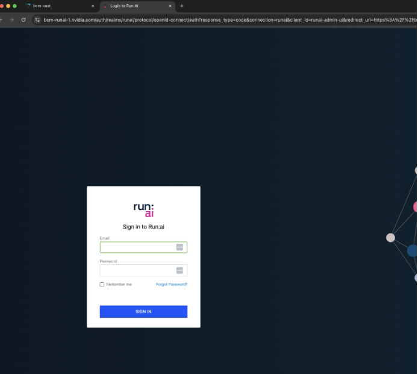
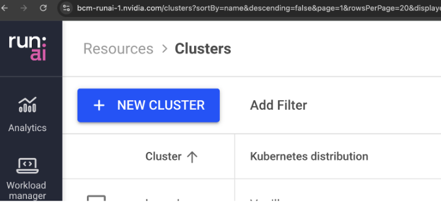
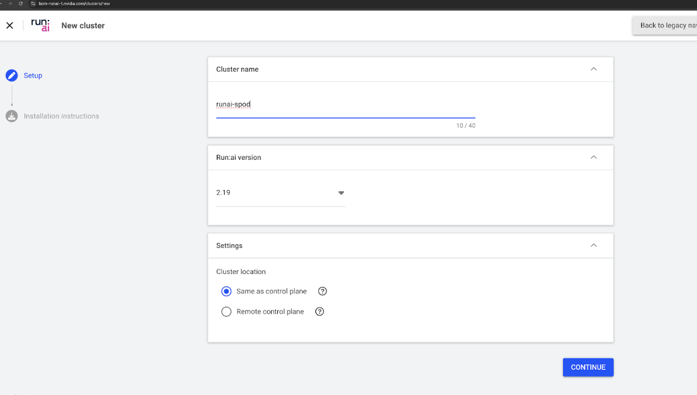
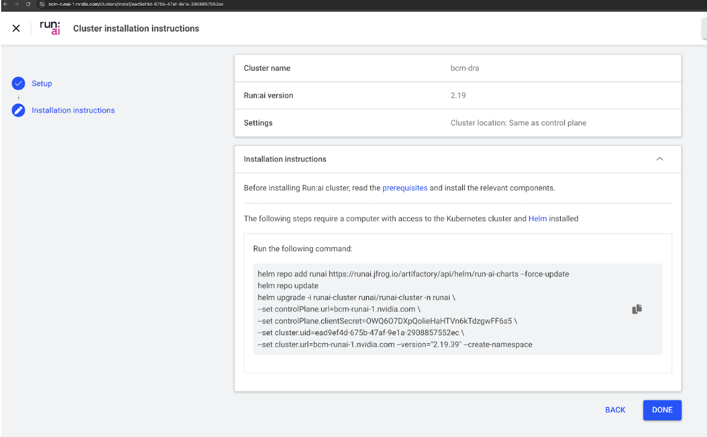
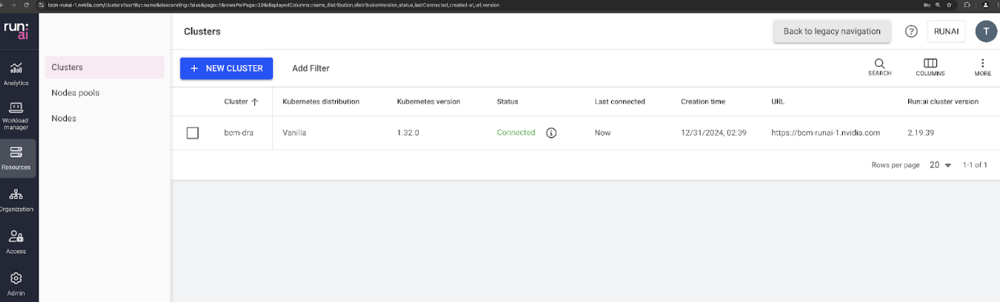

# Deploy Run:ai

## Deploy the Run:ai control plane

1. Create the Kubernetes TLS secret - [https://docs.run.ai/v2.19/admin/runai-setup/self-hosted/k8s/preparations/#domain-certificate](https://docs.run.ai/v2.19/admin/runai-setup/self-hosted/k8s/preparations/#domain-certificate)

2. Create a Public key needed for internal communication - usually the rootCA.pem file - [https://docs.run.ai/v2.19/admin/config/org-cert/#control-plane-installation](https://docs.run.ai/v2.19/admin/config/org-cert/#control-plane-installation)


3. Deploy the Run:ai control plane (requires Internet connectivity) and add the following flag to the helm command --set global.customCA.enabled=true:
[https://docs.run.ai/v2.19/admin/runai-setup/self-hosted/k8s/backend/#helm-install](https://docs.run.ai/v2.19/admin/runai-setup/self-hosted/k8s/backend/#helm-install)

    e.g.
    ```
    helm upgrade -i runai-backend -n runai-backend runai-backend/control-plane --version "2.19.83" --set global.customCA.enabled=true  --set global.domain=bcm-runai-1.nvidia.com

    Release "runai-backend" does not exist. Installing it now.
    NAME: runai-backend
    LAST DEPLOYED: Mon Dec 30 17:30:19 2024
    NAMESPACE: runai-backend
    STATUS: deployed
    REVISION: 1
    ```

    !!! Note
        Please verify with NVIDIA the supported version. To find the latest release use the helm search repo command above.

4. Connect to the Run:ai portal

    
    Go to: https://<FQDN> and log in using the default credentials:

    `User: test@run.ai `
    `Password: Abcd!234`

    After logging in, go to the Users area and change the password.

## Configure the Kubernetes API servers

1. Distributed the cluster certificate to the Public key Infrastructure directory of the Kubernetes master nodes:

    ```
    [bcmhead1]%
    [bcmhead1]% configurationoverlay
    [bcmhead1->configurationoverlay]% use kube-dra-master
    [bcmhead1->configurationoverlay[kube-dra-master]]% roles
    [bcmhead1->configurationoverlay[kube-dra-master]->roles]% use generic::containerd
    [bcmhead1->configurationoverlay[kube-dra-master]->roles[generic::containerd]]% configurations
    [bcmhead1->configurationoverlay[kube-dra-master]->roles[generic::containerd]->configurations]%
    [bcmhead1->configurationoverlay[kube-dra-master]->roles[generic::containerd]->configurations]% add static cluster-cert
    [bcmhead1->configurationoverlay*[kube-dra-master*]->roles*[generic::containerd*]->configurations*[cluster-cert*]]% set serviceactiononwrite none
    [bcmhead1->configurationoverlay*[kube-dra-master*]->roles*[generic::containerd*]->configurations*[cluster-cert*]]% set servicestoponfailure no
    [bcmhead1->configurationoverlay*[kube-dra-master*]->roles*[generic::containerd*]->configurations*[cluster-cert*]]% set filename /etc/kubernetes/pki/<k8s isntance>/server.pem
    [bcmhead1->configurationoverlay*[kube-dra-master*]->roles*[generic::containerd*]->configurations*[cluster-cert*]]% set content /PATH/TO/server.pem
    [bcmhead1->configurationoverlay*[kube-dra-master*]->roles*[generic::containerd*]->configurations*[cluster-cert*]]% commit
    ```

2. Add the following lines to /etc/kubernetes/manifests/kube-apiserver.yaml on each of the three Kubernetes master nodes. Under the - command: section:
    ```
    kind: Pod
    metadata:
    annotations:
        kubeadm.kubernetes.io/kube-apiserver.advertise-address.endpoint: 10.228.52.51:6443
    creationTimestamp: null
    labels:
        component: kube-apiserver
        tier: control-plane
    name: kube-apiserver
    namespace: kube-system
    spec:
    containers:
    - command:
        - kube-apiserver
    .....
    ```

6.  Verify that the changes have taken effect:

    ```
    $ kubectl  -n kube-system get po kube-apiserver-<k8s master node> -o yaml | grep oidc

        - --oidc-client-id=runai
        - --oidc-issuer-url=https://parker.nvidia.com/auth/realms/runai
        - --oidc-username-prefix=-
        - --oidc-ca-file=/etc/kubernetes/pki/<k8s-cluster-name>default/parker-ssl.pem
        - --oidc-username-claim=email
        - --oidc-groups-claim=groups
    ```


## Deploy the Run:ai cluster (scheduler)

1. Add the SSL keys to the `runai` namespace - [https://docs.run.ai/v2.19/admin/config/org-cert/#cluster-installation](https://docs.run.ai/v2.19/admin/config/org-cert/#cluster-installation)

2. Add new cluster:  [https://docs.run.ai/v2.19/admin/runai-setup/cluster-setup/cluster-install/#adding-a-new-cluster](https://docs.run.ai/v2.19/admin/runai-setup/cluster-setup/cluster-install/#adding-a-new-cluster)
Log in to the Run:ai user portal as an admin and go the “Clusters”:

    

3. Add a “New Cluster”:

    

3. Make the following selections:

    * Cluster location ->  **Same as control plane**
    * Version: 2.19 (same as control plane)

4. Copy the Run:ai cluster installation commands from the next screen:

    

5. Append `--set global.customCA.enabled=true` and execute the Helm installation command:

    e.g.
    ```
    helm repo add runai https://runai.jfrog.io/artifactory/api/helm/run-ai-charts --force-update

    helm repo update

    helm upgrade -i runai-cluster runai/runai-cluster -n runai \
    --set controlPlane.url=bcm-runai-1.nvidia.com \
    --set controlPlane.clientSecret=OWQ6O7DXpQolieHaHTVn6kTdzgwFF6s5 \
    --set cluster.uid=ead9ef4d-675b-47af-9e1a-2908857552ec \
    --set cluster.url=bcm-runai-1.nvidia.com --version="2.19.83" --create-namespace --set global.customCA.enabled=true
    ```

After a few minutes the Run:ai cluster should show up as “Connected” to the control plane:



After the Run:ai cluster deployment has finished and all pods are running, patch the OAuth2 proxy, in order to be able to use the signed SSL certificate:

```
kubectl patch runaiconfig runai -nrun runai --type="merge" -p '{"spec":{"workload-controller":{"externalAuthUrlEnabled": false}}}'
```