# Deploy Kubernetes

## Deployment Steps

1. From the active BCM headnode, run the cm-kubernetes-setup command. The following screen will pop-up:

    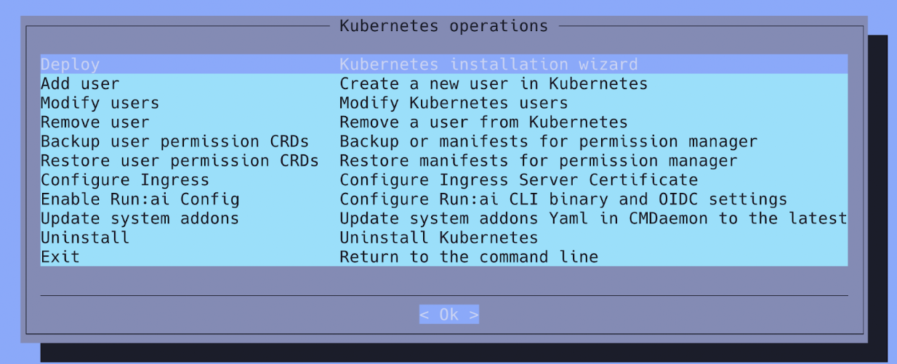

    The number of entries in the above menu might vary, but regardless you need to select “Deploy”.

2. Select Kubernetes version 1.31:

    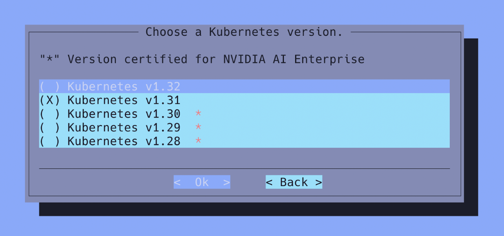

3. If you are re-installing Kubernetes- In case/s like version conflicts (from previous unsuccessful deployments), the following screen will be shown. In this case, select `OK` to proceed.

    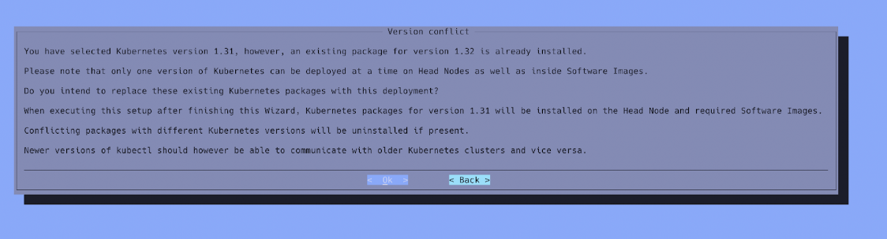

4. [Optional] Provide a DockerHub Container registry mirror, if required, otherwise leave blank:

    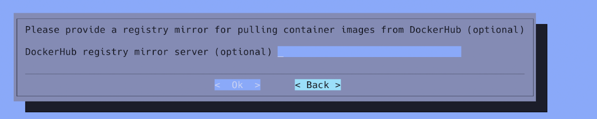

5. Kubernetes networks. The subnets need to be in private address space (per RFC 1918). Use the default values  and only modify if necessary or in case of conflict with other internal subnets within the network.

    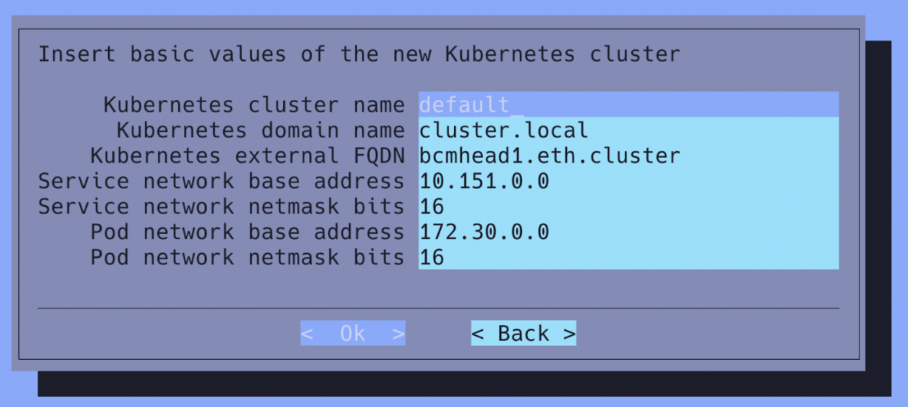

    !!! Note
        - Please make sure that the domain names of the networks are configured correctly and do the necessary modifications as required to match the “Kubernetes External FQDN” using the same domain as in [2.2 Customer DNS records](?tab=t.0#heading=h.lnxbz9).
        - Make sure that the subnet’s above do not overlap with the customer’s private IP ranges. The Pod Network subnet cannot be changed without reinstalling the cluster.

6. Expose the Kubernetes API servers to the cluster’s external network:

    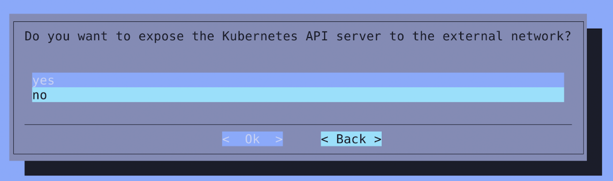

    The external network is defined in BCM’s base partition:
    ```
    cmsh -c "partition get base externalnetwork"
    ```
7. Choose the internal network that will be used by the Kubernetes nodes:

    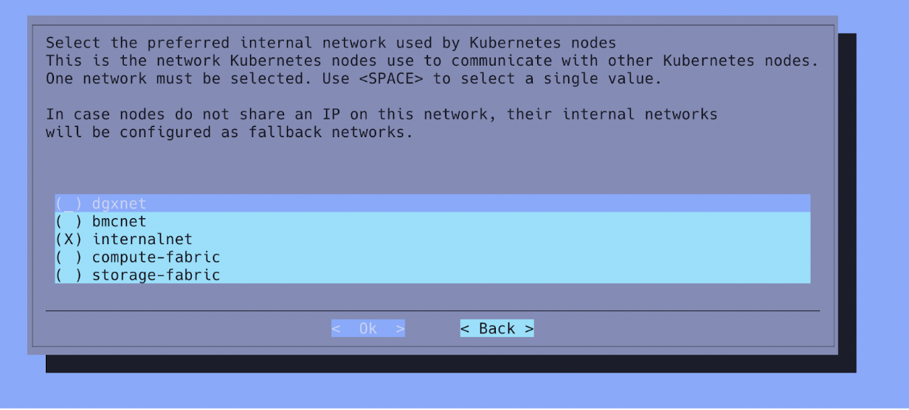

    Given that in SuperPOD deployment the Management and DGX nodes are on different BCM networks, choose the network used by the management nodes during this step. We will verify that DGX nodes can communicate during the Calico CNI configuration.

8. Select  at least 3 (three) Kubernetes master nodes:

    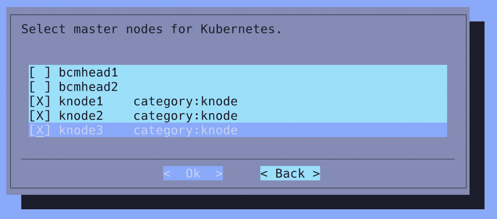

    The number of Kubernetes master needs to be an odd number as decisions are based on quorum.

9. Choose the BCM node categories for the Kubernetes worker node pool:

    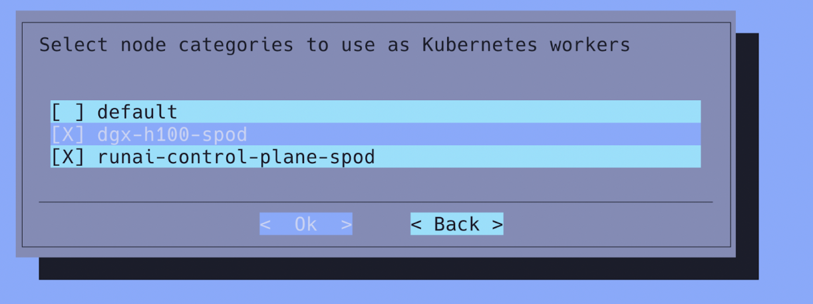

    !!! Note
        You need to choose both the DGX node and Run:ai control plane node  categories outlined in [5. BCM prerequisites](?tab=t.0#heading=h.2xcytpi) .

10. Optional - “Choose individual Kubernetes worker nodes”  TUI screen - **DO NOT **make any selections in this step and instead hit the OK button to proceed to the next step.

    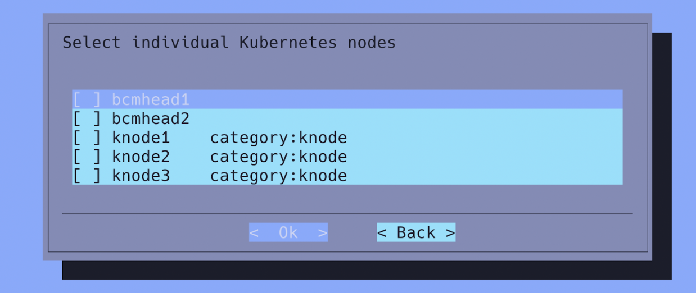

11. Select the  Etcd nodes - Choose the same three nodes as the Kubernetes master nodes (Step 8).

    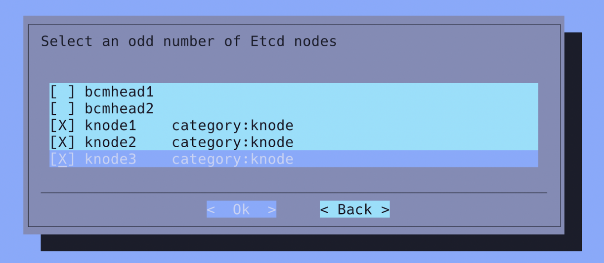

    Ignore the following message if it appears:

    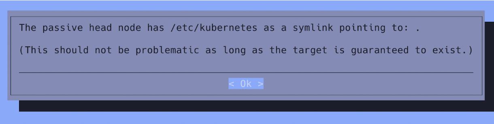

12. Set the  ports as shown below  and **do not modify the Etcd spool directory.**

    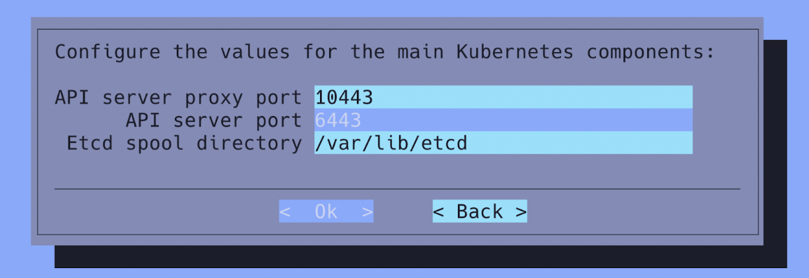

13. Choose** Calico** as the network plugin.

    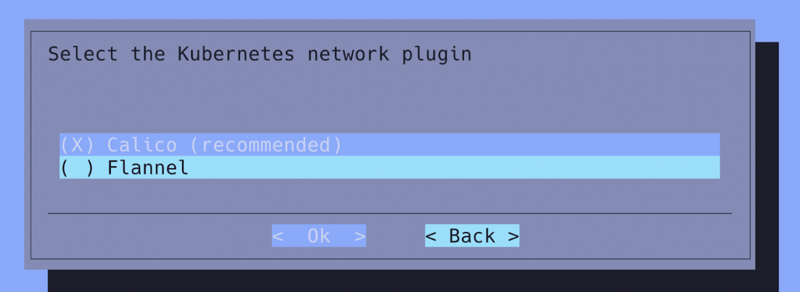

14. Do not install Kyverno during the initial deployment. It can always be enabled at a later stage:

    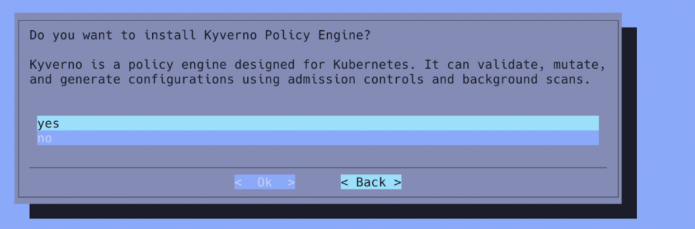

15. Select the following Operators to be deployed:

    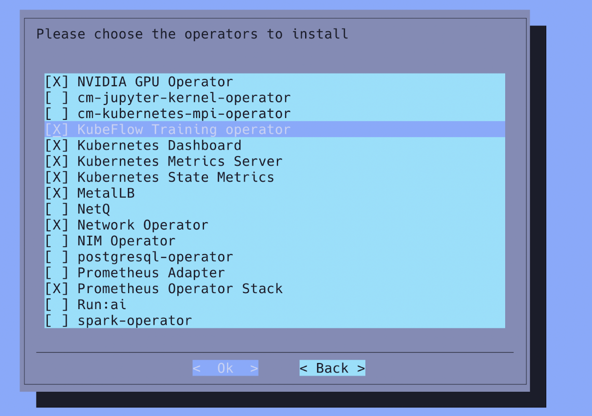

    In addition to the pre-selected entries, select the MetalLB, NVIDIA GPU, Kubeflow Training and  Network Operators as well as the Prometheus Operator stack

    !!! Note
        DO NOT  select the Run:ai deployment operator  in BCM10 at this stage as it is only relevant for Run:ai SaaS deployments.**

    For the **GPU Operator** Select version **24.9.1 **(See [1. Required software versions](?tab=t.0#heading=h.ubj3om7zdkuh)):

    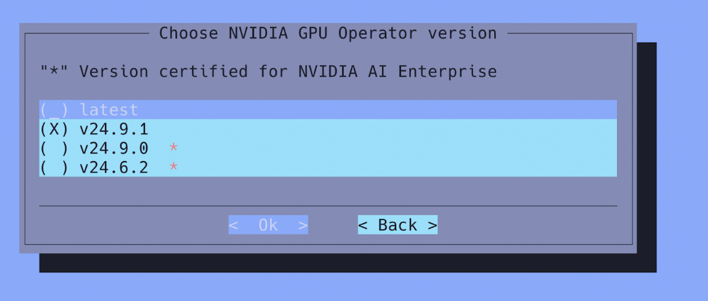

    And for the Network Operator version **24.7.0**:

    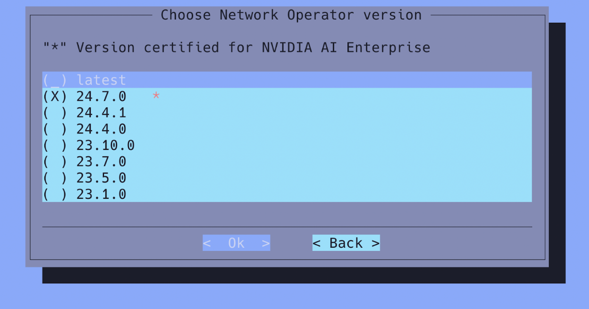

16. Leave the yaml configuration filename empty:

    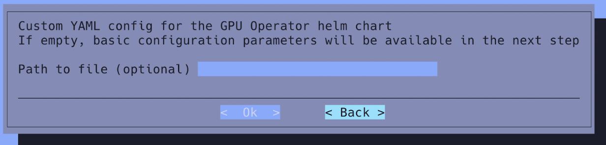

17. Choose the following configuration parameters for the **Configure NVIDIA GPU Operator**:

    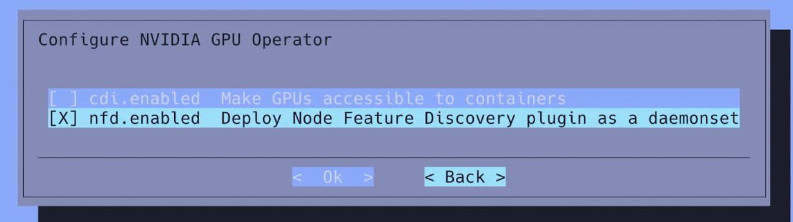

    For the Network Operator provide the following [Helm values YAML](https://gitlab-master.nvidia.com/kuberpod/runai-deployment-assets/-/raw/main/NetworkOperator/helm-values-sriov-nvipam.yaml?ref_type=heads):

    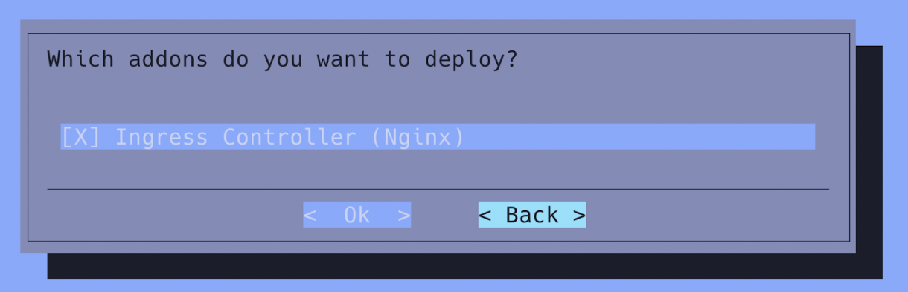

    The Network Operator Helm values file can be found here: [https://gitlab-master.nvidia.com/kuberpod/runai-deployment-assets/-/raw/main/NetworkOperator/helm-values-sriov-nvipam.yaml?ref_type=heads](https://gitlab-master.nvidia.com/kuberpod/runai-deployment-assets/-/raw/main/NetworkOperator/helm-values-sriov-nvipam.yaml?ref_type=heads)

    !!! Note
        Do not add any MetalLB address pools at this point.

        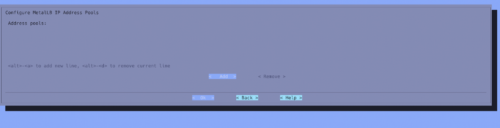

18. Install the following add-ons::

    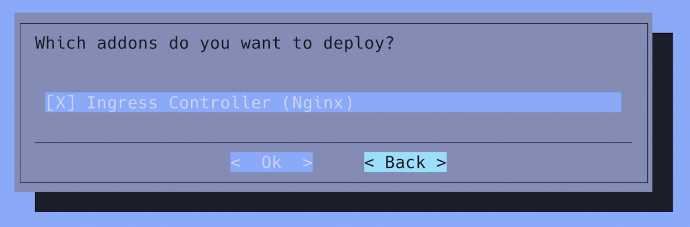

    And select “`yes`” when asked to exposed the Ingress service over port 443:

    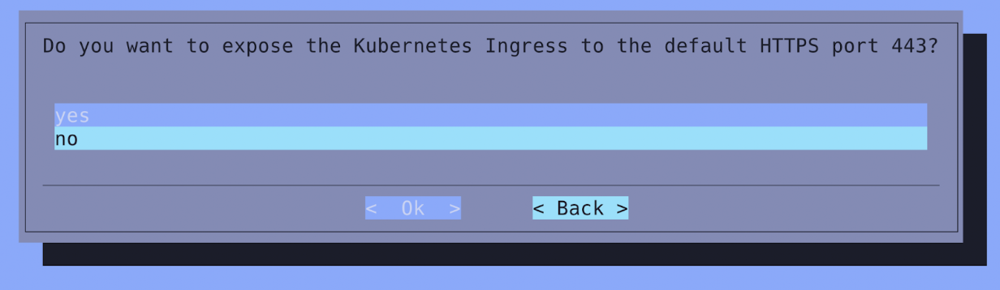

19. Keep the Ingress HTTPS port to 30443 (default value):

    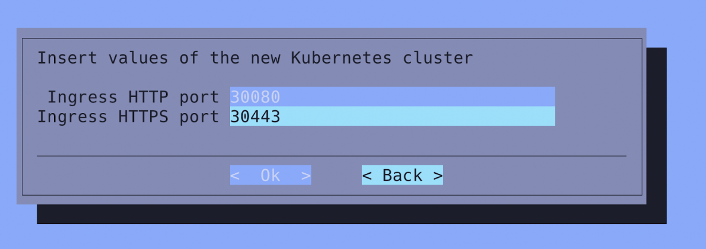

20. Install the BCM Kubernetes permissions manager:

    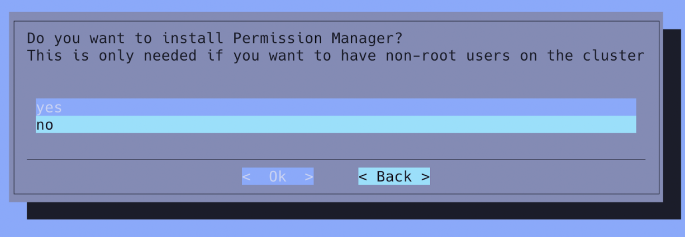

21. Choose Local path as a StorageClass:

    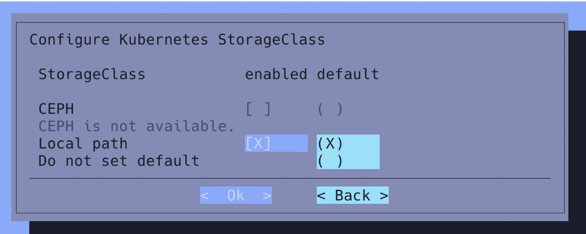

22. Put the storage class on the shared storage (/cm/shared – keep defaults)

    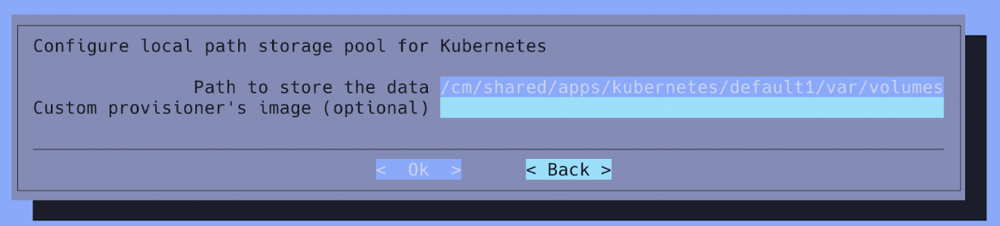

23. Choose save config & deploy

    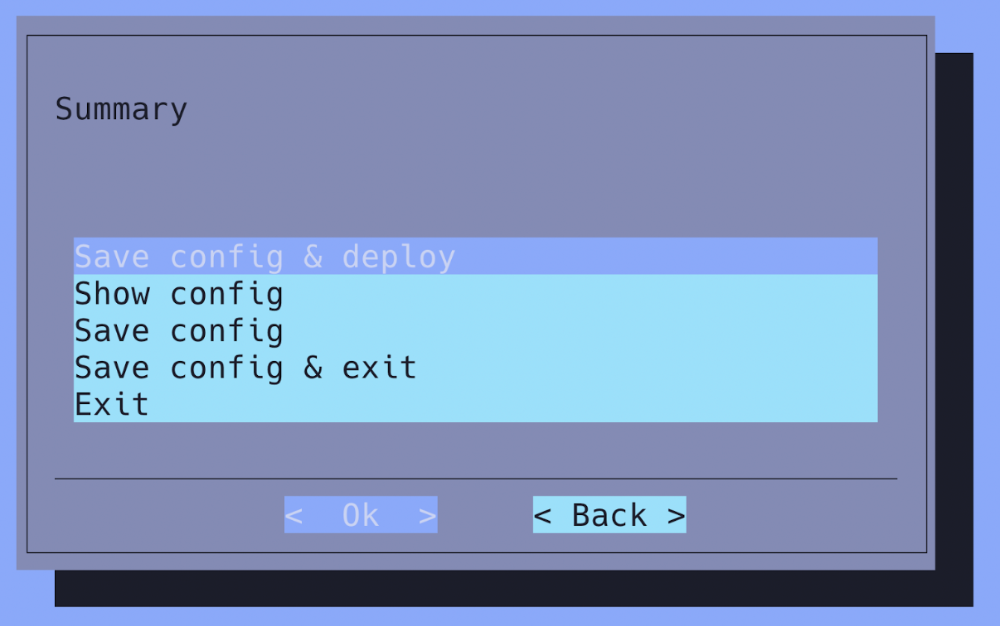

    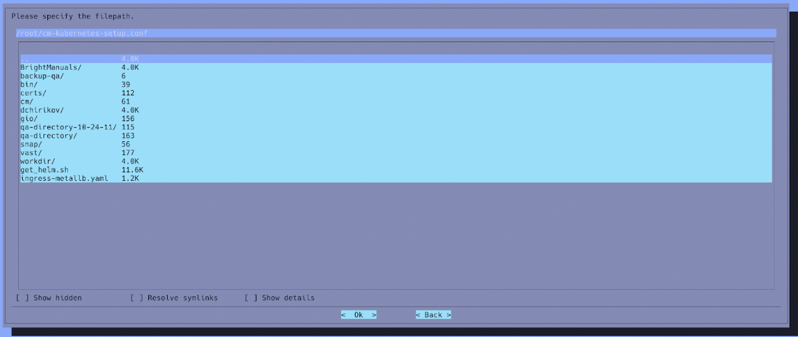

At this point the deployment will start. Half-way through the deployment all nodes that are member of the Kubernetes cluster will be rebooted and the installer will wait up to 60 minutes for all node to come back online.

### Validate Kubernetes Connectivity

1. Retrieve the Kube config file (/root/.kube/config-default on a BCM headnode)  and configure kube context in order to manage the kubernetes cluster. If you want to interact with Kubernetes  from another system, copy the KUBECONFIG to the other system ($HOME/.kube/config or set the KUBECONFIG environment variable pointing to the file) and modify it as following:
    ```
    apiVersion: v1
    clusters:
    - cluster:
        insecure-skip-tls-verify: true   ### ADD THIS LINE
        server: https://bcm-runai-1.nvidia.com:10443 ### Change to the FQDN
        certificate-authority-data: ... ### DELETE THIS LINE
    name: kubernetes
    contexts:
    - context:
        cluster: kubernetes
        user: kubernetes-admin
    name: kubernetes-admin@kubernetes
    current-context: kubernetes-admin@kubernetes
    kind: Config
    preferences: {}
    users:
    - name: kubernetes-admin
    user:
        client-certificate-data:...
        client-key-data: ...
    ```

2. You can tunnel over  SSH the traffic to the K8S API server with the following command:
    ```
    ssh -fNT -L 10443:localhost:10443 root@<IP address of BCM headnode>
    ```

3. If you want to run the kubectl command directly on the BCM headnode load the module first:
    ```
    module load shared kubernetes
    ```

4. This step should have been completed in prior steps above. However, you can verify your connection with the following command:
    ```
    kubectl cluster-info
    Kubernetes control plane is running at https://localhost:8888
    CoreDNS is running at https://localhost:8888/api/v1/namespaces/kube-system/services/kube-dns:dns/proxy
    ```

To further debug and diagnose cluster problems, use 'kubectl cluster-info dump'. 

### Validate the Calico CNI Discovery CIDR

```
root@headnode:~# cmsh
[headnode]% kubernetes
[headnode->kubernetes[default]]% appgroups
[headnode->kubernetes[default]->appgroups]% use system
[headnode->kubernetes[default]->appgroups[system]]% applications
[headnode->kubernetes[default]->appgroups[system]->applications]% use calico
[headnode->kubernetes[default]->appgroups[system]->applications[calico]]% environment
```
Make sure that the CIDR shown spans the network range of both the DGX and Dell worker node Ethernet networks.

