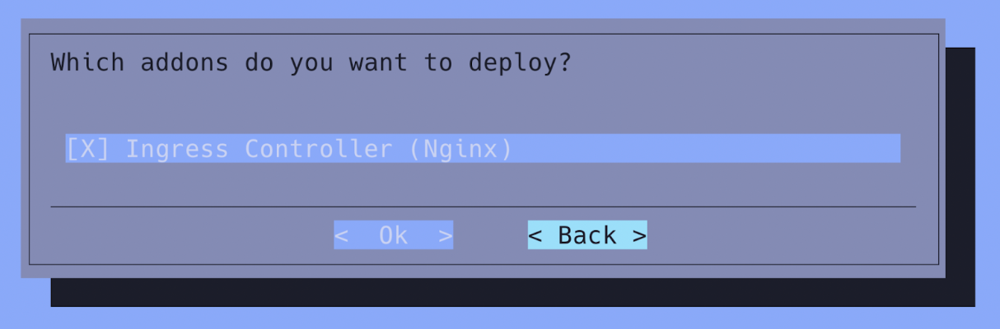

# System requirements


## Pre-installation Checklist

The following checklist is provided for convenience and can be seen as part of an expanded site survey for Run:ai deployments on SuperPOD. This information needs to be collected and validated (as per the steps Chapter 2), before the actual Run:ai deployment begins.

| **Component** | **Type** | 
| --- | --- |
| *[SSL] Full-chain SSL certificate* | <*.p7b, *.der or *.pem file> | 
| *[SSL] SSL Private Key* | Private certificate (e.g. *.key) | 
| *[SSL] CA trust chain public certificate* | X509 PEM file | 
| *[Networking] FQDN name/ Reserved IP address* | DNS A or CNAME record pointing to the BCM headnode shared/floating IP or Load Balancer reserved IP | 
| *[Networking]  Load Balancer IP address range* | Additional IP address space (8 or more) for the Kubernetes LoadBalancer (Inference, DataMover workloads) | 
| *[Storage] Lustre filesystem* | string (FS path) | 
| *[Storage] Lustre MGS NIDs* | String (Lustre NIDs) | 

## Hardware requirements

TBD: Oz

### NVIDIA Run:ai control plane nodes

TBD: Oz- should we add here and then send them to node roles https://docs.google.com/document/d/1FKUEsDSbDrib8sljB42CEO_R-60_O7652nWOzVH-BLU/edit?tab=t.0#heading=h.3z98bkk13y6s

### NVIDIA Run:ai worker nodes

TBD: Oz same as above https://docs.google.com/document/d/1FKUEsDSbDrib8sljB42CEO_R-60_O7652nWOzVH-BLU/edit?tab=t.0#heading=h.jeaiqnemewzj

### Shared storage

NVIDIA Run:ai workloads must be able to access data from any worker node in a uniform way, to access training data and code as well as save checkpoints, weights, and other machine-learning-related artifacts.

Typical protocols are Network File Storage (NFS) or Network-attached storage (NAS). NVIDIA Run:ai cluster supports both, for more information see [Shared storage](../../infrastructure-setup/procedures/shared-storage.md).

TBD: Oz is this equivalent to DDN storage?

## Software requirements

TBD 

## Operating system

TBD: Oz - Do we need to add the ones listed here https://docs.google.com/document/d/1FKUEsDSbDrib8sljB42CEO_R-60_O7652nWOzVH-BLU/edit?tab=t.0#heading=h.ubj3om7zdkuh

* Any **Linux** operating system supported by both Kubernetes and NVIDIA GPU Operator
* NVIDIA Run:ai cluster on Google Kubernetes Engine (GKE) supports both Ubuntu and Container Optimized OS (COS). COS is supported only with NVIDIA GPU Operator 24.6 or newer, and NVIDIA Run:ai cluster version 2.19 or newer. NVIDIA Run:ai cluster on Oracle Kubernetes Engine (OKE) supports only Ubuntu.
* Internal tests are being performed on **Ubuntu 22.04** and **CoreOS** for OpenShift.

## Kubernetes 

1. From the active BCM headnode, run the `cm-kubernetes-setup` command. The following screen will pop-up:

    

    The number of entries in the above menu might vary, but regardless you need to select “Deploy”.

2. Select Kubernetes version 1.31:

    

3. If you are re-installing Kubernetes- In case/s like version conflicts (from previous unsuccessful deployments), the following screen will be shown. In this case, select `OK` to proceed.

    

4. [Optional] Provide a DockerHub Container registry mirror, if required, otherwise leave blank:

    

5. Kubernetes networks. The subnets need to be in private address space (per RFC 1918). Use the default values  and only modify if necessary or in case of conflict with other internal subnets within the network.

    

    !!! Note
        - Please make sure that the domain names of the networks are configured correctly and do the necessary modifications as required to match the “Kubernetes External FQDN” using the same domain as in [2.2 Customer DNS records](?tab=t.0#heading=h.lnxbz9).
        - Make sure that the subnet’s above do not overlap with the customer’s private IP ranges. The Pod Network subnet cannot be changed without reinstalling the cluster.

6. Expose the Kubernetes API servers to the cluster’s external network:

    

    The external network is defined in BCM’s base partition:
    ```
    cmsh -c "partition get base externalnetwork"
    ```
7. Choose the internal network that will be used by the Kubernetes nodes:

    

    Given that in SuperPOD deployment the Management and DGX nodes are on different BCM networks, choose the network used by the management nodes during this step. We will verify that DGX nodes can communicate during the Calico CNI configuration.

8. Select at least 3 (three) Kubernetes master nodes:

    

    The number of Kubernetes master needs to be an odd number as decisions are based on quorum.

9. Choose the BCM node categories for the Kubernetes worker node pool:

    

    !!! Note
        You need to choose both the DGX node and Run:ai control plane node  categories outlined in [5. BCM prerequisites](?tab=t.0#heading=h.2xcytpi) .

10. Optional - “Choose individual Kubernetes worker nodes”  TUI screen - **DO NOT **make any selections in this step and instead hit the OK button to proceed to the next step.

    

11. Select the  Etcd nodes - Choose the same three nodes as the Kubernetes master nodes (Step 8).

    

    Ignore the following message if it appears:

    

12. Set the  ports as shown below  and **do not modify the Etcd spool directory.**

    

13. Choose** Calico** as the network plugin.

    

14. Do not install Kyverno during the initial deployment. It can always be enabled at a later stage:

    

### Operators

TBD: the screenshot shows kubeflow only?

Select the following Operators to be deployed:


In addition to the pre-selected entries, select the MetalLB, NVIDIA GPU, Kubeflow Training and Network Operators as well as the Prometheus Operator stack. TBD: Oz I don't see preselected entries.

!!! Note
   DO NOT select the Run:ai deployment operator in BCM10 at this stage as it is only relevant for Run:ai SaaS deployments.

#### GPU Operator

1. For the **GPU Operator** Select version **24.9.1 **(See [1. Required software versions](?tab=t.0#heading=h.ubj3om7zdkuh)):

   


2. Leave the yaml configuration filename empty:

   


3. Choose the following configuration parameters for the **Configure NVIDIA GPU Operator**:

    

#### Network Operator

And for the Network Operator version **24.7.0**:


For the Network Operator provide the following [Helm values YAML](https://gitlab-master.nvidia.com/kuberpod/runai-deployment-assets/-/raw/main/NetworkOperator/helm-values-sriov-nvipam.yaml?ref_type=heads):


The Network Operator Helm values file can be found here: [https://gitlab-master.nvidia.com/kuberpod/runai-deployment-assets/-/raw/main/NetworkOperator/helm-values-sriov-nvipam.yaml?ref_type=heads](https://gitlab-master.nvidia.com/kuberpod/runai-deployment-assets/-/raw/main/NetworkOperator/helm-values-sriov-nvipam.yaml?ref_type=heads)

!!! Note
   Do not add any MetalLB address pools at this point.

   

#### TBD

TBD: Oz not sure what to call this

18. Install the following add-ons:

    

    And select “`yes`” when asked to exposed the Ingress service over port 443:

    

19. Keep the Ingress HTTPS port to 30443 (default value):

    

20. Install the BCM Kubernetes permissions manager:

    

21. Choose Local path as a StorageClass:

    

22. Put the storage class on the shared storage (/cm/shared – keep defaults)

    

23. Choose save config & deploy

    

    

### Start deployment

At this point the deployment will start. Half-way through the deployment all nodes that are member of the Kubernetes cluster will be rebooted and the installer will wait up to 60 minutes for all node to come back online.


## Create the NVIDIA Run:ai namespaces

Create the following Kubernetes namespaces:

!!! Note
    Load the Kubernetes Lmod module if needed with `module load kubernetes`.

You will need a JFrog container registry pull secret in order to download the Run:ai container images. The token can be found in Run:ai welcome e-mail together with the EULA and other relevant info. If you do not have one, reach out to sales for guidance.

```
TOKEN="eyJ2ZXIiOiIyIiwi...."

kubectl create ns runai-backend

kubectl create ns runai

kubectl create secret docker-registry runai-reg-creds  \
--docker-server=https://runai.jfrog.io \
--docker-username=self-hosted-image-puller-prod \
--docker-password=$TOKEN \
--docker-email=support@run.ai \
--namespace=runai-backend 
```


## Configure the Kubernetes Ingress controller to use the signed SSL certificates

### Scale-up the Ingress Deployment

Increase the number of replicas (from 1 to 3):

```
# cmsh
[bcmhead1->device]% kubernetes
[bcmhead1->kubernetes[dra]]% appgroups
[bcmhead1->kubernetes[dra]->appgroups]% use system
[bcmhead1->kubernetes[dra]->appgroups[system]]% applications
[bcmhead1->kubernetes[dra]->appgroups[system]->applications]% use ingress_controller
[bcmhead1->kubernetes[dra]->appgroups[system]->applications[ingress_controller]]% environment
[bcmhead1->kubernetes[dra]->appgroups[system]->applications[ingress_controller]->environment]% set replicas  value 3
[bcmhead1->kubernetes*[dra*]->appgroups*[system*]->applications*[ingress_controller*]->environment*]% commit
```

## Configure the NGINX proxy TLS certificates

1. Run `cm-kubernetes-setup` on the active headnode and select `Configure Ingress.`

    

2. Select the Kubernetes cluster:

    

3. Select `yes` when asked to provide signed certificates:

    

4. Enter the path to the private key and PEM certificate (See [Customer-provided Prerequisites](?tab=t.0#heading=h.26in1rg) ):

    

5. Wait for the Ingress pod to restart (~1 minute) and verify that the pod is running.

    ```
    root@bcmhead1:~# a	kubectl get -n ingress-nginx   all
    NAME                                       	READY   STATUS	RESTARTS   AGE
    pod/ingress-nginx-controller-74dd65f46-9w247   1/1 	Running   0      	20s

    NAME                                     	TYPE    	CLUSTER-IP   	EXTERNAL-IP   PORT(S)                  	AGE
    service/ingress-nginx-controller         	NodePort	10.150.101.148   <none>    	80:30081/TCP,443:30444/TCP   29h
    service/ingress-nginx-controller-admission   ClusterIP   10.150.47.133	<none>    	443/TCP                  	29h

    NAME                                   	READY   UP-TO-DATE   AVAILABLE   AGE
    deployment.apps/ingress-nginx-controller   1/1 	1        	1       	29h

    NAME                                              	DESIRED   CURRENT   READY   AGE
    replicaset.apps/ingress-nginx-controller-6cb66c9c65   0     	0     	0   	29h
    replicaset.apps/ingress-nginx-controller-74dd65f46	1     	1     	1   	20s

    NAME                                   	STATUS 	COMPLETIONS   DURATION   AGE
    job.batch/ingress-nginx-admission-create   Complete   1/1       	7s     	29h
    job.batch/ingress-nginx-admission-patch	Complete   1/1       	24s    	29h
    root@bcmhead1:~#

    NAME                                              	DESIRED   CURRENT   READY   AGE
    replicaset.apps/ingress-nginx-controller-55c4bcf495   1     	1     	1   	21d
    replicaset.apps/ingress-nginx-controller-58dc974f94   0     	0     	0   	21d

    NAME                                   	COMPLETIONS   DURATION   AGE
    job.batch/ingress-nginx-admission-create   1/1       	32s    	21d
    job.batch/ingress-nginx-admission-patch	1/1       	51s    	21d
    ```

and that  the signing certificate is being used by connecting to one of the Kubernetes nodes (`bcm-runai-1.nvidia.com` in the example below) via HTTPS:

```
# openssl s_client -showcerts < ENDPOINT FQDN >:443 </dev/null | openssl x509 -text
```

Inspect the output and verify that the server certificate CN contains the FQDN hostname and that it is signed by the CA.

### Expose the Run:ai endpoint through MetalLB

The Run:ai can be exposed either through a reverse HTTPS proxy from the two BCM headnodes or through the MetalLB Load Balancer/Route Advertiser.  In the latter, additional configuration is needed to expose  the Kubernetes Ingress.

**Prerequisites:**

* MetalLB deployed as part of the Kubernetes installation
* A reserved range of IP addresses for the load balancer
 
 * The IP addresses need to be routable from the customer’s corporate network
 * The DNS record needs to point to one of the IP addresses from that range. That address will be reserved and allocated to the Kubernetes NGINX Ingress.
 * Ensure that no firewall is blocking connectivity to that IP address range.
 * Ensure that there are no conflicts.

Before we begin, ensure that the Kubernetes API proxy is configured with strict ARP validation:

```
kubectl get configmap kube-proxy -n kube-system -o yaml | \
sed -e "s/strictARP: false/strictARP: true/" | \
kubectl apply -f - -n kube-system
```

Create a new AppGroup application in BCM:

```
root@bcmhead1:~# cmsh
[bcmhead1]% kubernetes
[bcmhead1->kubernetes[dra]]% appgroups
[bcmhead1->kubernetes[dra]->appgroups]% use system
[bcmhead1->kubernetes[dra]->appgroups[system]]% applications
[bcmhead1->kubernetes[dra]->appgroups[system]->applications]% add ingress-metallb
[bcmhead1->kubernetes*[dra*]->appgroups*[system*]->applications*[ingress-metallb*]]% set config /root/ingress-metallb.yaml
[bcmhead1->kubernetes*[dra*]->appgroups*[system*]->applications*[ingress-metallb*]]% commit
[bcmhead1->kubernetes[dra]->appgroups[system]->applications[ingress-metallb]]%
```

The configuration YAML contents can be found at:

[https://gitlab-master.nvidia.com/kuberpod/runai-deployment-assets/-/raw/main/MetalLB/ingress-metallb.yaml?ref_type=heads](https://gitlab-master.nvidia.com/kuberpod/runai-deployment-assets/-/raw/main/MetalLB/ingress-metallb.yaml?ref_type=heads)

You will need to *substitute the IP address *with the reserved IP address.

What the above does, is that it creates the MetalLB IP address pool and L2 advertisement CRDs:

```
apiVersion: metallb.io/v1beta1
kind: L2Advertisement
metadata:
  name: l2-ingress
  namespace: metallb-system
spec:
  ipAddressPools:
  - ingress-pool
  nodeSelectors:
  - matchLabels:
   node-role.kubernetes.io/runai-system: "true"

---
apiVersion: metallb.io/v1beta1
kind: IPAddressPool
metadata:
  name: ingress-pool
  namespace: metallb-system
spec:
  addresses:
  - <RESERVED IP>/32
  autoAssign: false
  serviceAllocation:
   priority: 50
   namespaces:
   - ingress-nginx
```

And new Ingress Kubernetes service:

```
---
apiVersion: v1
kind: Service
metadata:
  labels:
   app.kubernetes.io/component: controller
   app.kubernetes.io/instance: ingress-nginx
   app.kubernetes.io/name: ingress-nginx
   app.kubernetes.io/part-of: ingress-nginx
   app.kubernetes.io/version: 1.11.2
  name: ingress-nginx-controller-lb1
  namespace: ingress-nginx
spec:
  ipFamilies:
  - IPv4
  ipFamilyPolicy: SingleStack
  ports:
  - appProtocol: http
   name: http
   port: 80
   protocol: TCP
   targetPort: http
  - appProtocol: https
   name: https
   port: 443
   protocol: TCP
   targetPort: https
  selector:
   app.kubernetes.io/component: controller
   app.kubernetes.io/instance: ingress-nginx
   app.kubernetes.io/name: ingress-nginx
  type: LoadBalancer
  loadBalancerIP: <RESERVED IP>
```

### Prometheus

TBD: Oz how is this done in BCM? I see it in Kubernetes deployment but with no specific instructions

## Additional software requirements

Additional NVIDIA Run:ai capabilities, Distributed Training and Inference require additional Kubernetes applications (frameworks) to be installed on the cluster. TBD

### Distributed training

Distributed training enables training of AI models over multiple nodes. This requires installing a distributed training framework on the cluster. The following frameworks are supported:

* [TensorFlow](https://www.tensorflow.org/)
* [PyTorch](https://pytorch.org/)
* [XGBoost](https://xgboost.readthedocs.io/)
* [MPI](https://docs.open-mpi.org/)

All are part of the Kubeflow Training Operator. Run:ai supports Training Operator version 1.7. The Kubeflow Training Operator gets installed as part of the BCM Kubernetes Deployment.

The Kubeflow Training Operator is packaged with MPI version 1.0 which is not supported by Run:ai. You need to separately install MPI v2beta1:

1. Run the below to install MPI v2beta:
    ```
    kubectl create -f https://raw.githubusercontent.com/kubeflow/mpi-operator/v0.6.0/deploy/v2beta1/mpi-operator.yaml
    ```
2. Disable MPI in the Training operator by running:
    ```
    kubectl patch deployment training-operator -n kubeflow --type='json' -p='[{"op": "add", "path": "/spec/template/spec/containers/0/args", "value": ["--enable-scheme=tfjob", "--enable-scheme=pytorchjob", "--enable-scheme=xgboostjob"]}]'
    ``` 

3. Run: kubectl delete crd mpijobs.kubeflow.org
4. Install MPI v2beta1 again:
    ```
    kubectl create -f https://raw.githubusercontent.com/kubeflow/mpi-operator/v0.6.0/deploy/v2beta1/mpi-operator.yaml

    # Ignore any errors in the above command

    kubectl replace -f https://raw.githubusercontent.com/kubeflow/mpi-operator/v0.6.0/deploy/v2beta1/mpi-operator.yaml
    ```


### Inference

Inference enables serving of AI models. This requires the [Knative Serving](https://knative.dev/docs/serving/) framework to be installed on the cluster and supports Knative versions 1.10 to 1.15.

Follow the [Installing Knative](https://knative.dev/docs/install/) instructions. After installation, configure Knative to use the NVIDIA Run:ai scheduler and features, by running:

1. Install the Knative CRDs:
    ```
    kubectl apply -f https://github.com/knative/serving/releases/download/knative-v1.15.0/serving-crds.yaml
    ```
2. Install Knative-serving:
    ```
    kubectl apply -f https://github.com/knative/serving/releases/download/knative-v1.15.0/serving-core.yaml
    ```
3. Deploy the Koerier Ingress:
    ```
    kubectl apply -f https://github.com/knative/net-kourier/releases/download/knative-v1.15.0/kourier.yaml
    ```
4. Patch the Knative deployment:
    ```
    kubectl patch configmap/config-autoscaler   --namespace knative-serving   --type merge   --patch '{"data":{"enable-scale-to-zero":"true"}}'

    kubectl patch configmap/config-features   --namespace knative-serving   --type merge   --patch '{"data":{"kubernetes.podspec-schedulername":"enabled","kubernetes.podspec-affinity":"enabled","kubernetes.podspec-tolerations":"enabled","kubernetes.podspec-volumes-emptydir":"enabled","kubernetes.podspec-securitycontext":"enabled","kubernetes.podspec-persistent-volume-claim":"enabled","kubernetes.podspec-persistent-volume-write":"enabled","multi-container":"enabled","kubernetes.podspec-init-containers":"enabled"}}'

    kubectl patch configmap/config-network   --namespace knative-serving   --type merge   --patch '{"data":{"ingress-class":"kourier.ingress.networking.knative.dev"}}'
    ```

5. The Koerier Ingress IP will be assigned by MetalLB and can be retrieved with:
    ```
    kubectl --namespace kourier-system get service kourier
    ```

## Fully Qualified Domain Name (FQDN)

TBD: Oz where should it be placed and should we continue using the heading customer DNS record?

You must have a Fully Qualified Domain Name (FQDN) to install NVIDIA Run:ai control plane (ex: `runai.mycorp.local`). This cannot be an IP. The domain name must be accessible inside the organization's private network.

The DNS record needs to point to the IP address (A record) of the shared, alias interface that is active on the active BCM headnode (<NIC device name>:cmha i.e. eth0:cmha) or be a CNAME alias to a host DNS record pointing to that same IP address.

## TLS certificate

You must have a TLS certificate that is associated with the FQDN for HTTPS access. The certificate will be installed on the Kubernetes control-plane nodes as well as a Kubernetes secret for the Run:ai backend and the NCM Kubernetes Ingress controller.

* The certificate CN name needs to be equal to the FQDN name is Section 2.1.
* The certificate needs to include at least one Subject Alternative Name DNS entry (SAN) for the same FQDN.
* The certificate needs to include the full trust chain (signing CA public keys)

Create a [Kubernetes Secret](https://kubernetes.io/docs/concepts/configuration/secret/) named `runai-cluster-domain-tls-secret` in the `runai` namespace and include the path to the TLS `--cert` and its corresponding private `--key` by running the following:

```bash
kubectl create secret tls runai-cluster-domain-tls-secret -n runai \    
  --cert /path/to/fullchain.pem  \ # Replace /path/to/fullchain.pem with the actual path to your TLS certificate    
  --key /path/to/private.pem # Replace /path/to/private.pem with the actual path to your private key
```


## Local certificate authority

TBD: Oz keep this?


