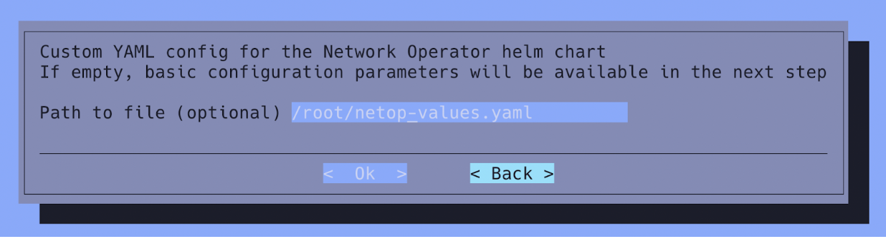

# System Requirements


## Pre-installation Checklist

The following checklist is provided for convenience and can be seen as part of an expanded site survey for NVIDIA Run:ai deployments on SuperPOD. This information needs to be collected and validated before the NVIDIA Run:ai deployment begins.

| **Component** | **Type** | 
| --- | --- |
| [SSL] Full-chain SSL certificate | <*.p7b, *.der or *.pem file> | 
| [SSL] SSL Private Key | Private certificate (e.g. *.key) | 
| [SSL] CA trust chain public certificate | X509 PEM file | 
| [Networking] FQDN name/ Reserved IP address | DNS A or CNAME record pointing to the load balancer reserved IP | 
| [Networking] Load Balancer IP address range | Additional IP address space (8 or more) for the Kubernetes LoadBalancer (Inference, DataMover workloads) | 

## Installer Machine

The machine running the installation must have:

* At least 50GB of free space
* Docker installed
* [Helm](https://helm.sh/) 3.14 or later

The configuration of BCM as well the deployment of NVIDIA Run:ai can be performed through SSH access on the BCM headnodes:

```bash
ssh root@<IP address of BCM headnode>
```

## Hardware Requirements

The following hardware requirements are for the NVIDIA Run:ai control plane and cluster system nodes. By default, all NVIDIA Run:ai services run on all available nodes. TBD: Sherin

### Kubernetes

| Component  | Required Capacity |
| ---------- | ----------------- |
| CPU        | 2 cores           |
| Memory     | 16GB              |
| Disk space | 100GB             |

### NVIDIA Run:ai - System Nodes

This configuration is the minimum requirement you need to install and use NVIDIA Run:ai.

| Component  | Required Capacity |
| ---------- | ----------------- |
| CPU        | 20 cores          |
| Memory     | 42GB              |
| Disk space | 160GB             |


### NVIDIA Run:ai - Worker Nodes

NVIDIA Run:ai supports NVIDIA SuperPods built on the A100, H100, H200, and B200 GPU architectures. These systems are optimized for high-performance AI workloads at scale.

The following configuration represents the minimum hardware requirements for installing and operating NVIDIA Run:ai on worker nodes. Each node must meet these specifications:

| Component | Required Capacity |
| --------- | ----------------- |
| CPU       | 2 cores           |
| Memory    | 4GB               |


### Node Categories

In BCM, a node category is a way to group nodes that share the same hardware profile and intended role. Defining node categories allows the system to assign the appropriate software image and configurations to each group during provisioning.

Before installing NVIDIA Run:ai, make sure the necessary BCM node categories are created for:

* NVIDIA Run:ai system nodes (in the below steps, this is named runai-control-plane-spod)
* NVIDIA Run:ai GPU worker nodes (in the below steps, dgx-h100-spod)
* Optional node category: NVIDIA Run:ai CPU worker nodes 

TBD


## Reserved IPs

Before installation, ensure that the following IPs are reserved and correctly configured:

* FQDN / Reserved IP - Reserve a static IP address that will be mapped to your system’s [Fully Qualified Domain Name (FQDN)](#fully-qualified-domain-name-fqdn). This IP must be referenced in a DNS A record or a CNAME that ultimately resolves to it. The IP is assigned to the alias interface on the active BCM headnode and is used for system access.

* Load Balancer IP Range - Reserve a block of at least 8 consecutive IP addresses. This range will be used by [MetalLB](#expose-the-nvidia-runai-endpoint---metallb) to expose Kubernetes LoadBalancer services externally, supporting components such as Inference and DataMover workloads. TBD: Oz

All reserved IPs must be reachable within your internal network and must not conflict with any existing IP allocations.

## Fully Qualified Domain Name (FQDN)

You must have a Fully Qualified Domain Name (FQDN) to install NVIDIA Run:ai control plane (ex: `runai.mycorp.local`). This cannot be an IP. The domain name must be accessible inside the organization's private network.

The DNS record needs to point to the IP address (A record) of the shared alias interface that is active on the active BCM headnode (<NIC device name>:cmha i.e. eth0:cmha) or be a CNAME alias to a host DNS record pointing to that same IP address.
This IP is also used by the system’s load balancer and must match the one referenced in the [Reserved IPs](#reserved-ips) section.

## TLS/SSL Certificates

You must have a TLS certificates that is associated with the FQDN for HTTPS access. The certificate will be installed on the Kubernetes control plane nodes as well as a [Kubernetes secret](#tls-certificate-for-nvidia-runai) for the NVIDIA Run:ai backend and the [Kubernetes Ingress controller](#configure-the-nginx-proxy-tls-certificates).

* The certificate CN name needs to be equal to the [FQDN](#fully-qualified-domain-name-fqdn) name.
* The certificate needs to include at least one Subject Alternative Name DNS entry (SAN) for the same FQDN.
* The certificate needs to include the full trust chain (signing CA public keys).


## Operating System

DGX OS is supported on your SuperPod and optimized for NVIDIA infrastructure. 
SR-IOV enables InfiniBand support at the host level. When used together with the NVIDIA Network Operator, it allows workloads to leverage InfiniBand networking for high-performance communication.


The VAST Multi-path or DDN EXA Lustre driver has been installed in all of the used the software image and the Lustre/VAST has been mounted on all DGX and K8S nodes using a BCM FSMount. TBD: Oz


## Deploy Kubernetes on Base Command Manager

1. From the active BCM headnode, run the following command:
    ```
    cm-kubernetes-setup
    ```

2. The following screen will pop up. Select **Deploy** and then click **Ok**:

    

    !!! Note
        The number of entries in the above menu may vary.

2. Select **Kubernetes v1.31** and then click **Ok**:

    

3. Optional: Provide a DockerHub container registry mirror if required and then click **Ok**. Otherwise, leave blank and click **Ok** to proceed:

    

4. Set the Kubernetes networks and then click **Ok**. The subnets need to be in a private address space (per RFC 1918). Use the default values and only modify if necessary or in case of conflict with other internal subnets within the network: Make sure the domain names of the networks are configured correctly and modify as required to match the “Kubernetes External FQDN” using the same domain set in [FQDN](#fully-qualified-domain-name-fqdn). TBD: Sherin

    

5. Select **yes** to expose the Kubernetes API servers to the cluster’s external network and then click **Ok**:

    


6. Select the internal network that will be used by the Kubernetes nodes and then click **Ok**:

    

7. Select at least 3 Kubernetes master nodes and then click **Ok**:

    

    !!! Note
        To ensure high availability and prevent a single point of failure, it is recommended to configure at least three Kubernetes master nodes in your cluster.

8. Select both the NVIDIA Run:ai system and worker [node categories](#node-categories) to operate as the Kubernetes worker nodes and then click **Ok**:

    


9. Selecting individual Kubernetes nodes is not required. Click **Ok** to proceed:

    

10. Select the Etcd nodes and then click **Ok**. Make sure to select the same three nodes as the Kubernetes master nodes (Step 8):

    

11. Ignore the following message if it appears and click **Ok**:

    

12. Set the ports as shown below and then click **Ok**. Do not modify the Etcd spool directory:

    

13. Select **Calico** as the Kubernetes network plugin and then click **Ok**:

    

14. Do not install Kyverno during the initial deployment. It can always be enabled at a later stage. Select **no** and then click **Ok**:

    

### Operators

Select the following Operators and then click **Ok**:


!!! Note
    Do NOT select the Run:ai deployment operator in BCM10 at this stage as it is only relevant for NVIDIA Run:ai SaaS deployments.

#### NVIDIA GPU Operator

NVIDIA Run:ai supports versions 22.9 to 25.3.

1. Select the required NVIDIA GPU Operator version and then click **Ok**:
    


2. Leave the yaml configuration file path empty and then click **Ok**:
    


3. Configure the NVIDIA GPU Operator by selecting the following configuration parameters and then click **Ok**:
    

#### Network Operator

1. Select Network Operator **v24.7.0** and then click **Ok**:

    


2. Create a YAML file with the following Helm values:
    ```yaml
    deployCR: true
    nfd:
      enabled: true
    ofedDriver:
      deploy: false
    psp:
      enabled: false
    rdmaSharedDevicePlugin:
      deploy: false
    secondaryNetwork:
      cniPlugins:
        deploy: true
      deploy: true
      ipamPlugin:
        deploy: false
      multus:
        deploy: true
    nvIpam:
      deploy: true
    sriovDevicePlugin:
      deploy: false
    sriovNetworkOperator:
      enabled: true
    ```

3. Add the path to the YAML file and then click **Ok**:

    


4. Do not add any MetalLB address pools at this point. Click **Ok** to proceed:
        
    

### Kubernetes Ingress Controller

1. Select **Ingress Controller (Nginx)** and then click **Ok**:
    

2. Select **yes** when asked to exposed the Ingress service over port 443 and then click **Ok**:
    

2. Keep the Ingress HTTPS port to 30443 (default value) and then click **Ok**:

    

### Permissions Manager

Click **yes** to install the BCM Kubernetes permissions manager and then click **Ok**:


### Storage Class


1. Select **Local path** as the Kubernetes StorageClass and then click **Ok**:

    


2. Put the storage class on the shared storage (/cm/shared – keep defaults) and then click **Ok**:

    

### Save your Configuration

Select **Save config & deploy** and then click **Ok**:


### Start Deployment

At this point the deployment will start. Half way through the deployment all nodes that are members of the Kubernetes cluster will be rebooted and the installer will wait up to 60 minutes for all nodes to come back online.


## Configure BCM Kubernetes for NVIDIA Run:ai

### Label the NVIDIA Run:ai System Nodes

!!! Note
    The names of the categories are arbitrary names so they may vary depending on the customer choice or any other preference. Make sure that you label the correct category. Mixing labels will result in pods running on incorrect nodes or not being scheduled at all.

Label the nodes using CMSH:

```bash
cmsh
kubernetes
labelsets
add runai-control-plane
append categories runai-control-plane
append labels 
node-role.kubernetes.io/runai-system=true
commit
```

!!! Note
    For more information, see [System nodes](../../../config/node-roles.md#system-nodes).

### Label the NVIDIA Run:ai Worker Nodes

!!! Note
    The names of the categories are arbitrary names so they may vary depending on the customer choice or any other preference. Make sure that you label the correct category. Mixing labels will result in pods running on incorrect nodes or not being scheduled at all.

1. Label the nodes using CMSH - GPU workers:
    ```bash
    cmsh
    kubernetes
    labelsets
    add runai-control-plane
    append categories dgx-h100-spod
    append labels 
    node-role.kubernetes.io/runai-gpu-worker=true
    commit
    ```
2. Optional: Label the nodes using CMSH - CPU workers:
    ```bash
    cmsh
    kubernetes
    labelsets
    add runai-control-plane
    append categories runai-cpu-workers
    append labels 
    node-role.kubernetes.io/runai-cpu-worker=true
    commit
    ```

!!! Note
    For more information, see [Worker nodes](../../../config/node-roles.md#worker-nodes). 


### Create the NVIDIA Run:ai Namespaces

Create the following Kubernetes namespaces:

```bash
kubectl create ns runai-backend
kubectl create ns runai
```

!!! Note
    If you cannot use kubectl, load the Kubernetes Lmod module using `module load kubernetes`.

### Configure Kubernetes Ingress Controller

#### Scale up the Ingress Deployment

For high availability, increase the number of replicas from 1 to 3:

```bash
# cmsh
[bcmhead1->device]% kubernetes
[bcmhead1->kubernetes[dra]]% appgroups
[bcmhead1->kubernetes[dra]->appgroups]% use system
[bcmhead1->kubernetes[dra]->appgroups[system]]% applications
[bcmhead1->kubernetes[dra]->appgroups[system]->applications]% use ingress_controller
[bcmhead1->kubernetes[dra]->appgroups[system]->applications[ingress_controller]]% environment
[bcmhead1->kubernetes[dra]->appgroups[system]->applications[ingress_controller]->environment]% set replicas  value 3
[bcmhead1->kubernetes*[dra*]->appgroups*[system*]->applications*[ingress_controller*]->environment*]% commit
```

#### Configure the NGINX Proxy TLS Certificates

1. From the active BCM headnode, run the following command:
    ```bash
    cm-kubernetes-setup
    ```

2. The following screen will pop up. Select **Configure Ingress** and then click **Ok**:

    

2. Select the Kubernetes cluster and then click **Ok**:

    

3. Select **yes** when asked to provide signed certificates and then click **Ok**:

    

4. Enter the path to the private key and PEM certificate and then click **Ok**. See [TLS Certificate](#tls-certificate) for more details:

    


#### Expose the NVIDIA Run:ai Endpoint - MetalLB

**Requires testing**

NVIDIA Run:ai is exposed through the MetalLB load balancer/Route Advertiser. Additional configuration is needed to expose the Kubernetes Ingress.
Make sure MetalLB is deployed as part of the [Kubernetes installation](#kubernetes) and a reserved range of IP addresses is available for the load balancer as detailed in [Reserved IPs](#reserved-ips) section.


1. Configure the Kubernetes API proxy with strict ARP validation:

    ```bash
    kubectl get configmap kube-proxy -n kube-system -o yaml | \
    sed -e "s/strictARP: false/strictARP: true/" | \
    kubectl apply -f - -n kube-system
    ```

2. Create a new appGroup application in BCM:

    ```bash
    root@bcmhead1:~# cmsh
    [bcmhead1]% kubernetes
    [bcmhead1->kubernetes[dra]]% appgroups
    [bcmhead1->kubernetes[dra]->appgroups]% use system
    [bcmhead1->kubernetes[dra]->appgroups[system]]% applications
    [bcmhead1->kubernetes[dra]->appgroups[system]->applications]% add ingress-metallb
    [bcmhead1->kubernetes*[dra*]->appgroups*[system*]->applications*[ingress-metallb*]]% set config /root/ingress-metallb.yaml
    [bcmhead1->kubernetes*[dra*]->appgroups*[system*]->applications*[ingress-metallb*]]% commit
    [bcmhead1->kubernetes[dra]->appgroups[system]->applications[ingress-metallb]]%
    ```
You will need to substitute the IP address with the reserved IP address.
The below creates the MetalLB IP address pool and L2 advertisement CRD as well as the new Ingress Kubernetes service:

    ```yaml
    ---
    apiVersion: metallb.io/v1beta1
    kind: L2Advertisement
    metadata:
    name: l2-ingress
    namespace: metallb-system
    spec:
    ipAddressPools:
        - ingress-pool
    nodeSelectors:
        - matchLabels:
            node-role.kubernetes.io/runai-system: "true"

    ---
    apiVersion: metallb.io/v1beta1
    kind: IPAddressPool
    metadata:
    name: ingress-pool
    namespace: metallb-system
    spec:
    addresses:
        - <RESERVED IP>/32
    autoAssign: false
    serviceAllocation:
        priority: 50
        namespaces:
        - ingress-nginx

    ---
    apiVersion: v1
    kind: Service
    metadata:
    labels:
        app.kubernetes.io/component: controller
        app.kubernetes.io/instance: ingress-nginx
        app.kubernetes.io/name: ingress-nginx
        app.kubernetes.io/part-of: ingress-nginx
        app.kubernetes.io/version: 1.11.2
    name: ingress-nginx-controller-lb1
    namespace: ingress-nginx
    spec:
    ipFamilies:
        - IPv4
    ipFamilyPolicy: SingleStack
    ports:
        - appProtocol: http
        name: http
        port: 80
        protocol: TCP
        targetPort: http
        - appProtocol: https
        name: https
        port: 443
        protocol: TCP
        targetPort: https
    selector:
        app.kubernetes.io/component: controller
        app.kubernetes.io/instance: ingress-nginx
        app.kubernetes.io/name: ingress-nginx
    type: LoadBalancer
    loadBalancerIP: <RESERVED IP>
    ```

### Configure the Network Operator

The default deployment of the Network Operator installs the boiler-plate services, but does not initialize the SR-IOV and secondary network plugins. To that the following CRD resources have to be created in that exact order:

* SR-IOV Network Policies for each NVIDIA InfiniBand NIC
* An nvIPAM IP address pool
* SR-IOV InfiniBand networks

The above CRD YAML specs can be downloaded from the following Gitlab repo: https://gitlab-master.nvidia.com/kuberpod/runai-deployment-assets
TBD: need access to yaml files

1. Increase the number of simultaneous updates by the Network Operator:
    ```bash
    kubectl patch sriovoperatorconfigs.sriovnetwork.openshift.io -n network-operator default --patch '{ "spec": { "maxParallelNodeConfiguration": 0 } }' --type='merge'
    ```
    and

    ```bash
    kubectl patch sriovoperatorconfigs.sriovnetwork.openshift.io -n network-operator default --patch '{ "spec": { "featureGates": { "parallelNicConfig": true  } } }' --type='merge'
    ```
2. Create the SR-IOV network node policies:
    ```bash
    kubectl apply -f sriov-network-node-policy.yaml
    ```

    Adjust the number of Virtual Function (numVfs) as needed.

3. Create an IPAM IP Pool:
    ```bash
    kubectl apply -f nvipam-ip-pool.yaml
    ```

4. Create the SR-IOV IB networks:
    ```bash
    kubectl apply -f sriov-ib-network.yaml
    ```

!!! Note
    The Network Operator will restart the DGX nodes if the number of Virtual Functions in the SR-IOV Network Policy file does not match the NVIDIA/Mellanox firmware configuration. 

## Certificates Setup

### TLS Certificate

You must have TLS certificate that is associated with the FQDN for HTTPS access. Create a [Kubernetes Secret](https://kubernetes.io/docs/concepts/configuration/secret/) named `runai-backend-tls` in the `runai-backend` namespace and include the path to the TLS `--cert` and its corresponding private `--key` by running the following:

```bash
kubectl create secret tls runai-backend-tls -n runai-backend \
  --cert /path/to/fullchain.pem  \ # Replace /path/to/fullchain.pem with the actual path to your TLS certificate 
  --key /path/to/private.pem # Replace /path/to/private.pem with the actual path to your private key
```

### Local Certificate Authority

A local certificate authority serves as the root certificate for organizations that cannot use publicly trusted certificate authority if external connections or standard HTTPS authentication is required. Follow the below steps to configure the local certificate authority. 


1. Add the public key to the `runai-backend `namespace:
    ```bash
    kubectl -n runai-backend create secret generic runai-ca-cert \ 
        --from-file=runai-ca.pem=<ca_bundle_path>
    ```

2. Add the public key to the `runai` namespace:
    ```bash
    kubectl -n runai create secret generic runai-ca-cert \
        --from-file=runai-ca.pem=<ca_bundle_path>
    kubectl label secret runai-ca-cert -n runai run.ai/cluster-wide=true run.ai/name=runai-ca-cert --overwrite
    ```

3. When installing the control plane and cluster, make sure the following flag is added to the helm command `--set global.customCA.enabled=true`.

## Additional Software Requirements

Additional NVIDIA Run:ai capabilities, Distributed Training and Inference require additional Kubernetes applications (frameworks) to be installed.

### Distributed Training

Distributed training enables training of AI models over multiple nodes. This requires installing a distributed training framework on the cluster. The following frameworks are supported:

* [TensorFlow](https://www.tensorflow.org/)
* [PyTorch](https://pytorch.org/)
* [XGBoost](https://xgboost.readthedocs.io/)
* [MPI](https://docs.open-mpi.org/)

All are part of the Kubeflow Training Operator. NVIDIA Run:ai supports Training Operator version 1.7. The Kubeflow Training Operator gets installed as part of the BCM Kubernetes Deployment.

The Kubeflow Training Operator is packaged with MPI version 1.0 which is not supported by NVIDIA Run:ai. You need to separately install MPI v2beta1:

1. Run the below to install MPI v2beta:
    ```bash
    kubectl create -f https://raw.githubusercontent.com/kubeflow/mpi-operator/v0.6.0/deploy/v2beta1/mpi-operator.yaml
    ```
2. Disable MPI in the Training operator by running:
    ```bash
    kubectl patch deployment training-operator -n kubeflow --type='json' -p='[{"op": "add", "path": "/spec/template/spec/containers/0/args", "value": ["--enable-scheme=tfjob", "--enable-scheme=pytorchjob", "--enable-scheme=xgboostjob"]}]'
    ``` 

3. Run: 
    ```bash
    kubectl delete crd mpijobs.kubeflow.org
    ```

4. Install MPI v2beta1 again:
    ```bash
    kubectl create -f https://raw.githubusercontent.com/kubeflow/mpi-operator/v0.6.0/deploy/v2beta1/mpi-operator.yaml
    # Ignore any errors in the above command
    kubectl replace -f https://raw.githubusercontent.com/kubeflow/mpi-operator/v0.6.0/deploy/v2beta1/mpi-operator.yaml
    ```


### Inference

Inference enables serving of AI models. This requires the [Knative Serving](https://knative.dev/docs/serving/) framework to be installed on the cluster and supports Knative versions 1.10 to 1.15.

Follow the [Installing Knative](https://knative.dev/docs/install/) instructions. After installation, configure Knative to use the NVIDIA Run:ai Scheduler and features, by running:

1. Install the Knative CRDs:
    ```bash
    kubectl apply -f https://github.com/knative/serving/releases/download/knative-v1.15.0/serving-crds.yaml
    ```
2. Install Knative-serving:
    ```bash
    kubectl apply -f https://github.com/knative/serving/releases/download/knative-v1.15.0/serving-core.yaml
    ```
3. Deploy the Koerier Ingress:
    ```bash
    kubectl apply -f https://github.com/knative/net-kourier/releases/download/knative-v1.15.0/kourier.yaml
    ```
4. Patch the Knative deployment:
    ```bash
    kubectl patch configmap/config-autoscaler   --namespace knative-serving   --type merge   --patch '{"data":{"enable-scale-to-zero":"true"}}'
    kubectl patch configmap/config-features   --namespace knative-serving   --type merge   --patch '{"data":{"kubernetes.podspec-schedulername":"enabled","kubernetes.podspec-affinity":"enabled","kubernetes.podspec-tolerations":"enabled","kubernetes.podspec-volumes-emptydir":"enabled","kubernetes.podspec-securitycontext":"enabled","kubernetes.podspec-persistent-volume-claim":"enabled","kubernetes.podspec-persistent-volume-write":"enabled","multi-container":"enabled","kubernetes.podspec-init-containers":"enabled"}}'
    kubectl patch configmap/config-network   --namespace knative-serving   --type merge   --patch '{"data":{"ingress-class":"kourier.ingress.networking.knative.dev"}}'
    ```

5. The Koerier Ingress IP will be assigned by MetalLB and can be retrieved with:
    ```bash 
    kubectl --namespace kourier-system get service kourier
    ```


post installation - two flags runai system and restrictscheduling 

global.NodeAffinity.RestrictRunAISystem false by default need to be true
makes sure the cluster services are scheduled on the system nodes


