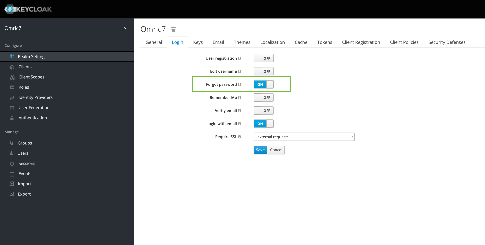
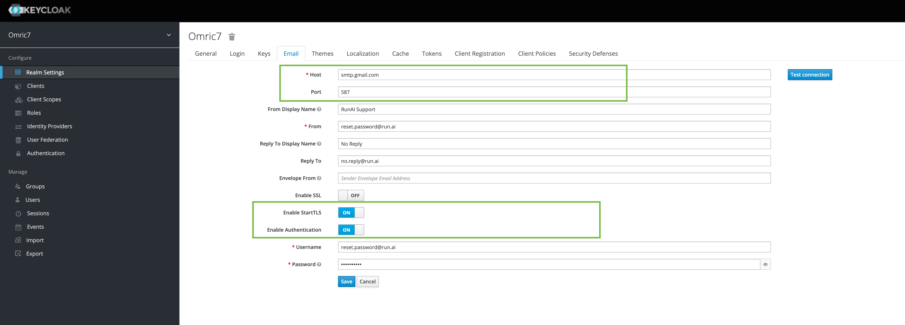

# Install the Run:ai Control Plane (Backend) 

## Create a Control Plane Configuration

Create a configuration file to install the Run:ai control plane:

=== "Connected"
    Generate a values file by running:
    ``` bash 
    runai-adm generate-values 
        --external-ips <ip> \ # (1)
        --domain <dns-record> \ # (2) 
        --tls-cert <file-name>  --tls-key <file-name> \ # (3)  
        --nfs-server <nfs-server-address> --nfs-path <path-in-nfs>  # (4)
    ```

    1. An available, IP Address that is accessible from Run:ai Users' machines. Typically (but not always) the IP of one of the nodes. 
    2. DNS A record such as `runai.<company-name>` or similar. The A record should point to the IP address above. 
    3. TLS certificate and private key for the above domain.
    4. NFS server location where Run:ai can create files. For using alternative storage mechanisms see optional values below 

=== "Airgapped"
    Generate a values file by running the following __under the `deploy` folder__:
    ``` bash
    runai-adm generate-values 
        --external-ips <ip> \ # (1)
        --domain <dns-record> \ # (2) 
        --tls-cert <file-name>  --tls-key <file-name> \ # (3)  
        --nfs-server <nfs-server-address> --nfs-path <path-in-nfs> \ # (4)
        --airgapped
    ```

    1. An available, IP Address that is accessible from Run:ai Users' machines. Typically (but not always) the IP of one of the nodes. 
    2. DNS A record such as `runai.<company-name>` or similar. The A record should point to the IP address above. 
    3. TLS certificate and private key for the above domain.
    4. NFS server location where Run:ai can create files. For using alternative storage mechanisms see optional values below 

<!-- Where:

* `--tls-` flags relate to the TLS certificate and private key for `<DNS_RECORD>`
* `--nfs` flags relate to NFS server location where Run:ai can create files. For using alternative storage mechanisms see optional values below 
* `--external-ips` relates to the IP address(es) allocated for Run:ai. Typically (but not always) the IP of one of the nodes.  -->

!!! Note
    In cloud environments, the flag `--external-ips` should contain both the internal and external IPs (comma separated)


A file called `runai-backend-values.yaml` will be created.

## (Optional) Edit Configuration File

There may be cases where you need to change properties in the values file as follows:

|  Key     |   Change   | Description |
|----------|----------|-------------| 
||||
| `backend.initTenant.promProxy` <br> and <br> `grafana.datasources.datasources.yaml.datasources.url` | When using an existing Promethues service, replace this URL with the URL of the existing Prometheus service (obtain by running `kubectl get svc` on the Prometheus namespace) | Internal URL to Promethues server |
| `pspEnabled` | `<true/false>` | Set to `true` if using [PodSecurityPolicy](https://kubernetes.io/docs/concepts/policy/pod-security-policy/){target=_blank} | 
| `nginx-ingress.podSecurityPolicy` |  Set to `true` if using [PodSecurityPolicy](https://kubernetes.io/docs/concepts/policy/pod-security-policy/){target=_blank} |
| `postgresql.persistence` | PostgreSQL permanent storage via a Persistent Volume.  | You can either use `storageClassName` to create a PV automatically or set `nfs.server` and `nfs.path` to provide the network file storage for the PV. The folder in the path should be pre-created and have full access rights. This key is now covered under the runai-adm flags above |
| `nginx-ingress.controller.externalIPs` | `<RUNAI_IP_ADDRESS>` | IP address allocated for Run:ai. This key is now covered under the runai-adm flags above  |
| `backend.https` | replace `key` and `crt` with public and private keys for `runai.<company-name>`. This key is now covered under the runai-adm flags above|
| `thanos.receive.persistence` | Permanent storage for Run:ai metrics | See Postgresql persistence above. Can use the same location. This key is now covered under the runai-adm flags above |
| `backend.initTenant.admin` | Change password for admin@run.ai | This user is the master Control Plane administrator | 
||||


## Install the Control Plane (Backend)

Run the helm command below:


=== "Connected"
    ```
    helm repo add runai-backend https://backend-charts.storage.googleapis.com
    helm repo update
    helm install runai-backend -n runai-backend runai-backend/runai-backend  \
        -f runai-backend-values.yaml
    ```

    !!! Info
        To install a specific version, add `--version <version>` to the install command.

=== "Airgapped"
    ```
    helm install runai-backend runai-backend-<version>.tgz -n \
        runai-backend -f runai-backend-values.yaml 
    ```
    (replace `<version>` with the Run:ai control plane version)

!!! Tip
    Use the  `--dry-run` flag to gain an understanding of what is being installed before the actual installation. 

### Connect to Run:ai User Interface

Go to: `runai.<company-name>`. Log in using the default credentials: User: `test@run.ai`, Password: `password`


## (Optional) Enable "Forgot password"

In order to support the “Forgot password” functionality, follow the steps below.

* Go to `runai.<company-name>/auth` and Log in. 
* Under `Realm settings`, select the `Login` tab and enable the `Forgot password` feature.


* Under the `Email` tab, define an SMTP server, as shown here:

* An email account should be provided in order to send the “reset password” email. If you have a two-factor authentication, then providing the password for the account would not work. This, you will need to create a new `App password`, as described [here](https://support.google.com/mail/answer/185833?hl=en) and use the generated token as the account password.

## Next Steps

Continue with installing a [Run:ai Cluster](cluster.md).

