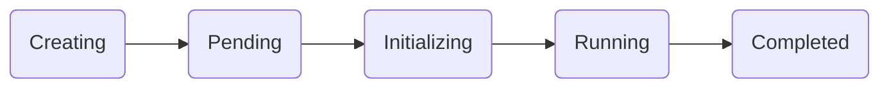

## Overview

Run:ai *Workloads* is specifically designed and optimized for AI and data science workloads, enhancing Kubernetes management of containerized applications. Run:ai augments Kubernetes workloads with additional resources crucial for AI pipelines (for example, Compute resources, NW, and storage).

Runai is an open platform and supports three types of workloads each with a different set of features:

1. Run:ai native workloads (trainings, workspaces, deployments)
      1. Submit via UI/CLI
      2. Actions - Delete/stop/connect
      3. Policies (defaults and enforcing rules)
      4. Scheduling rules
      5. RBAC
2. Framework integrations
      1. Smart gang scheduling (workload aware)
      2. Specific workload aware visibility (GPU Utilization, workload view, dashboards)
3. Typical Kubernetes workloads
      1. Scheduling capabilities:
           1. Fairness
           2. Nodepools
           3. Bin packing/spread
      2. Core capabilities:
           1. Fractions
           2. Overprovisioning

To enable the *Workloads* view, press *Try Workloads*. To return to the *Jobs* view, press *Go Back To Jobs View*.

## Workloads Monitoring

Run:ai makes it easy to run machine learning workloads effectively on Kubernetes. Run:ai provides both a UI and API interface that introduces a simple and more efficient way to manage machine learning workloads, which will appeal to data scientists and engineers alike. The new UI is not just a cosmetic change, it is the gateway to several enhancements that improve the workload management experience.

### API Documentation

Access the platform [API documentation](https://app.run.ai/api/docs){target=_blank} for more information on using the API to manage workloads.

## Workloads View

The Workloads view provides a more advanced UI than the previous Jobs UI and is a replacement for the Jobs, Trainings, and workspaces views. The new table format provides:

* Changing of the layout of the *Workloads* table by pressing *Columns* to add or remove columns from the table.
* Download the table to a CSV file by pressing *More*, then pressing *Download as CSV*.
* Search for a workload by pressing *Search* and entering the name of the workload.
* Advanced workload management.

To create new workloads, press [*New Workload*](submitting-workloads.md).

## Managing Workloads

You can manage a workload by selecting one from the table. Once selected, you can:

* Delete a workload
* Connect
* Stop a workload
* Activate a workload
* Show details&mdash;provides in-depth information about the selected workload including:

      * Event history&mdash;workload status over time. Use the filter to search through the history for specific events.
      * Metrics&mdash;metrics for GPU utilization, CPU usage, GPU memory usage, and CPU memory usage. Use the date selector to choose the time period for the metrics.
      * Logs&mdash;logs of the current status. Use the Download button to download the logs.

### Workloads Status

The *Status* column shows the current status of the workload. The following table describes the statuses presented:

| **Phase Name** | **Description** | **Entry Condition** | **Exit Condition** | 
| --- | --- | --- | --- |
| **Creating** | We are initiating workload setup in the cluster. Resources and pods are now provisioning. | A workload is submitted. | A pod group is created—handling of multi-pod groups TBD. | 
| **Pending** | Workload is queued and awaiting resource allocation. | A pod group exists. | All pods are scheduled—handling of multi-pod groups TBD. | 
| **Initializing** | Workload is setting up: retrieving images, starting containers, and preparing pods. | All pods are scheduled—handling of multi-pod groups TBD. | All pods are initialized or a failure to initialize is detected. | 
| **Running** | Workload is currently in progress with all pods operational. | All pods initialized (all containers in pods are ready). | Job completion or failure. | 
| **Degraded** | The workload is underperforming: pods may not align with specifications, network services might be incomplete, or persistent volumes could be detached. Refer to logs for detailed information. | Pending: All pods are running but with issues. Running: All pods are running with no issues. | Running: All resources are OK. Completed: Job finished with fewer resources. Failed: Job failure or user-defined rules. | 
| **Deleting** | Workload and its associated resources are being decommissioned from the cluster. | Decision made to delete the workload. | Resources are fully deleted. | 
| **Stopped** | Workload is on hold; resources are intact but inactive. | An operational decision is made to stop the workload without deleting resources. | Transitioning back to the initializing phase or to deletion. | 
| **Failed** | Workload encountered errors: image retrieval failed or containers experienced a crash. Consult logs for specifics. | An error occurs preventing the successful completion of the job. | Terminal state. | 
| **Completed** | Workload has successfully finished its execution. | The job has finished processing without errors. | Terminal state. | 

### Successful flow

A successful flow will follow the following flow chart:

## Run:ai Native Workloads

To get the full experience of Run:ai’s environment and platform use the following types of workloads.

* [Workspaces](../../Researcher/user-interface/workspaces/overview.md#getting-familiar-with-workspaces)
* [Trainings](../../Researcher/user-interface/trainings.md#trainings) (Only available when using the *Jobs* view)
* [Distributed trainings](../../Researcher/user-interface/trainings.md#trainings)
* [Deployment](../admin-ui-setup/deployments.md#viewing-and-submitting-deployments)

## Supported integrations

To assist you with other platforms, and other types of workloads use the integrations listed below.

1. [Airflow](https://docs.run.ai/v2.13/admin/integration/airflow/)
2. [MLflow](https://docs.run.ai/v2.13/admin/integration/mlflow/)
3. [Kubeflow](https://docs.run.ai/v2.13/admin/integration/kubeflow/)
4. [Seldon Core](https://docs.run.ai/v2.13/admin/integration/seldon/)
5. [Spark](https://docs.run.ai/v2.13/admin/integration/spark/)
6. [Ray](https://docs.run.ai/v2.13/admin/integration/ray/)
7. [KubeVirt (VM)](https://docs.run.ai/v2.13/admin/integration/kubevirt/)

## Standard Kubernetes Workloads

You can still enjoy the Run:ai platform when you submit standard Kubernetes workloads. Feel free to submit your own CRDs.
