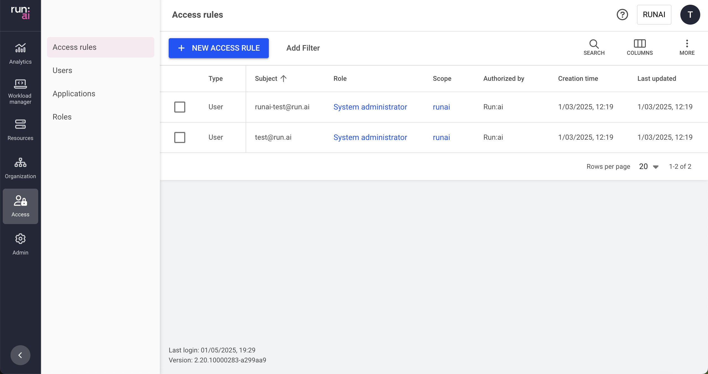

# Access rules

This article explains the procedure to manage Access rules.

Access rules provide users, groups, or applications privileges to system entities.

An access rule is the assignment of a role to a subject in a scope: `<Subject>` is a `<Role>` in a `<Scope>`.

For example, user **user@domain.com** is a **department admin** in **department A**.

## Access rules table

The Access rules table can be found under **Access** in the Run:ai platform.

The Access rules table provides a list of all the access rules defined in the platform and allows you to manage them.

!!! Note
    __Flexible management__

    It is also possible to manage access rules directly for a specific user, application, project, or department.

The Access rules table consists of the following columns:

| Column | Description |
| :---- | :---- |
| Type | The type of subject assigned to the access rule (user, SSO group, or application). |
| Subject | The user, SSO group, or application assigned with the role |
| Role | The role assigned to the subject |
| Scope | The scope to which the subject has access. Click the name of the scope to see the scope and its subordinates |
| Authorized by | The user who granted the access rule |
| Creation time | The timestamp for when the rule was created |
| Last updated | The last time the access rule was updated |

### Customizing the table view

* Filter - Click ADD FILTER, select the column to filter by, and enter the filter values  
* Search - Click SEARCH and type the value to search by  
* Sort - Click each column header to sort by  
* Column selection - Click COLUMNS and select the columns to display in the table  
* Download table - Click MORE and then Click Download as CSV. Export to CSV is limited to 20,000 rows. 

## Adding new access rules

To add a new access rule:

1. Click **\+NEW ACCESS RULE**  
1. Select a subject **User, SSO Group**, or **Application**  
1. Select or enter the subject identifier:  
    * **User Email** for a local user created in Run:ai or for SSO user as recognized by the IDP  
    * **Group name** as recognized by the IDP  
    * **Application name** as created in Run:ai  
1. Select a role  
1. Select a scope  
1. Click **SAVE RULE**

!!!Note
    An access rule consists of a single subject with a single role in a single scope. To assign multiple roles or multiple scopes to the same subject, multiple access rules must be added.

## Editing an access rule

Access rules cannot be edited. To change an access rule, you must delete the rule, and then create a new rule to replace it.

## Deleting an access rule

1. Select the access rule you want to delete  
1. Click **DELETE**  
1. On the dialog, click **DELETE** to confirm the deletion

## Using API

Go to the [Access rules](https://app.run.ai/api/docs#tag/Access-rules) API reference to view the available actions

