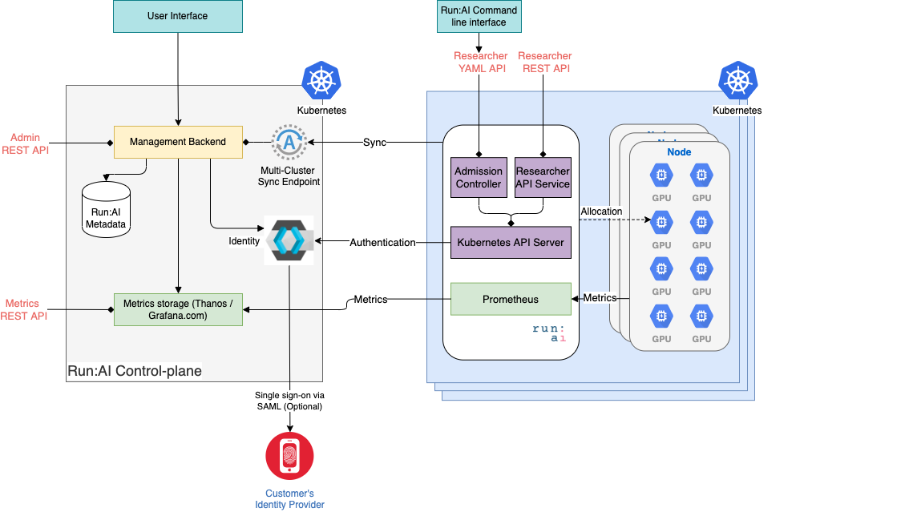

!!! runai "📣 The NVIDIA Run:ai docs are moving!"
      
    We’ve launched a new documentation site to improve navigation, clarity, and access to the latest features starting from NVIDIA Run:ai v2.20 and above. Visit [NVIDIA Run:ai documentation](https://docshub.run.ai).

    Documentation for versions **2.19 and below** will remain on this site.

# Overview

Developers can access Run:ai through various programmatic interfaces.

## API Architecture

Run:ai is composed of a single, multi-tenant control plane. Each tenant can be connected to one or more GPU clusters. See [Run:ai system components](../home/components.md) for detailed information.

The following programming interfaces are available:

| API     | Description | Purpose | 
|---------|--------------|--------------|
| __Run:ai REST API__ | Get and Modify any Run:ai business object | This is the API mostly used by system developers. The API is also used by the Run:ai user interface as well as the __new__ command-line interface | 
| __Cluster API (Deprecated)__ | Submit Workloads directly to the Cluster | A YAML-based API allowing submittion of Workloads directly to the Cluster. With Run:ai 2.18, this API is replaced by the above Run:ai, which is now the recommended method | 
| __Metrics API (deprecated)__ | Get cluster metrics | Get utilization metrics. | 

  

<!--  -->

## Run:ai REST API

Allows you to Add, delete, modify and list Run:ai meta-data objects such as Projects, Departments, Users.
For Clusters of Run:ai 2.18 and above, allows the submitting of Workloasd. 

The API is provided as REST and is accessible via the control plane endpoint.  

For more information see [Run:ai REST API](admin-rest-api/overview.md).

!!! Important
    The endpoints and fields specified in the [API reference](https://app.run.ai/api/docs) are the ones that are officially supported by Run:ai. Endpoints and fields that are not listed in the API reference are not supported.

    Run:ai does not recommend using API endpoints and fields marked as `deprecated` and will not add functionality to them. Once an API endpoint or field is marked as `deprecated`, Run:ai will stop supporting it after 2 major releases for self-hosted deployments, and after 6 months for SaaS deployments.

    For details, see the [Deprecation notifications](../home/whats-new-2-17.md#deprecation-notifications).

## Cluster API (Deprecated)

The [Cluster API](cluster-api/workload-overview-dev.md) allows you to submit and delete Workloads directly to the cluster itself.

The API is provided as [Kubernetes API](./cluster-api/submit-yaml.md).

Cluster API is accessible via the GPU cluster itself. As such, **multiple clusters may have multiple endpoints**.

!!! Important
    * This API is replaced by a Run:ai REST API to submit jobs, which is now the recommended method for cluster versions of 2.18 and above. 
    * If you are looking to automate tasks with older versions of Run:ai, it's best to use the [Run:ai Command-line interface](../Researcher/cli-reference/Introduction.md) which provides forward compatibility.  

## Metrics API

Retrieve metrics from multiple GPU clusters.

See the [Metrics API](metrics/metrics.md) document.

## API Authentication

See [API Authentication](rest-auth.md) for information on how to gain authenticated access to Run:ai APIs.
