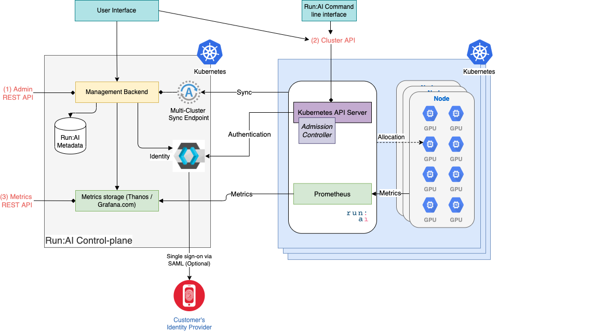

# Overview: Developer Documentation

Developers can access Run:ai through various programmatic interfaces. 

## API Architecture

Run:ai is composed of a single, multi-tenant control plane (also called 'backend'). Each tenant can be connected to one or more GPU clusters. See [Run:ai system components](../home/components.md) for detailed information.

Below is a diagram of the Run:ai API Architecture. A developer may:

1. Access the control plane via the _Administrator API_.
2. Access any one of the GPU clusters via _Researcher API_.
3. Access cluster metrics via the _Metrics API_.  

## Administrator API

Add, delete, modify and list Run:ai meta-data objects such as Projects, Departments, Users, and more. 

The API is provided as REST and is accessible via the control plane (backend) endpoint.  

For more information see [Administrator REST API](admin-rest-api/overview.md). 

## Researcher API

Submit, delete, and list Jobs. 

The API is provided as:

* [REST API](researcher-rest-api/overview.md) or 
* [Kubernetes API](k8s-api/overview.md) by using YAML-based files. 

Researcher API is accessible via the GPU cluster itself. As such, __multiple clusters may have multiple endpoints__.

!!! Note
    The same functionality is also available via the [Run:ai Command-line interface](../../Researcher/cli-reference/introduction). The CLI provides an alternative for automating with shell scripts. 
## Metrics API

Retrieve metrics from multiple GPU clusters. 

See the [Metrics API](metrics/metrics.md) document.

## Inference API

Deploying inference workloads is currently provided via a special [inference API](inference/overview.md).

## API Authentication

See [REST API Authentication](rest-auth.md) for information on how to authenticate REST API.

