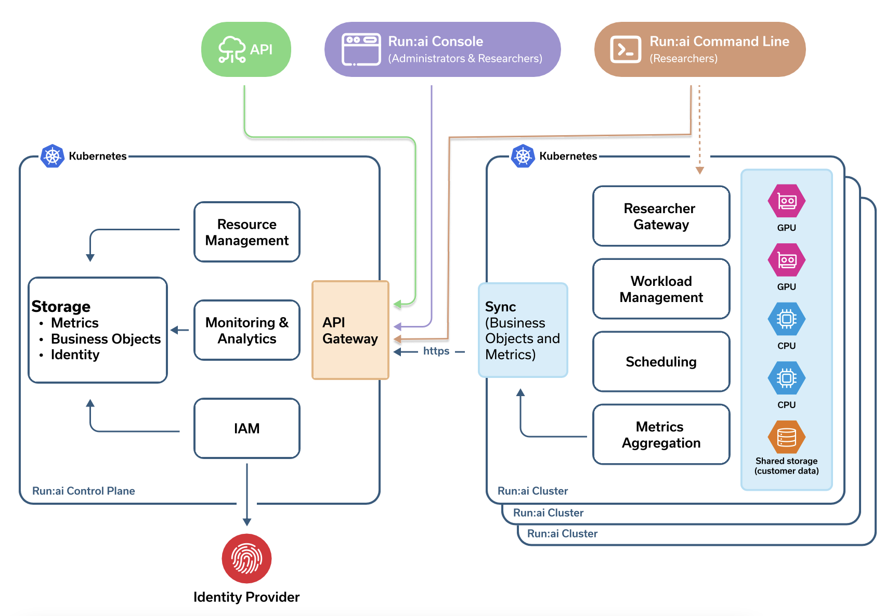

# Run:ai System Components 

## Components

* Run:ai is installed over a Kubernetes Cluster

* Researchers submit Machine Learning workloads via the Run:ai Command-Line Interface (CLI), or directly by sending YAML files to Kubernetes. 

* Administrators monitor and set priorities via the Run:ai User Interface

## The Run:ai Cluster 

The Run:ai Cluster contains:

* The Run:ai Scheduler which extends the Kubernetes scheduler. It uses business rules to schedule workloads sent by Researchers. 
* Fractional GPU management. Responsible for the Run:ai technology which allows Researchers to allocate parts of a GPU rather than a whole GPU  
* The Run:ai agent. Responsible for sending Monitoring data to the Run:ai Cloud.
* Clusters require outbound network connectivity to the Run:ai Cloud.  

### Kubernetes-Related Details

* The Run:ai cluster is installed as a [Kubernetes Operator](https://kubernetes.io/docs/concepts/extend-kubernetes/operator/){target=_blank}
* Run:ai is installed in its own Kubernetes _namespace_ named __runai__
* Workloads are run in the context of __Projects__. Each Project is a Kubernetes namespace with its own settings and access control. 

## The Run:ai Control Plane

The Run:ai control plane is the basis of the Run:ai User Interface. 

* The Run:ai cloud aggregates monitoring information from __multiple__ tenants (customers).
* Each customer may manage __multiple__ Run:ai clusters. 

The Run:ai control plane resides on the cloud but can also be locally installed. To understand the various installation options see the [installation types](../admin/runai-setup/installation-types.md) document.

