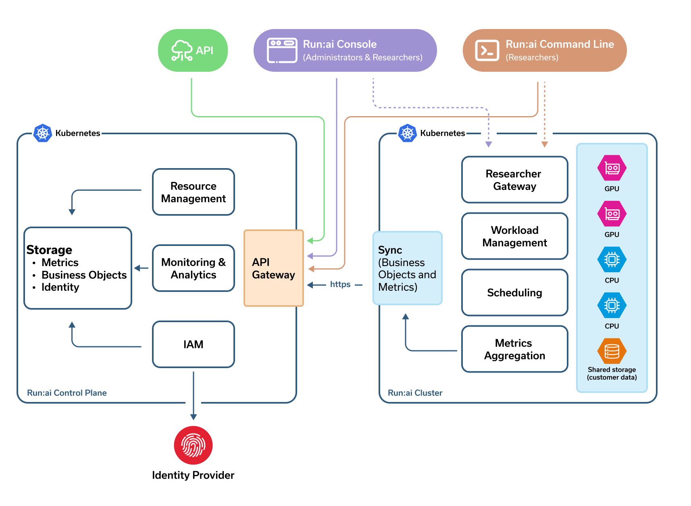

# Overview

Run:ai is a GPU orchestration and optimization platform that helps organizations maximize compute utilization for AI workloads. By optimizing the use of expensive compute resources, Run:ai accelerates AI development cycles, and drives faster time-to-market for AI-powered innovations.

Built on Kubernetes, Run:ai supports dynamic GPU allocation, workload submission, workload scheduling, and resource sharing, ensuring that AI teams get the compute power they need while IT teams maintain control over infrastructure efficiency.

## How Run:ai helps your organization

### For infrastructure administrators

Run:ai centralizes cluster management and optimizes infrastructure control by offering:

* [**Centralized cluster management**](../admin/config/clusters.md) – Manage all clusters from a single platform, ensuring consistency and control across environments.
* [**Usage monitoring and capacity planning**](../platform-admin/performance/dashboard-analysis.md) – Gain real-time and historical insights into GPU consumption across clusters to optimize resource allocation and plan future capacity needs efficiently.
* [**Policy enforcement** ](../platform-admin/workloads/policies/overview.md)– Define and enforce security and usage policies to align GPU consumption with business and compliance requirements.
* [**Enterprise-grade authentication**](../admin/authentication/authentication-overview.md) – Integrate with your organization's identity provider for streamlined authentication (Single Sign On) and role-based access control (RBAC).
* **Kubernetes-native application** – Install as a Kubernetes-native application, seamlessly extending Kubernetes for native cloud experience and operational standards (install, upgrade, configure).

### For platform administrators

Run:ai simplifies AI infrastructure management by providing a structured approach to managing AI initiatives, resources, and user access. It enables platform administrators maintain control, efficiency, and scalability across their infrastructure:

* [**AI Initiative structuring and management**](../platform-admin/aiinitiatives/overview.md#mapping-your-organization) – Map and set up AI initiatives according to your organization's structure, ensuring clear resource allocation.
* [**Centralized GPU resource management**](../platform-admin/aiinitiatives/overview.md#mapping-your-resources) – Enable seamless sharing and pooling of GPUs across multiple users, reducing idle time and optimizing utilization.
* [**User and access control** ](../platform-admin/aiinitiatives/overview.md#assigning-users-to-projects-and-departments)– Assign users (AI practitioners, ML engineers) to specific projects and departments to manage access and enforce security policies, utilizing role-based access control (RBAC) to ensure permissions align with user roles.
* [**Workload scheduling**](../Researcher/scheduling/how-the-scheduler-works.md) – Use scheduling to prioritize and allocate GPUs based on workload needs.
* [**Monitoring and insights**](../platform-admin/performance/dashboard-analysis.md) – Track real-time and historical data on GPU usage to help track resource consumption and optimize costs.

### For AI practitioners

Run:ai empowers data scientists and ML engineers by providing:

* [**Optimized workload scheduling**](../Researcher/scheduling/how-the-scheduler-works.md) – Ensure high-priority jobs get GPU resources. Workloads dynamically receive resources based on demand.
* [**Fractional GPU usage**](../Researcher/scheduling/fractions.md) – Request and utilize only a fraction of a GPU's memory, ensuring efficient resource allocation and leaving room for other workloads.
* [**AI initiatives lifecycle support** ](../platform-admin/workloads/overviews/introduction-to-workloads.md)– Run your entire AI initiatives lifecycle – Jupyter Notebooks, training jobs, and inference workloads efficiently.
* [**Interactive session**](../platform-admin/workloads/overviews/workload-types.md) – Ensure an uninterrupted experience when working on Jupyter Notebooks without taking away GPUs.
* [**Scalability for training and inference**](../platform-admin/workloads/overviews/workload-types.md) – Support for distributed training across multiple GPUs and auto-scales inference workloads.
* [**Integrations**](../platform-admin/integrations/integration-overview.md) – Integrate with popular ML frameworks - PyTorch, TensorFlow, XGBoost, Knative, Spark, Kubeflow Pipelines, Apache Airflow, Argo workloads, Ray and more.
* [**Flexible workload submission** ](../platform-admin/workloads/overviews/introduction-to-workloads.md) – Submit workloads using the Run:ai UI, API, CLI or run third-party workloads.

## Run:ai system components

Run:ai is made up of two components both installed over a [Kubernetes](https://kubernetes.io) cluster:

* **Run:ai cluster** – Provides Scheduling and workload management, extending Kubernetes native capabilities.
* **Run:ai control plane** – Provides resource management, handles workload submission and provides cluster monitoring and analytics.

### Run:ai cluster

The Run:ai cluster is responsible for scheduling AI workloads and efficiently allocating GPU resources across users and projects:

* [**Run:ai Scheduler**](../Researcher/scheduling/the-runai-scheduler.md) – Applies AI-aware rules to efficiently schedule workloads submitted by AI practitioners.
* [**Workload management**](../platform-admin/workloads/overviews/introduction-to-workloads.md) – Handles workload management which includes the researcher code running as a Kubernetes container and the system resources required to run the code, such as storage, credentials, network endpoints to access the container and so on.
* [**Kubernetes operator-based deployment** ](https://kubernetes.io/docs/concepts/extend-kubernetes/operator/)– Installed as a Kubernetes Operator to automate deployment, upgrades and configuration of Run:ai cluster services.
* **Storage** – Supports Kubernetes-native storage using [Storage Classes](https://kubernetes.io/docs/concepts/storage/storage-classes/), allowing organizations to bring their own storage solutions. Additionally, it also integrates with [external storage solutions](../platform-admin/workloads/assets/overview.md) such as Git, S3, and NFS to support various data requirements.
* **Secured communication** – Uses an outbound-only, secured (SSL) connection to synchronize with the Run:ai control plane.
* **Private** – Run:ai only synchronizes metadata and operational metrics (e.g., workloads, nodes) with the control plane. No proprietary data, model artifacts, or user data sets are ever transmitted, ensuring full data privacy and security.

### Run:ai control plane

The Run:ai control plane provides a centralized management interface for organizations to oversee their GPU infrastructure across multiple locations/subnets, accessible via Web UI, [API](../developer/overview-developer.md) and [CLI](../Researcher/cli-reference/new-cli/runai.md). The control plane can be deployed on the cloud or on-premise for organizations that require local control over their infrastructure - self-hosted. Self-hosted installation supports both connected and air-gapped. See [self-hosted installation](../admin/runai-setup/self-hosted/overview.md) for more details.

* [**Multi-cluster management** ](../admin/config/clusters.md)– Manages multiple Run:ai clusters for a single tenant across different locations and subnets from a single unified interface.
* [**Resource and access management** ](../platform-admin/aiinitiatives/overview.md)– Allows administrators to define Projects, Departments and user roles, enforcing policies for fair resource distribution.
* [**Workload submission and monitoring**](../platform-admin/workloads/overviews/managing-workloads.md) – Allows teams to submit workloads, track usage, and monitor GPU performance in real time.
