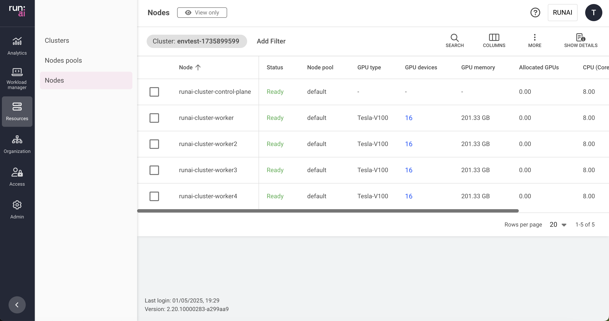

# Nodes

This article explains the procedure for managing Nodes.

Nodes are Kubernetes elements automatically discovered by the Run:ai platform. Once a node is discovered by the Run:ai platform, an associated instance is created in the Nodes table, administrators can view the Node’s relevant information, and Run:ai scheduler can use the node for [Scheduling](../../scheduling-and-resource-optimization/runai-scheduler-concepts-and-principles.md).

## Nodes table

The Nodes table can be found under __Resources__ in the Run:ai platform.

The Nodes table displays a list of predefined nodes available to users in the Run:ai platform.

!!! Note
    * It is not possible to create additional nodes, or edit, or delete existing nodes.  
    * Only users with relevant permissions can view the table.

The Nodes table consists of the following columns:

| Column | Description |
| :---- | :---- |
| Node | The Kubernetes name of the node |
| Status | The state of the node. Nodes in the Ready state are eligible for scheduling. If the state is Not ready then the main reason appears in parenthesis on the right side of the state field. Hovering the state lists the reasons why a node is Not ready. |
| Node pool | The name of the associated node pool. By default, every node in the Run:ai platform is associated with the default node pool, if no other node pool is associated |
| GPU type | The GPU model, for example, H100, or V100 |
| GPU devices | The number of GPU devices installed on the node. Clicking this field pops up a dialog with details per GPU (described below in this article) |
| Free GPU devices | The current number of fully vacant GPU devices |
| GPU memory | The total amount of GPU memory installed on this node. For example, if the number is 640GB and the number of GPU devices is 8, then each GPU is installed with 80GB of memory (assuming the node is assembled of homogenous GPU devices) |
| Allocated GPUs | The total allocation of GPU devices in units of GPUs (decimal number). For example, if 3 GPUs are 50% allocated, the field prints out the value 1.50. This value represents the portion of GPU memory consumed by all running pods using this node |
| Used GPU memory | The actual amount of memory (in GB or MB) used by pods running on this node. |
| GPU compute utilization | The average compute utilization of all GPU devices in this node |
| GPU memory utilization | The average memory utilization of all GPU devices in this node |
| CPU (Cores) | The number of CPU cores installed on this node |
| CPU memory | The total amount of CPU memory installed on this node |
| Allocated CPU (Cores) | The number of CPU cores allocated by pods running on this node (decimal number, e.g. a pod allocating 350 mili-cores shows an allocation of 0.35 cores). |
| Allocated CPU memory | The total amount of CPU memory allocated by pods running on this node (in GB or MB) |
| Used CPU memory | The total amount of actually used CPU memory by pods running on this node. Pods may allocate memory but not use all of it, or go beyond their CPU memory allocation if using Limit > Request for CPU memory (burstable workload) |
| CPU compute utilization | The utilization of all CPU compute resources on this node (percentage) |
| CPU memory utilization | The utilization of all CPU memory resources on this node (percentage) |
| Used swap CPU memory | The amount of CPU memory (in GB or MB) used for GPU swap memory (* future) |
| Pod(s) | List of pods running on this node, click the field to view details (described below in this article) |

### GPU devices for node

Click one of the values in the GPU devices column, to view the list of GPU devices and their parameters.

| Column | Description |
| :---- | :---- |
| Index | The GPU index, read from the GPU hardware. The same index is used when accessing the GPU directly |
| Used memory | The amount of memory used by pods and drivers using the GPU (in GB or MB) |
| Compute utilization | The portion of time the GPU is being used by applications (percentage) |
| Memory utilization | The portion of the GPU memory that is being used by applications (percentage) |
| Idle time | The elapsed time since the GPU was used (i.e. the GPU is being idle for ‘Idle time’) |

### Pods associated with node

Click one of the values in the Pod(s) column, to view the list of pods and their parameters.

!!! Note
    This column is only viewable if your role in the Run:ai platform gives you read access to workloads, even if you are allowed to view workloads, you can only view the workloads within your allowed scope. This means, there might be more pods running on this node than appear in the list your are viewing.

| Column | Description |
| :---- | :---- |
| Pod | The Kubernetes name of the pod. Usually name of the pod is made of the name of the parent workload if there is one, and an index for unique for that pod instance within the workload |
| Status | The state of the pod. In steady state this should be Running and the amount of time the pod is running |
| Project | The Run:ai project name the pod belongs to. Clicking this field takes you to the Projects table filtered by this project name |
| Workload | The workload name the pod belongs to. Clicking this field takes you to the Workloads table filtered by this workload name |
| Image | The full path of the image used by the main container of this pod |
| Creation time | The pod’s creation date and time |

### Customizing the table view

* Filter - Click ADD FILTER, select the column to filter by, and enter the filter values  
* Search - Click SEARCH and type the value to search by  
* Sort - Click each column header to sort by  
* Column selection - Click COLUMNS and select the columns to display in the table  
* Download table - Click MORE and then Click Download as CSV. Export to CSV is limited to 20,000 rows.  
* Show/Hide details - Click to view additional information on the selected row

### Show/Hide details

Click a row in the Nodes table and then click the Show details button at the upper right side of the action bar. The details screen appears, presenting the following metrics graphs:

* GPU utilization  
  Per GPU graph and an average of all GPUs graph, all on the same chart, along an adjustable period allows you to see the trends of all GPUs compute utilization (percentage of GPU compute) in this node.  
* GPU memory utilization  
  Per GPU graph and an average of all GPUs graph, all on the same chart, along an adjustable period allows you to see the trends of all GPUs memory usage (percentage of the GPU memory) in this node.  
* CPU compute utilization  
  The average of all CPUs’ cores compute utilization graph, along an adjustable period allows you to see the trends of CPU compute utilization (percentage of CPU compute) in this node.  
* CPU memory utilization  
  The utilization of all CPUs memory in a single graph, along an adjustable period allows you to see the trends of CPU memory utilization (percentage of CPU memory) in this node.  
* CPU memory usage  
  The usage of all CPUs memory in a single graph, along an adjustable period allows you to see the trends of CPU memory usage (in GB or MB of CPU memory) in this node.

* For GPUs charts - Click the GPU legend on the right-hand side of the chart, to activate or deactivate any of the GPU lines.  
* You can click the date picker to change the presented period  
* You can use your mouse to mark a sub-period in the graph for zooming in, and use the ‘Reset zoom’ button to go back to the preset period  
* Changes in the period affect all graphs on this screen.

## Using API

To view the available actions, go to the [Nodes](https://app.run.ai/api/docs#tag/Nodes) API reference.
