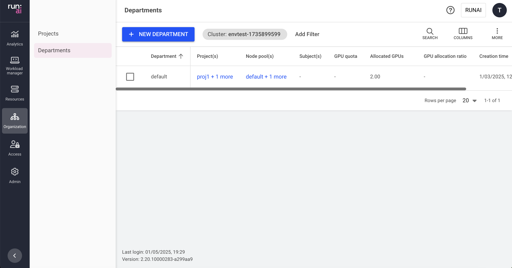

  
This article explains the procedure for managing departments

Departments are a grouping of projects. By grouping projects into a department, you can set quota limitations to a set of projects, create policies that are applied to the department, and create assets that can be scoped to the whole department or a partial group of descendent projects

For example, in an academic environment, a department can be the Physics Department grouping various projects (AI Initiatives) within the department, or grouping projects where each project represents a single student.

## Departments

The Departments table can be found under Departments in the Run:ai platform.

!!! Note
    Departments are disabled, by default. If you cannot see Departments in the menu, then it must be enabled by your Administrator, under General Settings → Resources → Departments

The Departments table lists all departments defined for a specific cluster and allows you to manage them. You can switch between clusters by selecting your cluster using the filter at the top.

The Departments table consists of the following columns:

| Column | Description |
| :---- | :---- |
| Department | The name of the department |
| Node pool(s) with quota | The node pools associated with this department. By default, all node pools within a cluster are associated with each department. Administrators can change the node pools’ quota parameters for a department. Click the values under this column to view the list of node pools with their parameters (as described below) |
| GPU quota | GPU quota associated with the department |
| Total GPUs for projects | The sum of all projects’ GPU quotas associated with this department |
| Project(s) | List of projects associated with this department |
| Subject(s) | The users, SSO groups, or applications with access to the project. Click the values under this column to view the list of subjects with their parameters (as described below). This column is only viewable if your role in Run:ai platform allows you those permissions. |
| Allocated GPUs | The total number of GPUs allocated by successfully scheduled workloads in projects associated with this department |
| GPU allocation ratio | The ratio of Allocated GPUs to GPU quota. This number reflects how well the department’s GPU quota is utilized by its descendant projects. A number higher than 100% means the department is using over-quota GPUs. A number lower than 100% means not all projects are utilizing their quotas. A quota becomes allocated once a workload is successfully scheduled. |
| Creation time | The timestamp for when the department was created |
| Workload(s) | The list of workloads under projects associated with this department. Click the values under this column to view the list of workloads with their resource parameters (as described below) |
| Cluster | The cluster that the department is associated with |

### Customizing the table view

* Filter - Click ADD FILTER, select the column to filter by, and enter the filter values  
* Search - Click SEARCH and type the value to search by  
* Sort - Click each column header to sort by  
* Column selection - Click COLUMNS and select the columns to display in the table  
* Download table - Click MORE and then Click Download as CSV

### Node pools with quota associated with the department

Click one of the values of Node pool(s) with quota column, to view the list of node pools and their parameters

| Column | Description |
| :---- | :---- |
| Node pool | The name of the node pool is given by the administrator during node pool creation. All clusters have a default node pool created automatically by the system and named ‘default’. |
| GPU quota | The amount of GPU quota the administrator dedicated to the department for this node pool (floating number, e.g. 2.3 means 230% of a GPU capacity) |
| CPU (Cores) | The amount of CPU (cores) quota the administrator has dedicated to the department for this node pool (floating number, e.g. 1.3 Cores = 1300 mili-cores). The ‘unlimited’ value means the CPU (Cores) quota is not bound and workloads using this node pool can use as many CPU (Cores) resources as they need (if available) |
| CPU memory | The amount of CPU memory quota the administrator has dedicated to the department for this node pool (floating number, in MB or GB). The ‘unlimited’ value means the CPU memory quota is not bounded and workloads using this node pool can use as much CPU memory resource as they need (if available). |
| Allocated GPUs | The total amount of GPUs allocated by workloads using this node pool under projects associated with this department. The number of allocated GPUs may temporarily surpass the GPU quota of the department if over-quota is used. |
| Allocated CPU (Cores) | The total amount of CPUs (cores) allocated by workloads using this node pool under all projects associated with this department. The number of allocated CPUs (cores) may temporarily surpass the CPUs (Cores) quota of the department if over-quota is used. |
| Allocated CPU memory | The actual amount of CPU memory allocated by workloads using this node pool under all projects associated with this department. The number of Allocated CPU memory may temporarily surpass the CPU memory quota if over-quota is used. |

### Subjects authorized for the project

Click one of the values of the Subject(s) column, to view the list of subjects and their parameters. This column is only viewable if your role in the Run:ai system affords you those permissions.

| Column | Description |
| :---- | :---- |
| Subject | A user, SSO group, or application assigned with a role in the scope of this department |
| Type | The type of subject assigned to the access rule (user, SSO group, or application). |
| Scope | The scope of this department within the organizational tree. Click the name of the scope to view the organizational tree diagram, you can only view the parts of the organizational tree for which you have permission to view. |
| Role | The role assigned to the subject, in this department’s scope |
| Authorized by | The user who granted the access rule |
| Last updated | The last time the access rule was updated |

!!!Note
    A role given in a certain scope, means the role applies to this scope and any descendant scopes in the organizational tree.

## Adding a new department

To create a new Department:

1. Click +NEW DEPARTMENT  
2. Select a __scope__.  
    By default, the field contains the scope of the current UI context cluster, viewable at the top left side of your screen. You can change the current UI context cluster by clicking the ‘Cluster: cluster-name’ field and applying another cluster as the UI context. Alternatively, you can choose another cluster within the ‘+ New Department’ form by clicking the organizational tree icon on the right side of the scope field, opening the organizational tree and selecting one of the available clusters.  
3. Enter a __name__ for the department. Department names must start with a letter and can only contain lower case latin letters, numbers or a hyphen ('-’).  
4. Under __Quota Management__, select a quota for the department. The Quota management section may contain different fields depending on pre-created system configuration. Possible system configurations are:  
    * Existence of Node Pools  
    * CPU Quota - Allow setting a quota for CPU resources.

When no node pools are configured, you can set the following quota parameters:

* __GPU Devices__  
  The number of GPUs you want to allocate for this department (decimal number). This quota is consumed by the department’s subordinated project.  
* __CPUs (cores)__ (when CPU quota is set)  
   The number of CPU cores you want to allocate for this department (decimal number). This quota is consumed by the department’s subordinated projects  
* __CPUs memory__ (when CPU quota is set)  
   The amount of CPU memory you want to allocate for this department (in Megabytes or Gigabytes). This quota is consumed by the department’s subordinated projects

When node pools are enabled, it is possible to set the above quota parameters __for each node-pool separately__.

* __Order of priority__
This column is displayed only if more than one node pool exists. The default order in which the Scheduler uses node pools to schedule a workload. 
This means, the Scheduler first tries to allocate resources using the highest priority node pool, followed by the next in priority, until it reaches the lowest priority node pool list, then the Scheduler starts from the highest priority again. The Scheduler uses the department list of prioritized node pools, only if the order of priority of node pools is not set in project or the workload during submission (either by an admin policy or by the user). An empty value indicates that the node pool is not part of the department’s default node pool priority list, but a node pool can still be chosen by the admin policy or a user during workload submission.
Department nodepool priority sets defaults to the subordinate projects but does not enforce it, meaning projects are free to change their priority.
* In addition, you can decide whether to allow a department to go over-quota. Allowing over-quota at the department level means that one department can receive more resources than its quota when not required by other departments. If the over-quota is disabled, workloads running under subordinated projects are not able to use more resources than the department’s quota, but each project can still go over-quota (if enabled at the project level) up to the department’s quota.

Unlimited CPU(Cores) and CPU memory quotas are an exception - in this case, workloads of subordinated projects can consume available resources up to the physical limitation of the cluster or any of the node pools.

Example of Quota management:

7. Click CREATE DEPARTMENT

## Adding an access rule to a department

To create a new access rule for a department:

1. Select the department you want to add an access rule for  
2. Click ACCESS RULES  
3. Click +ACCESS RULE  
4. Select a subject  
5. Select or enter the subject identifier:  
    * User Email for a local user created in Run:ai or for SSO user as recognized by the IDP  
    * Group name as recognized by the IDP  
    * Application name as created in Run:ai  
6. Select a role  
7. Click SAVE RULE  
8. Click CLOSE

## Deleting an access rule from a department

To delete an access rule from a department:

1. Select the department you want to remove an access rule from  
2. Click ACCESS RULES  
3. Find the access rule you would like to delete  
4. Click on the trash icon  
5. Click CLOSE

## Editing a department

1. Select the Department you want to edit  
2. Click EDIT  
3. Update the Department and click SAVE

## Viewing a department’s policy

To view the policy of a department:

1. Select the department for which you want to view its policies.  
    This option is only active if the department has defined policies in place.  
2. Click VIEW POLICY and select the workload type for which you want to view the policies:  
    a. Workspace workload type policy with its set of rules  
    b. Training workload type policies with its set of rules  
3. In the Policy form, view the workload rules that are enforcing your department for the selected workload type as well as the defaults:  
    * Parameter - The workload submission parameter that Rule and Default is applied on  
    * Type (applicable for data sources only) - The data source type (Git, S3, nfs, pvc etc.)  
    * Default - The default value of the Parameter  
    * Rule - Set up constraints on workload policy fields  
    * Source - The origin of the applied policy (cluster, department or project)  

!!! Notes  
    * The policy affecting the department consists of rules and defaults. Some of these rules and defaults may be derived from the policies of a parent cluster (source). You can see the source of each rule in the policy form.  
    * A policy set for a department affects all subordinated projects and their workloads, according to the policy workload type

## Deleting a department

1. Select the department you want to delete  
2. Click DELETE  
3. On the dialog, click DELETE to confirm the deletion

!!! Note
    Deleting a department permanently deletes its subordinated projects, any assets created in the scope of this department, and any of its subordinated projects such as compute resources, environments, data sources, templates, and credentials. However, workloads running within the department’s subordinated projects, or the policies defined for this department or its subordinated projects - remain intact and running.

## Reviewing a department

1. Select the department you want to review  
2. Click REVIEW  
3. Review and click CLOSE

## Using API

Go to the [Departments](https://app.run.ai/api/docs#tag/Departments) API reference to view the available actions

