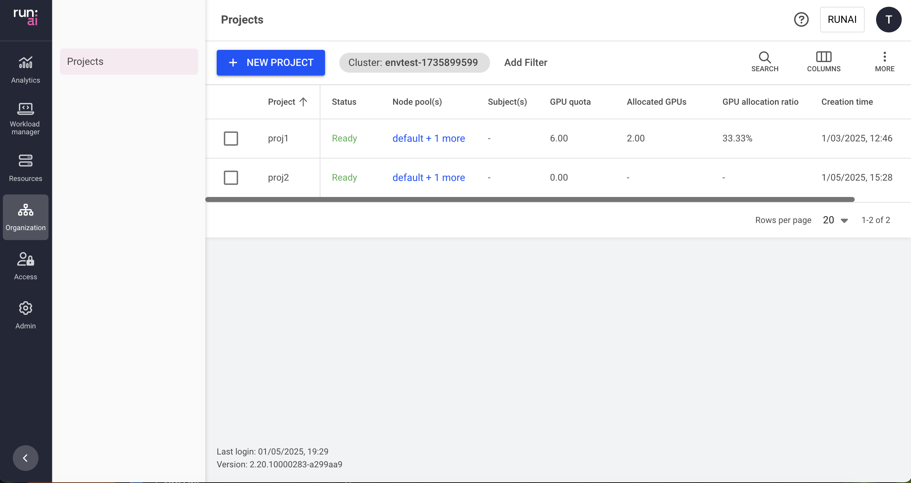

  
This article explains the procedure to manage Projects.

Researchers submit AI workloads. To streamline resource allocation and prioritize work, Run:ai introduces the concept of Projects. Projects are the tool to implement resource allocation policies as well as the segregation between different initiatives. A project may represent a team, an individual, or an initiative that shares resources or has a specific resource quota. Projects may be aggregated in Run:ai [departments](departments.md).

For example, you may have several people involved in a specific face-recognition initiative collaborating under one project named “face-recognition-2024”. Alternatively, you can have a project per person in your team, where each member receives their own quota.

## Projects table

The Projects table can be found under __Organization__ in the Run:ai platform.

The Projects table provides a list of all projects defined for a specific cluster, and allows you to manage them. You can switch between clusters by selecting your cluster using the filter at the top.

The Projects table consists of the following columns:

| Column | Description |
| :---- | :---- |
| Project | The name of the project |
| Department | The name of the parent department. Several projects may be grouped under a department. |
| Status | The Project creation status. Projects are manifested as Kubernetes namespaces. The project status represents the Namespace creation status. |
| Node pool(s) with quota | The node pools associated with the project. By default, a new project is associated with all node pools within its associated cluster. Administrators can change the node pools’ quota parameters for a project. Click the values under this column to view the list of node pools with their parameters (as described below) |
| Subject(s) | The users, SSO groups, or applications with access to the project. Click the values under this column to view the list of subjects with their parameters (as described below). This column is only viewable if your role in the Run:ai platform allows you those permissions. |
| Allocated GPUs | The total number of GPUs allocated by successfully scheduled workloads under this project |
| GPU allocation ratio | The ratio of Allocated GPUs to GPU quota. This number reflects how well the project’s GPU quota is utilized by its descendent workloads. A number higher than 100% indicates the project is using over-quota GPUs. |
| GPU quota | The GPU quota allocated to the project. This number represents the sum of all node pools’ GPU quota allocated to this project. |
| Allocated CPUs (Core) | The total number of CPU cores allocated by workloads submitted within this project. (This column is only available if the CPU Quota setting is enabled, as described below). |
| Allocated CPU Memory | The total number of CPUs allocated by successfully scheduled workloads under this project. (This column is only available if the CPU Quota setting is enabled, as described below). |
| CPU quota (Cores) | CPU quota allocated to this project. (This column is only available if the CPU Quota setting is enabled, as described below). This number represents the sum of all node pools’ CPU quota allocated to this project. The ‘unlimited’ value means the CPU (cores) quota is not bounded and workloads using this project can use as many CPU (cores) resources as they need (if available). |
| CPU memory quota | CPU memory quota allocated to this project. (This column is only available if the CPU Quota setting is enabled, as described below). This number represents the sum of all node pools’ CPU memory quota allocated to this project. The ‘unlimited’ value means the CPU memory quota is not bounded and workloads using this Project can use as much CPU memory resources as they need (if available). |
| CPU allocation ratio | The ratio of Allocated CPUs (cores) to CPU quota (cores). This number reflects how much the project’s ‘CPU quota’ is utilized by its descendent workloads. A number higher than 100% indicates the project is using over-quota CPU cores. |
| CPU memory allocation ratio | The ratio of Allocated CPU memory to CPU memory quota. This number reflects how well the project’s ‘CPU memory quota’ is utilized by its descendent workloads. A number higher than 100% indicates the project is using over-quota CPU memory. |
| Node affinity of training workloads | The list of Run:ai node-affinities. Any training workload submitted within this project must specify one of those Run:ai node affinities, otherwise it is not submitted. |
| Node affinity of interactive workloads | The list of Run:ai node-affinities. Any interactive (workspace) workload submitted within this project must specify one of those Run:ai node affinities, otherwise it is not submitted. |
| Idle time limit of training workloads | The time in days:hours:minutes after which the project stops a training workload not using its allocated GPU resources. |
| Idle time limit of preemptible workloads | The time in days:hours:minutes after which the project stops a preemptible interactive (workspace) workload not using its allocated GPU resources. |
| Idle time limit of non preemptible workloads | The time in days:hours:minutes after which the project stops a non-preemptible interactive (workspace) workload not using its allocated GPU resources.. |
| Interactive workloads time limit | The duration in days:hours:minutes after which the project stops an interactive (workspace) workload |
| Training workloads time limit | The duration in days:hours:minutes after which the project stops a training workload |
| Creation time | The timestamp for when the project was created |
| Workload(s) | The list of workloads associated with the project. Click the values under this column to view the list of workloads with their resource parameters (as described below). |
| Cluster | The cluster that the project is associated with |

### Node pools with quota associated with the project

Click one of the values of Node pool(s) with quota column, to view the list of node pools and their parameters

| Column | Description |
| :---- | :---- |
| Node pool | The name of the node pool is given by the administrator during node pool creation. All clusters have a default node pool created automatically by the system and named ‘default’. |
| GPU quota | The amount of GPU quota the administrator dedicated to the project for this node pool (floating number, e.g. 2.3 means 230% of GPU capacity). |
| CPU (Cores) | The amount of CPUs (cores) quota the administrator has dedicated to the project for this node pool (floating number, e.g. 1.3 Cores = 1300 mili-cores). The ‘unlimited’ value means the CPU (Cores) quota is not bounded and workloads using this node pool can use as many CPU (Cores) resources as they require, (if available). |
| CPU memory | The amount of CPU memory quota the administrator has dedicated to the project for this node pool (floating number, in MB or GB). The ‘unlimited’ value means the CPU memory quota is not bounded and workloads using this node pool can use as much CPU memory resource as they need (if available). |
| Allocated GPUs | The actual amount of GPUs allocated by workloads using this node pool under this project. The number of allocated GPUs may temporarily surpass the GPU quota if over-quota is used. |
| Allocated CPU (Cores) | The actual amount of CPUs (cores) allocated by workloads using this node pool under this project. The number of allocated CPUs (cores) may temporarily surpass the CPUs (Cores) quota if over-quota is used. |
| Allocated CPU memory | The actual amount of CPU memory allocated by workloads using this node pool under this Project. The number of Allocated CPU memory may temporarily surpass the CPU memory quota if over-quota is used. |
| Order of priority | The default order in which the Scheduler uses node-pools to schedule a workload. This is used only if the order of priority of node pools is not set in the workload during submission, either by an admin policy or the user. An empty value means the node pool is not part of the project’s default list, but can still be chosen by an admin policy or the user during workload submission |

### Subjects authorized for the project

Click one of the values in the Subject(s) column, to view the list of subjects and their parameters. This column is only viewable, if your role in the Run:ai system affords you those permissions.

| Column | Description |
| :---- | :---- |
| Subject | A user, SSO group, or application assigned with a role in the scope of this Project |
| Type | The type of subject assigned to the access rule (user, SSO group, or application) |
| Scope | The scope of this project in the organizational tree. Click the name of the scope to view the organizational tree diagram, you can only view the parts of the organizational tree for which you have permission to view. |
| Role | The role assigned to the subject, in this project’s scope |
| Authorized by | The user who granted the access rule |
| Last updated | The last time the access rule was updated |

### Workloads associated with the project

Click one of the values of Workload(s) column, to view the list of workloads and their parameters

| Column | Description |
| :---- | :---- |
| Workload | The name of the workload, given during its submission. Optionally, an icon describing the type of workload is also visible |
| Type | The type of the workload, e.g. Workspace, Training, Inference |
| Status | The state of the workload and time elapsed since the last status change |
| Created by | The subject that created this workload |
| Running/ requested pods | The number of running pods out of the number of requested pods for this workload. e.g. a distributed workload requesting 4 pods but may be in a state where only 2 are running and 2 are pending |
| Creation time | The date and time the workload was created |
| GPU compute request | The amount of GPU compute requested (floating number, represents either a portion of the GPU compute, or the number of whole GPUs requested) |
| GPU memory request | The amount of GPU memory requested (floating number, can either be presented as a portion of the GPU memory, an absolute memory size in MB or GB, or a MIG profile) |
| CPU memory request | The amount of CPU memory requested (floating number, presented as an absolute memory size in MB or GB) |
| CPU compute request | The amount of CPU compute requested (floating number, represents the number of requested Cores) |

### Customizing the table view

* Filter - Click ADD FILTER, select the column to filter by, and enter the filter values  
* Search - Click SEARCH and type the value to search by  
* Sort - Click each column header to sort by  
* Column selection - Click COLUMNS and select the columns to display in the table  
* Download table - Click MORE and then Click Download as CSV

## Adding a new project

To create a new Project:

1. Click +NEW PROJECT  
2. Select a scope, you can only view clusters if you have permission to do so - within the scope of the roles assigned to you  
3. Enter a name for the project  
   Project names must start with a letter and can only contain lower case Latin letters, numbers or a hyphen ('-’)  
4. Namespace associated with Project  
   Each project has an associated (Kubernetes) namespace in the cluster.  
    All workloads under this project use this namespace.  
   a. By default, Run:ai creates a namespace based on the Project name (in the form of `runai-<name>`)  
   b. Alternatively, you can choose an existing namespace created for you by the cluster administrator  
5. In the Quota management section, you can set the quota parameters and prioritize resources  
    * Order of priority  
    This column is displayed only if more than one node pool exists. The default order in which the Scheduler uses node pools to schedule a workload. This means the Scheduler first tries to allocate resources using the highest priority node pool, then the next in priority, until it reaches the lowest priority node pool list, then the Scheduler starts from the highest again. The Scheduler uses the Project list of prioritized node pools, only if the order of priority of node pools is not set in the workload during submission, either by an admin policy or by the user. Empty value means the node pool is not part of the Project’s default node pool priority list, but a node pool can still be chosen by the admin policy or a user during workload submission  
    * Node pool  
    This column is displayed only if more than one node pool exists. It represents the name of the node pool.  
    * GPU devices  
    The number of GPUs you want to allocate for this project in this node pool (decimal number).  
    * CPUs (Cores)  
    This column is displayed only if CPU quota is enabled via the General settings.  
    Represents the number of CPU cores you want to allocate for this project in this node pool (decimal number).  
    * CPU memory  
    This column is displayed only if CPU quota is enabled via the General settings.  
    The amount of CPU memory you want to allocate for this project in this node pool (in Megabytes or Gigabytes).  
    * Over quota / Over quota priority  
    If over-quota priority is enabled via the General settings then over-quota priority is presented, otherwise over-quota  is presented  
        * Over quota  
        When enabled, the project can use non-guaranteed overage resources above its quota in this node pool. The amount of the non-guaranteed overage resources for this project is calculated proportionally to the project quota in this node pool. When disabled, the project cannot use more resources than the guaranteed quota in this node pool.  
        * Over quota priority  
        Represents a weight used to calculate the amount of non-guaranteed overage resources a project can get on top  
        of its quota in this node pool. All unused resources are split between projects that require the use of overage resources:  
            * Medium  
            The default value. The Admin can change the default to any of the following values: High, Low, Lowest, or None.  
            * None  
            When set, the project cannot use more resources than the guaranteed quota in this node pool.  
            * Lowest  
            Over-quota priority ‘lowest’ has a unique behavior, because its weight is 0, it can only use over-quota (unused overage) resources if no other project needs them, and any project with a higher over-quota priority can snap the average resources at any time.

!!! Note
    Setting the quota to 0 (either GPU, CPU, or CPU memory) and the over-quota to ‘disabled’ or over-quota priority to ‘none’ means the project is blocked from using those resources on this node pool.

When no node pools are configured, you can set the same parameters but it is for the whole project, instead of per node pool.

After node pools are created, you can set the above parameters __for each node-pool separately__.

6. Set Scheduling rules as required. You can have a scheduling rule for:  
    * Idle GPU timeout  
    Preempt a workload that does not use GPUs for more than a specified duration. You can apply a single rule per workload type - Preemptive Workspaces, Non-preemptive Workspaces, and Training.  
  
    !!! Note  
        To make ‘Idle GPU timeout’ effective, it must be set to a shorter duration than that workload duration of the same workload type.  

    * Workspace duration  
    Preempt workspaces after a specified duration. This applies to both preemptive and non-preemptive Workspaces.  
    * Training duration  
    Preempt a training workload after a specified duration.  
    * Node type (Affinity)  
    Node type is used to select a group of nodes, usually with specific characteristics such as a hardware feature, storage type, fast networking interconnection, etc. The scheduler uses node type as an indication of which nodes should be used for your workloads, within this project.  
    Node type is a label in the form of [run.ai/type](http://run.ai/type) and a value (e.g. run.ai/type = dgx200) that the administrator uses to tag a set of nodes. Adding the node type to the project’s scheduling rules enables the user to submit workloads with any node type label/value pairs in this list, according to the workload type - Workspace or Training. The Scheduler then schedules workloads using a node selector, targeting nodes tagged with the Run:ai node type label/value pair. Node pools and a node type can be used in conjunction with each other. For example, specifying a node pool and a smaller group of nodes from that node pool that includes a fast SSD memory or other unique characteristics.  

7. Click CREATE PROJECT

## Adding an access rule to a project

To create a new access rule for a project:

1. Select the project you want to add an access rule for  
2. Click ACCESS RULES  
3. Click +ACCESS RULE  
4. Select a subject  
5. Select or enter the subject identifier:  
    1. User Email for a local user created in Run:ai or for SSO user as recognized by the IDP  
    2. Group name as recognized by the IDP  
    3. Application name as created in Run:ai  
6. Select a role  
7. Click SAVE RULE  
8. Click CLOSE

## Deleting an access rule from a project

To delete an access rule from a project:

1. Select the project you want to remove an access rule from  
2. Click ACCESS RULES  
3. Find the access rule you want to delete  
4. Click on the trash icon  
5. Click CLOSE

## Editing a project

To edit a project:

1. Select the project you want to edit  
2. Click EDIT  
3. Update the Project and click SAVE

## Viewing a project’s policy

To view the policy of a project:

1. Select the project for which you want to view its policies. This option is only active for projects with defined policies in place.  
2. Click VIEW POLICY and select the workload type for which you want to view the policies:  
    a. Workspace workload type policy with its set of rules  
    b. Training workload type policies with its set of rules  
3. In the Policy form, view the workload rules that are enforcing your project for the selected workload type as well as the defaults:  
    * Parameter - The workload submission parameter that Rules and Defaults are applied to  
    * Type (applicable for data sources only) - The data source type (Git, S3, nfs, pvc etc.)  
    * Default - The default value of the Parameter  
    * Rule - Set up constraints on workload policy fields  
    * Source - The origin of the applied policy (cluster, department or project)  

!!! Note  
    The policy affecting the project consists of rules and defaults. Some of these rules and defaults may be derived from policies of a parent cluster and/or department (source). You can see the source of each rule in the policy form.

## Deleting a project

To delete a project:

1. Select the project you want to delete  
2. Click DELETE  
3. On the dialog, click DELETE to confirm the deletion

!!! Note
    Deleting a project does not delete its associated namespace, any of the workloads running using this namespace, or the policies defined for this project. However, any assets created in the scope of this project such as compute resources, environments, data sources, templates and credentials, are permanently deleted from the system.

## Using API

Go to the [Projects](https://app.run.ai/api/docs#tag/Projects) API reference to view the available actions

