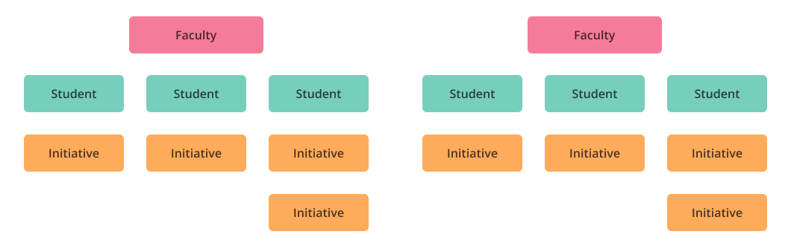
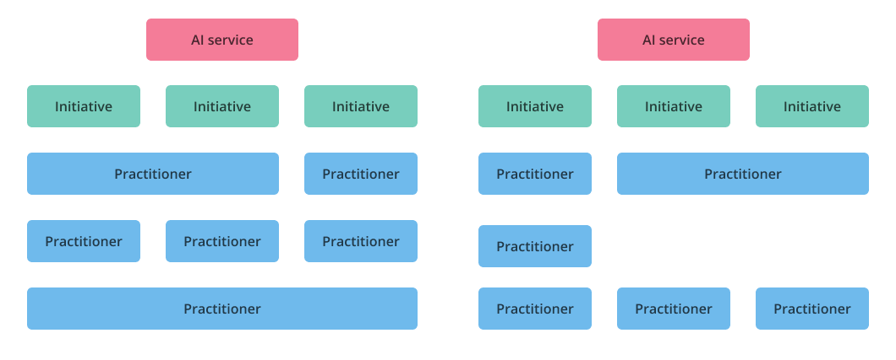
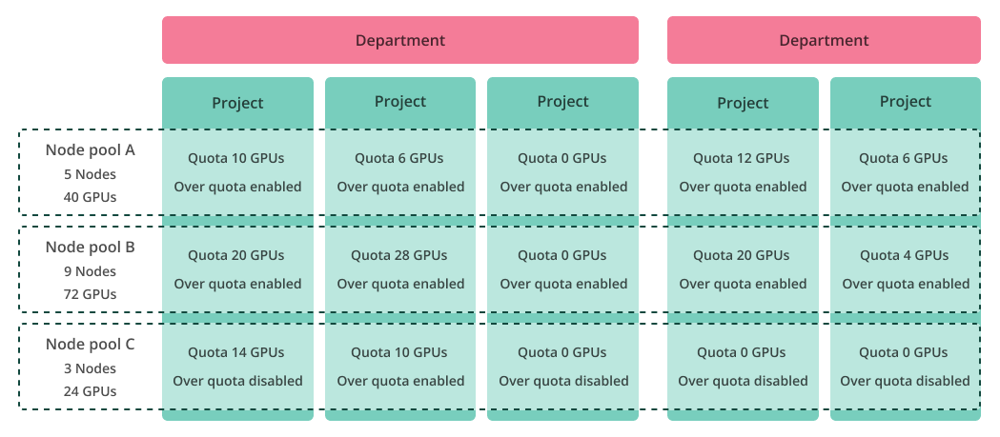

# Adapting AI initiatives to your organization

AI initiatives refer to advancing research, development, and implementation of AI technologies. These initiatives represent your business needs and involve collaboration between individuals, teams, and other stakeholders. AI initiatives require compute resources and a methodology to effectively and efficiently use those compute resources and split them among the different AI initiatives stakeholders. The building blocks of AI compute resources are GPUs, CPUs, and CPU memory, which are built into nodes (servers) and can be further grouped into node pools. Nodes and node pools are part of a Kubernetes Cluster.

To manage AI initiatives in Run:ai you should:

* Map your organization and initiatives to projects and optionally departments  
* Map compute resources (node pools and quotas) to projects and optionally departments  
* Assign users (e.g. AI practitioners, ML engineers, Admins) to projects and departments

## Mapping your organization

The way you map your AI initiatives and organization into Run:ai projects and departments should reflect your organization’s structure and Project management practices. There are multiple options, and we provide you here with 3 examples of typical forms in which to map your organization, initiatives, and users into Run:ai, but of course, other ways that suit your requirements are also acceptable.

### Based on individuals

A typical use case would be students (individual practitioners) within a faculty (business unit) - an individual practitioner may be involved in one or more initiatives. In this example, the resources are accounted for by the student (project) and aggregated per faculty (department).  
Department = business unit / Project = individual practitioner

### Based on business units

A typical use case would be an AI service (business unit) split into AI capabilities (initiatives) - an individual practitioner may be involved in several initiatives. In this example, the resources are accounted for by Initiative (project) and aggregated per AI service (department).

Department = business unit / Project = initiative

### Based on the organizational structure

A typical use case would be a business unit split into teams - an individual practitioner is involved in a single team (project) but the team may be involved in several AI initiatives. In this example, the resources are accounted for by team (project) and aggregated per business unit (department).

Department = business unit  /  Project = team

## Mapping your resources

AI initiatives require compute resources such as GPUs and CPUs to run. Compute resources in any organization are limited, either due to the number of servers (nodes) owned by the organization is limited, the budget it can spend to lease resources in the cloud or spending for in-house servers is also limited. Every organization strives to optimize the usage of its resources by maximizing their utilization and providing all users with their needs. Therefore, the organization needs to split resources according to the organization's internal priorities and budget constraints. But even after splitting the resources, the orchestration layer should still provide fairness between the resourced consumers, and allow access to unused resources to minimize scenarios of idle resources.

Another aspect of resource management is how to group your resources effectively, especially in large environments, or environments that are made of heterogeneous types of hardware, where some users need to use specific hardware types, or where other users should avoid occupying critical hardware of some users or initiatives.

Run:ai assists you with all of these complex issues by allowing you to map your cluster resources to node pools, then map each Project and Department a quota allocation per node pool, and set access rights to unused resources (Over quota) per node pool.

### Grouping your resources

There are several reasons why you would group resources (nodes) into node pools:

* **Control the GPU type to use in heterogeneous hardware environment** - in many cases, AI models can be optimized per hardware type they will use, e.g. a training workload that is optimized for H100 does not necessarily run optimally on an A100, and vice versa. Therefore segmenting into node pools, each with a different hardware type gives the AI researcher and ML engineer better control of where to run.  
* **Quota control** - splitting to node pools allows the admin to set specific quota per hardware type, e.g. give high priority project guaranteed access to advanced GPU hardware, while keeping lower priority project with a lower quota or even with no quota at all for that high-end GPU, but give it a “best-effort” access only (i.e. if the high priority guaranteed project is not using those resources).  
* **Multi-region or multi-availability-zone cloud environments** - if some or all of your clusters run on the cloud (or even on-premise) but any of your clusters uses different physical locations or different topologies (e.g. racks), you probably want to segment your resources per region/zone/topology to be able to control where to run your workloads, how much quota to assign to specific environments (per project, per department), even if all those locations are all using the same hardware type. This methodology can help in optimizing the performance of your workloads because of the superior performance of local computing such as the locality of distributed workloads, local storage etc.  
* **Explainability and predictability** - large environments are complex to understand, this becomes even more complex when an environment is loaded. To maintain users’ satisfaction and their understanding of the resources state, as well as to keep predictability of your workload chances to get scheduled, segmenting your cluster into smaller pools may significantly help.  
* **Scale** - Run:ai implementation of node pools has many benefits, one of the main of them is scale. Each node pool has its own scheduler instance, therefore allowing the cluster to handle more nodes and schedule workloads faster when segmented into node pools vs. one large cluster. To allow your workloads to use any resource within a cluster that is split to node pools, a second-level Scheduler is in charge of scheduling workloads between node pools according to your preferences and resource availability.  
* **Prevent mutual exclusion** - Some AI workloads consume CPU-only resources, to prevent those workloads from consuming the CPU resources of GPU nodes and thus block GPU workloads from using those nodes, it is recommended to group CPU-only nodes into a dedicated node pool(s) and assign a quota for CPU projects to CPU node-pools only while keeping GPU node-pools with zero quota and optionally “best-effort” over-quota access for CPU-only projects.

#### Grouping Examples

Set out below are illustrations of different grouping options.                              

Example: grouping nodes by topology

Example: grouping nodes by hardware type

### Assigning your resources

After the initial grouping of resources, it is time to associate resources to AI initiatives, this is performed by assigning quotas to projects and optionally to departments. Assigning GPU quota to a project, on a node pool basis, means that the workloads submitted by that project are entitled to use those GPUs as guaranteed resources and can use them for all workload types.

However, what happens if the project requires more resources than its quota? This depends on the type of workloads that the user wants to submit. If the user requires more resources for non-preemptible workloads, then the quota must be increased, because non-preemptible workloads require guaranteed resources. On the other hand, if the type of workload is, for example, a model Training workload that is preemptible - in this case the project can exploit unused resources of other projects, as long as the other projects don’t need them. Over-quota is set per project on a node-pool basis and per department.

Administrators can use quota allocations to prioritize resources between users, teams, and AI initiatives. The administrator can completely prevent the use of certain node pools by a project or department by setting the node pool quota to 0 and disabling over quota for that node pool, or it can keep the quota to 0 and enable over-quota to that node pool and allow access based on resource availability only (e.g. unused GPUs). However, when a project with a non-zero quota needs to use those resources, the Scheduler reclaims those resources back and preempts the preemptible workloads of over-quota projects. As an administrator, you can also have an impact on the amount of over-quota resources a project or department uses.

It is essential to make sure that the sum of all projects' quota does NOT surpass that of the Department, and that the sum of all departments does not surpass the number of physical resources, per node pool and for the entire cluster (we call such behavior - ‘over-subscription’). The reason over-subscription is not recommended is that it may produce unexpected scheduling decisions, especially those that might preempt ‘non-preemptive’ workloads or fail to schedule workloads within quota, either non-preemptible or preemptible, thus quota cannot be considered anymore as ‘guaranteed’. Admins can opt-in a system flag that helps to prevent over-subscription scenarios.

Example: assigning resources to projects

## Assigning users to projects and departments

Run:ai system is using ‘Role Based Access Control’ (RBAC) to manage users’ access rights to the different objects of the system, its resources, and the set of allowed actions.  
To allow AI researchers, ML engineers, Project Admins, or any other stakeholder of your AI initiatives to access projects and use AI compute resources with their AI initiatives, the administrator needs to assign users to projects. After a user is assigned to a project with the proper role, e.g. ‘L1 Researcher’, the user can submit and monitor its workloads under that project. Assigning users to departments is usually done to assign ‘Department Admin’ to manage a specific department. Other roles, such as ‘L1 Researcher’, can also be assigned to departments, this allows the researcher access to all projects within that department.

## Scopes in the organization

This is an example of an organization, as represented in the Run:ai platform:

The organizational tree is structured from top down under a single node headed by the account. The account is comprised of clusters, departments and projects.

!!! Note
    Different [roles and permissions](../../admin/authentication/authentication-overview.md#role-based-access-control-rbac-in-runai) can be granted to specific clusters, departments and projects within an organization.

The organizational tree is structured from top down under a single node headed by the account. The account is comprised of clusters, departments and projects.

After mapping and building your hierarchal structured organization as shown above, you can assign or associate various Run:ai components (e.g. workloads, roles, assets, policies, and more) to __different parts__ of the organization - these organizational parts are the __Scopes__.
The following organizational example consists of 5 optional scopes:

!!! Note
    When a scope is selected, the very same unit, including all of its subordinates (both existing and any future subordinates, if added), are selected as well.

## Next Steps

Now that resources are grouped into node pools, organizational units or business initiatives are mapped into projects and departments, projects’ quota parameters are set per node pool, and users are assigned to projects, you can finally [submit workloads](../workloads/overviews/managing-workloads.md) from a project and use compute resources to run your AI initiatives.